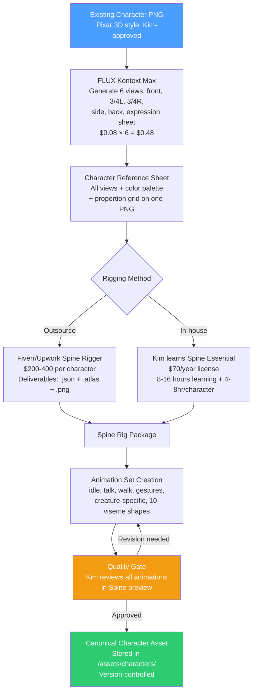
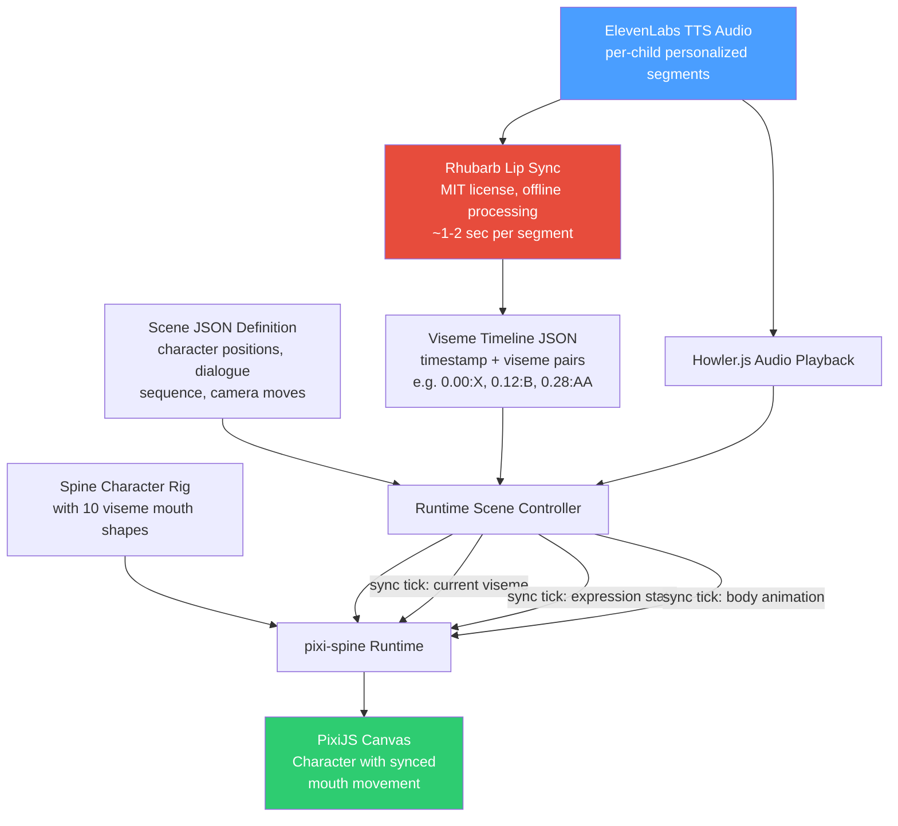
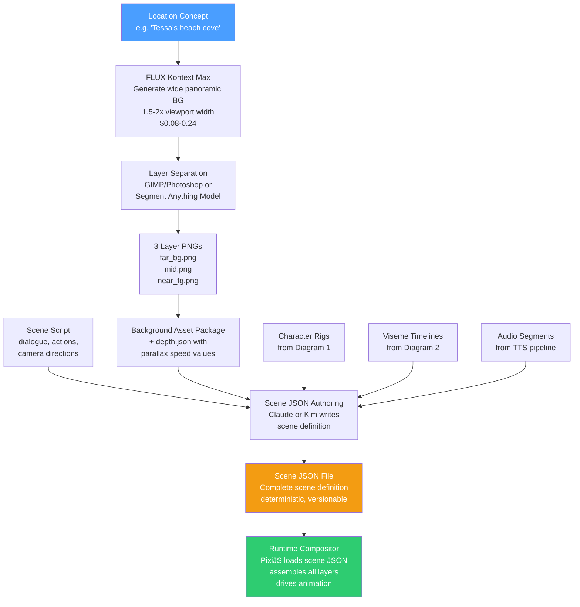
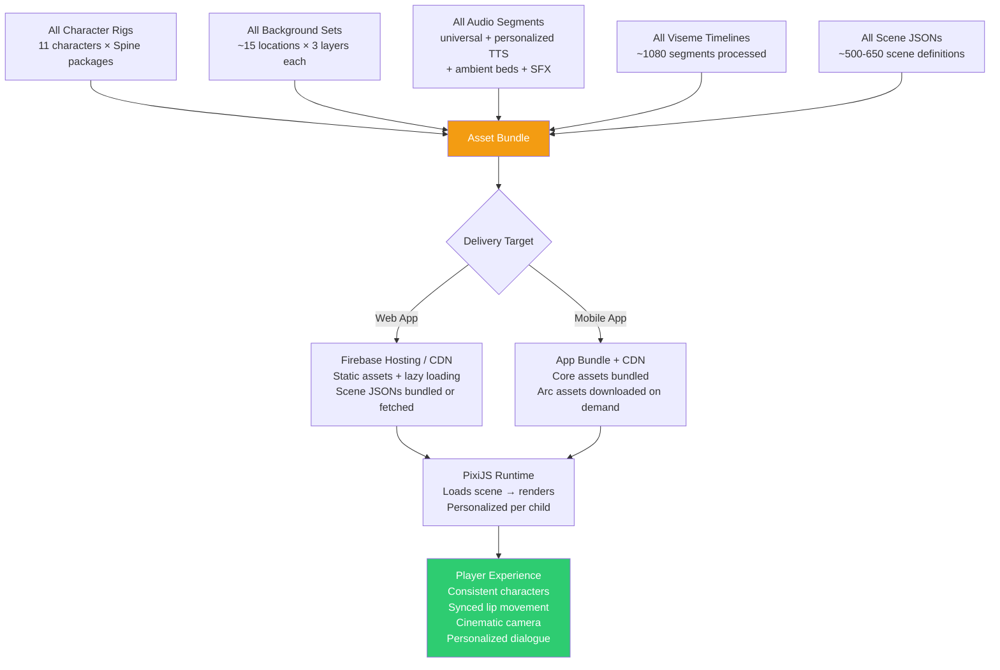

# MindfulNest Visual Pipeline Architecture v1

**Date:** April 12, 2026  
**Author:** Claude (Principal Graphics Engineer / Pipeline Architect)  
**Status:** Architecture Recommendation — Awaiting Kim Review  
**Supersedes:** The ad-hoc FLUX Kontext → Seedance → ByteDance pipeline documented in memory and PIPELINE_BRAIN_v1.md

---

## Executive Summary

The current fully-generative video pipeline (FLUX Kontext → Seedance → ByteDance Lipsync at ~$0.26/scene) is **not viable for scaled production**. It produces inconsistent characters between scenes, uncontrollable poses, extra-limb artifacts, and non-deterministic results that require expensive re-rolling. Every scene is a gamble.

**The recommended architecture is a rigged 2D character system (Spine 2D) composited over AI-generated backgrounds, with deterministic phoneme-driven lip sync (Rhubarb), rendered via PixiJS in the app at runtime.** This gives perfect character consistency, frame-accurate lip sync, full camera control, near-zero marginal cost per scene, and — critically — **runtime personalization** (the rig's mouth moves to whatever TTS audio plays, including `{childName}` personalized audio).

Upfront investment: ~$2,500–4,000 (character rigging for 11 characters).  
Marginal cost per scene after setup: effectively **$0**.  
Break-even vs. current pipeline: ~40 scenes (reached in the first arc).

---

## STEP 1 — Problem Decomposition

Five discrete systems must work together:

| System | Core Question | Key Constraint |
|--------|--------------|----------------|
| **Character Consistency** | How do characters look identical across hundreds of scenes? | Must survive pose changes, expressions, different backgrounds, lighting |
| **Lip Sync / Facial Animation** | How do mouths move convincingly to TTS dialogue? | Must work with per-child personalized audio (runtime, not pre-baked) |
| **Scene Composition** | How are backgrounds, characters, and FX layered? | Must support asset reuse; backgrounds shared across many scenes |
| **Camera Motion** | How do we get pans, zooms, parallax? | Must not require re-rendering the scene |
| **Asset Reuse** | How do we avoid paying per scene at scale? | 54 modules × ~8-12 scenes = 430-650 scenes across 9 arcs |

The personalization requirement is the hidden constraint that eliminates most pre-rendered approaches: because every child hears `{childName}` in TTS audio, lip sync must happen at runtime against dynamic audio, not against a fixed video file.

---

## STEP 2 — Rapid Evaluation of Approaches

### Approach 1: Fully AI-Generated Video
**Current pipeline.** FLUX Kontext → Seedance → ByteDance Lipsync.

**VERDICT: REJECT for scaled production.**

Why it fails:
- **No consistency guarantee.** Even with reference images, FLUX Kontext produces variations in proportions, eye shape, color saturation, and silhouette between generations. Seedance amplifies these through temporal noise. Over 500+ scenes, characters will drift visibly.
- **No pose control.** You can prompt "Tessa looking left" but you cannot specify exact arm position, body angle, or expression intensity. Every generation is a slot machine.
- **Extra-limb artifacts.** Seedance regularly produces phantom limbs. This is a known, unfixed issue with diffusion-based video generation as of April 2026.
- **Non-deterministic.** Same prompt, same reference → different result. Unacceptable for production at scale.
- **Linear cost.** $0.26/scene never decreases with volume. 500 scenes = $130 in API costs alone, plus hours of human re-rolling and quality-checking.
- **Pre-rendered lip sync breaks personalization.** ByteDance Lipsync bakes mouth movement into a video file. If the child's name changes the audio timing, the lip sync is wrong.
- **WaveSpeed reliability.** The Seedance/ByteDance APIs go through intermittent outages. Production cannot depend on a single vendor's uptime.

**Where it still has value:** Background generation (one-time), character concept art, style exploration. Keep FLUX Kontext for these supporting roles.

### Approach 2: AI Images + 2.5D Animation (Parallax/Ken Burns)
Slice AI-generated images into depth layers, apply parallax movement.

**VERDICT: REJECT as primary system.**

Why it fails:
- **No lip sync.** Parallax moves layers; it doesn't animate mouths.
- **No character animation.** Characters are frozen in their generated pose.
- **Already tested and rejected.** Memory records: "parallax/Rive (too manual)" was rejected in earlier pipeline evaluation.
- **Useful only for establishing shots.** Wide landscape reveals, location transitions — yes. Character dialogue — no.

**Where it still has value:** Background parallax layers behind rigged characters. This becomes a subsystem of the winning architecture, not a standalone approach.

### Approach 3: Rigged 2D Character System (Spine / Live2D)
Create animatable character rigs from the existing Pixar 3D character art. Drive them programmatically.

**VERDICT: PRIMARY RECOMMENDATION.**

Why it wins:
- **Perfect consistency.** The rig IS the character. Same proportions, same colors, same silhouette — always. Character drift is literally impossible.
- **Deterministic.** Same animation state → same visual output. Every time.
- **Lip sync is a solved problem.** Audio → phonemes (Rhubarb) → visemes (mouth shapes on the rig). Frame-accurate, zero cost.
- **Runtime personalization.** The rig's mouth responds to whatever audio is playing. `{childName}` in TTS changes audio timing → rig adapts automatically. This is the killer feature.
- **Reusable.** Rig a character once, use it in every scene forever. Amortized cost approaches zero.
- **Controllable.** Exact pose, exact expression, exact timing. No re-rolling, no slot machine.
- **Lightweight.** Spine 2D rigs are typically 2-5MB per character. Compare to video: 5-15MB per scene clip. The rig approach is 10-100x more storage-efficient.
- **Web/mobile native.** Spine has JavaScript/TypeScript runtimes. PixiJS integration is mature. Works in React (MindfulNest's stack).

Cost structure:
- Upfront: $200-400 per character for rigging (outsourced) × 11 characters = $2,200-4,400
- Per scene: $0
- Software: Spine Essential $70/year

### Approach 4: Lightweight Stylized 3D (Blender/Unity)
Model characters in 3D, render in a stylized Pixar-like shader.

**VERDICT: REJECT.**

Why it fails:
- **Massively over-engineered.** MindfulNest scenes are dialogue-heavy character encounters, not action sequences. 3D rigging, UV mapping, texturing, and lighting are 10x the complexity of 2D rigging for no visible benefit.
- **Slow iteration.** 3D pipeline: model → rig → texture → light → render. 2D pipeline: draw → rig → animate. Half the steps.
- **Requires 3D expertise.** Kim is a solo founder with AI tools. Blender's learning curve is months, not hours.
- **Overkill for the art style.** The Pixar 3D "look" in MindfulNest's existing character art (generated by FLUX) is an illustration style — it looks 3D but it's a flat image with 3D shading. A 2D rig with Spine's mesh deformation can reproduce this look perfectly.
- **Runtime weight.** 3D models + shaders are heavy. 2D rigs are light. MindfulNest is a mobile-first therapeutic app for kids — performance matters.

### Approach 5: Hybrid (Rigged 2D Characters + AI Backgrounds + Programmatic Camera)
Combine the best elements: rigged characters for consistency and lip sync, AI-generated backgrounds for visual richness, programmatic composition for camera motion.

**VERDICT: THIS IS THE WINNING ARCHITECTURE.** It is a specific implementation of Approach 3 with AI-assisted supporting systems. Detailed below.

---

## STEP 3 — The Winning Architecture

### Architecture: Spine 2D Rigs + AI Backgrounds + Rhubarb Lip Sync + PixiJS Runtime

```
┌─────────────────────────────────────────────────────────────┐
│                    RUNTIME (in-app)                         │
│                                                             │
│  ┌──────────────┐  ┌──────────────┐  ┌──────────────┐      │
│  │  Background   │  │  Character   │  │   Audio      │      │
│  │  Layers       │  │  Spine Rigs  │  │   (TTS)      │      │
│  │  (parallax)   │  │  (animated)  │  │              │      │
│  └──────┬───────┘  └──────┬───────┘  └──────┬───────┘      │
│         │                 │                  │               │
│         └────────┬────────┘                  │               │
│                  │                           │               │
│           ┌──────▼───────┐           ┌──────▼───────┐       │
│           │   PixiJS     │◄──────────│  Rhubarb     │       │
│           │   Scene      │  viseme   │  Lip Sync    │       │
│           │   Compositor │  events   │  (realtime)  │       │
│           └──────┬───────┘           └──────────────┘       │
│                  │                                           │
│           ┌──────▼───────┐                                  │
│           │   Camera     │                                  │
│           │   Controller │  (pan, zoom, parallax offsets)   │
│           └──────┬───────┘                                  │
│                  │                                           │
│           ┌──────▼───────┐                                  │
│           │   WebGL      │                                  │
│           │   Canvas     │  ← final pixel output            │
│           └──────────────┘                                  │
│                                                             │
└─────────────────────────────────────────────────────────────┘
```

**Why this specific combination:**

| Component | Tool | Rationale |
|-----------|------|-----------|
| Character rigs | **Spine 2D** | Industry standard, mesh deformation gives pseudo-3D look matching Pixar style, lightweight runtime, massive freelancer pool for rigging |
| Lip sync | **Rhubarb Lip Sync** | Free, open source, audio → phoneme → viseme. Runs offline or at build time. Outputs timed viseme data. |
| Backgrounds | **FLUX Kontext Max** | Already proven. $0.08/image. Generate once per location, slice into depth layers, reuse everywhere. |
| Scene composition | **PixiJS** | Mature WebGL renderer with Spine plugin. Handles layered 2D scenes, blending, particles. React-compatible. |
| Camera | **Programmatic (PixiJS)** | Pan = translate viewport. Zoom = scale viewport. Parallax = differential layer speeds. Zero-cost, infinite control. |
| Audio | **ElevenLabs TTS** | Already in pipeline. Per-child personalized. Rig lip sync binds to this audio at runtime. |

---

## STEP 4 — Full Production Pipeline Design

### A. Character System

#### Canonical Character Creation

**Source of truth:** The 11 existing character PNGs (Tessa, Luna, Ember, Bramble, Benson, Bork, Grizzle, Guide Bird, Oliver, King, Willow) generated in Pixar 3D style via FLUX Kontext / Midjourney.

**Character sheet pipeline:**

```
Existing character PNG (approved by Kim)
        │
        ▼
┌─────────────────────────────┐
│  FLUX Kontext Max           │  Generate additional views:
│  ($0.08 × ~6 views)        │  front, 3/4 left, 3/4 right,
│                             │  side, back, expression sheet
└─────────────┬───────────────┘
              │
              ▼
┌─────────────────────────────┐
│  Character Reference Sheet  │  Single PNG with all views,
│  (canonical document)       │  color palette, proportion grid
└─────────────┬───────────────┘
              │
              ▼
┌─────────────────────────────┐
│  Spine 2D Rigging           │  Outsourced or self-rigged
│  (one-time per character)   │  4-8 hours per character
└─────────────┬───────────────┘
              │
              ▼
┌─────────────────────────────┐
│  Spine Export (.skel + .atlas + .png) │
│  = Canonical animatable character     │
└───────────────────────────────────────┘
```

**Consistency enforcement:**
- The Spine rig IS the consistency mechanism. Once rigged, the character cannot drift — it is the same mesh, same texture, same skeleton in every scene.
- No per-scene regeneration. No reference images. No embeddings. No re-rolling.
- If a character needs a costume change or seasonal variant, it's a texture swap on the same rig (same skeleton, different skin).

**Expression and pose system:**

Each character rig includes:

| Category | Assets | Implementation |
|----------|--------|----------------|
| **Idle states** | Breathing loop, blink loop, subtle sway | Spine animation clips, looped |
| **Expressions** | Neutral, happy, sad, scared, curious, excited, determined | Bone-driven facial deformation + eye/brow slots |
| **Mouth shapes** | 10 viseme poses (see Lip Sync section) | Bone-driven jaw + lip deformation |
| **Body poses** | Standing, sitting, walking, gesturing (2-3 gesture variants) | Spine animation clips |
| **Creature-specific** | Tessa: shell-tuck. Luna: wing-flap. Bork: quill-rattle. Ember: tail-curl. | Custom animations per rig |

**Skin system (Spine feature):**
- Each character has a "default" skin and can have variant skins
- Guide Bird: same rig, but different feather color options if needed
- Creatures: "healthy" vs "unwell" appearance (pre- and post-spell states)
- This is built into Spine natively — no additional tooling

#### Rigging Specification (for outsourcing)

Provide to freelance Spine rigger:
1. Character reference sheet (front + 3/4 + expression grid)
2. Art style guide: "Pixar 3D illustration style — maintain painted shading, do not flatten"
3. Required animations list (idle, talk, walk, 3 gestures, creature-specific)
4. Viseme mouth shape reference (10 shapes — see Section B)
5. Export format: Spine JSON + atlas + PNG (not binary .skel for easier debugging)
6. Resolution: 2048px tall character on transparent background
7. Mesh deformation enabled (for pseudo-3D volume when turning/emoting)

**Outsourcing market:** Spine 2D rigging on Fiverr/Upwork runs $150-400 per character depending on complexity. MindfulNest characters are moderately complex (animal/fantasy creatures with expressive faces). Budget $300 average.

---

### B. Lip Sync System

#### Architecture: Rhubarb Lip Sync → Viseme Timeline → Spine Runtime

```
ElevenLabs TTS Audio (.mp3)
        │
        ▼
┌─────────────────────────────┐
│  Rhubarb Lip Sync           │  Free, open source (MIT license)
│  (offline processing)       │  github.com/DanielSWolf/rhubarb-lip-sync
│                             │  Input: audio file + optional transcript
│                             │  Output: timed viseme sequence (JSON/TSV)
└─────────────┬───────────────┘
              │
              ▼
┌─────────────────────────────┐
│  Viseme Timeline (JSON)     │  [{ time: 0.0, viseme: "B" },
│                             │   { time: 0.12, viseme: "AA" },
│                             │   { time: 0.28, viseme: "T" }, ...]
└─────────────┬───────────────┘
              │
              ▼
┌─────────────────────────────┐
│  Runtime Viseme Driver      │  Maps Rhubarb visemes → Spine
│  (JS, runs in app)         │  mouth-shape animation keys
│                             │  Syncs to audio playback position
└─────────────┬───────────────┘
              │
              ▼
┌─────────────────────────────┐
│  Spine Character Rig        │  Mouth bones deform to match
│  (mouth shape updates       │  current viseme in real-time
│   at 24+ fps)              │
└─────────────────────────────┘
```

#### Mouth Shape System: Preston Blair Viseme Set

Rhubarb outputs visemes using a standard set. Each maps to a mouth shape on the Spine rig:

| Rhubarb Viseme | Phonemes | Mouth Shape Description |
|---------------|----------|------------------------|
| **A** | M, B, P | Closed lips |
| **B** | EE, I | Wide narrow opening |
| **C** | EH, AE | Open medium |
| **D** | AA, AH | Wide open |
| **E** | AO, AW | Round small |
| **F** | OO, UW | Tight round (pucker) |
| **G** | F, V | Teeth on lip |
| **H** | L, TH | Tongue tip visible |
| **X** | (silence) | Neutral/rest |

That's **9 active shapes + 1 rest pose = 10 total mouth positions** per character rig. This is a small, manageable set that produces convincing lip sync for stylized characters.

#### Sync Accuracy vs. Cost Tradeoff

| Approach | Accuracy | Cost | Personalization | Verdict |
|----------|----------|------|-----------------|---------|
| **Rhubarb (offline)** | 90-95% frame-accurate | $0 (MIT license) | Process per-child audio at build time or on first play | **CHOSEN** |
| ByteDance Lipsync (current) | ~85% (generative) | $0.15/5s | Cannot — baked into video | Rejected |
| Manual keyframing | 99% | Hours per scene | N/A — too slow | Rejected |
| Oculus/Meta lip sync SDK | 95%+ | Free, but native only | Runtime capable | Backup option |

**Personalization workflow:**

The TTS pipeline already segments audio into universal sentences (shared) and personalized sentences (per-child). Rhubarb processes each audio segment and outputs a viseme timeline. At runtime:

1. App loads the scene definition (which audio segments to play, in order)
2. For each audio segment, the corresponding viseme timeline is loaded
3. As audio plays, the viseme driver updates the Spine rig's mouth in real-time
4. `{childName}` segments have their own viseme timelines — lip sync is always correct

**Cost for lip sync processing:** Rhubarb runs in ~1-2 seconds per audio segment on commodity hardware. For the entire app (54 modules × ~20 audio segments each = ~1,080 segments), total processing time is ~30 minutes on a single machine. Can run as a batch job. **Total cost: $0.**

---

### C. Scene System

#### Background Strategy: AI-Generated, Layer-Sliced, Reused

```
Scene Location Concept
(e.g., "Tessa's beach cove")
        │
        ▼
┌──────────────────────────────┐
│  FLUX Kontext Max            │  Generate panoramic background
│  ($0.08/image × 2-3 tries)  │  Wider than viewport (1.5-2x)
│                              │  for pan room
└─────────────┬────────────────┘
              │
              ▼
┌──────────────────────────────┐
│  Layer Separation            │  Manual (Photoshop/GIMP) or
│  (one-time per background)   │  AI-assisted (segment-anything)
│                              │  Split into 3 depth planes:
│                              │  - Far BG (sky, distant mountains)
│                              │  - Mid (trees, structures)
│                              │  - Near FG (foliage, rocks)
└─────────────┬────────────────┘
              │
              ▼
┌──────────────────────────────┐
│  Background Asset Package    │  3 PNGs (far/mid/near) per location
│  + parallax depth values     │  + depth.json with layer speeds
└──────────────────────────────┘
```

#### Location Inventory and Reuse Strategy

MindfulNest's scenes take place in a limited set of locations. This is a massive advantage for asset reuse:

| Location | Used In | Background Sets Needed |
|----------|---------|----------------------|
| Heartwood Tree clearing | Every module (hub) | 7 states (dormant → awakened) |
| Tessa's beach/cove | M1 scenes | 1 (+ time-of-day variant) |
| Luna's observatory/roost | M2 scenes | 1 |
| Ember's meadow/den | M4 scenes | 1 |
| Bramble's forest/tree | M6 scenes | 1 |
| Benson's cave/cliff | M3 scenes | 1 |
| Bork's fortress/lair | M5 scenes | 1 |
| Oliver's meeting place | Arc narrative | 1 |
| Map / Everdale overview | Transitions | 1 |
| Child's home (interior) | Opening | 1 (already exists) |

**Total unique backgrounds for Arc 1: ~12-15** (including variants).  
**Total unique backgrounds for all 9 arcs: ~80-100** (estimated).

At $0.08-0.24 per background (1-3 FLUX generations), the entire background library costs **$8-24** for all 9 arcs. Trivial.

#### Layering Architecture

Every scene is composed from bottom to top:

```
Layer 5:  UI overlay (coins, buttons)              ← app layer
Layer 4:  Particle FX (sparkles, magic)            ← PixiJS particles
Layer 3:  Foreground elements (near foliage)       ← parallax near
Layer 2:  Characters (Spine rigs)                  ← Spine rendering
Layer 1:  Midground (structures, trees)            ← parallax mid
Layer 0:  Far background (sky, horizon)            ← parallax far
```

Characters always render between mid and near foreground layers. This creates natural depth without 3D rendering.

#### Reusability

Each background set is used for ALL scenes in that location. A typical module has 6-10 scene beats; most happen in 1-2 locations. That means one background set serves 3-5 scenes minimum.

Across 9 arcs (54 modules), the average background is reused ~5-7 times. The heartwood clearing background is reused ~54+ times (every module's return-to-hub scene).

---

### D. Camera / Motion System

#### 2.5D Parallax Approach

Camera motion is achieved by moving the viewport over a scene that is wider and taller than the screen:

```
┌─────────────────────────────────────────────────┐
│           FULL SCENE (wider than viewport)       │
│                                                  │
│    ┌─────────────────────┐                       │
│    │     VIEWPORT        │  ◄── what the player  │
│    │     (screen)        │      actually sees     │
│    │                     │                        │
│    └─────────────────────┘                        │
│              │                                    │
│              │ PAN ──►                            │
│              │                                    │
└─────────────────────────────────────────────────┘
```

When the viewport moves:
- **Far background** moves at 0.3x viewport speed (distant = slow)
- **Midground** moves at 0.6x viewport speed
- **Characters** move at 1.0x viewport speed (grounded in scene)
- **Near foreground** moves at 1.3x viewport speed (close = fast)

This differential creates a convincing depth effect with zero 3D rendering.

#### Camera Operations

All camera operations are simple 2D transforms on the viewport:

| Operation | Implementation | Cost |
|-----------|---------------|------|
| **Pan** | Translate viewport X/Y with easing | $0 — math |
| **Zoom** | Scale viewport with easing, adjust parallax ratios | $0 — math |
| **Focus shift** | Ease viewport to center on a character | $0 — math |
| **Shake** | Random offset oscillation (for dramatic moments) | $0 — math |
| **Fade** | Alpha transition on viewport or overlay layer | $0 — math |

**No re-rendering.** The scene is always fully composed; the camera is just a window into it. Changing camera position is instant and costs nothing.

#### Scene Definition Format

Each scene beat is defined in a JSON structure:

```json
{
  "sceneId": "m1_discovery_01",
  "background": "tessa_beach_cove",
  "characters": [
    {
      "id": "guide_bird",
      "position": { "x": 0.3, "y": 0.7 },
      "facing": "right",
      "initialAnimation": "idle_hover"
    },
    {
      "id": "tessa",
      "position": { "x": 0.7, "y": 0.8 },
      "facing": "left",
      "initialAnimation": "idle_scared"
    }
  ],
  "camera": {
    "initial": { "x": 0.5, "y": 0.5, "zoom": 1.0 },
    "moves": [
      { "at": 0.0, "to": { "x": 0.3, "zoom": 1.2 }, "duration": 2.0, "ease": "quadOut" },
      { "at": 4.5, "to": { "x": 0.7, "zoom": 1.0 }, "duration": 1.5, "ease": "quadInOut" }
    ]
  },
  "dialogue": [
    {
      "character": "guide_bird",
      "audioSegment": "m1_gb_intro_01",
      "visemeTimeline": "m1_gb_intro_01.visemes.json",
      "animation": "talk_excited"
    }
  ]
}
```

This format is fully deterministic, versionable, diffable, and can be authored by Kim or generated by Claude.

---

### E. Composition & Rendering

#### Runtime vs. Pre-Render Decision

**RUNTIME RENDERING. No pre-render.**

Reasons:
1. **Personalization requires runtime.** TTS audio with `{childName}` varies per child → lip sync must adapt → must be runtime.
2. **Storage efficiency.** Runtime: ~50MB total assets for all of Arc 1 (rigs + backgrounds + audio). Pre-rendered video: ~500MB+ for Arc 1. For a mobile app, 10x less storage is decisive.
3. **Update flexibility.** Change a character expression or camera timing? Update the scene JSON. No re-rendering hundreds of video files.
4. **Platform parity.** PixiJS renders identically on iOS Safari, Android Chrome, and desktop. No video codec compatibility issues.

#### Rendering Stack

```
┌─────────────────────────────────────┐
│         React App (Lovable/Cursor)  │
│                                     │
│  ┌────────────────────────────────┐ │
│  │  Scene Controller (TypeScript) │ │
│  │  - Loads scene JSON            │ │
│  │  - Manages state machine       │ │
│  │  - Drives dialogue sequence    │ │
│  └───────────┬────────────────────┘ │
│              │                      │
│  ┌───────────▼────────────────────┐ │
│  │  PixiJS Stage                  │ │
│  │  ┌─────────────────────────┐   │ │
│  │  │ Background Layer System │   │ │
│  │  │ (parallax containers)   │   │ │
│  │  └─────────────────────────┘   │ │
│  │  ┌─────────────────────────┐   │ │
│  │  │ Spine Character Layer   │   │ │
│  │  │ (pixi-spine plugin)     │   │ │
│  │  └─────────────────────────┘   │ │
│  │  ┌─────────────────────────┐   │ │
│  │  │ Particle FX Layer       │   │ │
│  │  │ (@pixi/particle-emitter)│   │ │
│  │  └─────────────────────────┘   │ │
│  │  ┌─────────────────────────┐   │ │
│  │  │ Camera Viewport         │   │ │
│  │  │ (transform container)   │   │ │
│  │  └─────────────────────────┘   │ │
│  └────────────────────────────────┘ │
│                                     │
│  ┌────────────────────────────────┐ │
│  │  Audio Engine                  │ │
│  │  - Howler.js for playback      │ │
│  │  - Rhubarb viseme sync         │ │
│  │  - Background music/ambience   │ │
│  └────────────────────────────────┘ │
│                                     │
└─────────────────────────────────────┘
```

#### Key Libraries

| Library | Version | Purpose | License |
|---------|---------|---------|---------|
| **PixiJS** | v8.x | WebGL 2D renderer | MIT |
| **pixi-spine** | v4.x | Spine runtime for PixiJS | Spine Runtime License (free with Spine license) |
| **Howler.js** | v2.x | Cross-browser audio playback | MIT |
| **Rhubarb** | v1.13+ | Lip sync processing (build-time) | MIT |
| **@pixi/particle-emitter** | v5.x | Magic sparkle FX | MIT |

Total runtime JS bundle addition: ~300-400KB gzipped. Acceptable for a mobile web app.

#### Export / Delivery Pipeline

There is no "export" step in the traditional sense. The delivery is the scene JSON + assets:

```
/assets/
  /characters/
    tessa.json          (Spine skeleton)
    tessa.atlas         (Spine texture atlas)
    tessa.png           (Spine texture sheet)
    guide_bird.json
    ...
  /backgrounds/
    tessa_beach_cove/
      far.png
      mid.png
      near.png
      depth.json
    heartwood_clearing/
      ...
  /audio/
    /universal/         (shared TTS segments)
    /personalized/      (per-child TTS segments)
    /music/             (ambient beds, bells, gongs)
  /visemes/
    m1_gb_intro_01.visemes.json
    ...
  /scenes/
    m1_discovery_01.scene.json
    m1_discovery_02.scene.json
    ...
```

Assets are hosted on CDN (Firebase Hosting or CloudFront). Scene JSONs can be bundled with the app or loaded dynamically.

---

## STEP 5 — Pipeline Diagrams

### Diagram 1: Character Creation & Rigging Pipeline



### Diagram 2: Lip Sync / Animation Pipeline



### Diagram 3: Scene Composition Pipeline



### Diagram 4: Final Render / Delivery Pipeline



---

## STEP 6 — Cost Model

### Setup Costs (One-Time)

| Item | Unit Cost | Quantity | Total |
|------|-----------|----------|-------|
| Spine Essential license | $70/year | 1 | $70 |
| Character reference sheets (FLUX) | $0.48/character | 11 | $5.28 |
| Character rigging (outsourced) | $300/character avg | 11 | $3,300 |
| Background generation (FLUX) | $0.16/location avg | 15 (Arc 1) | $2.40 |
| Background layer separation | $0 (Kim in GIMP) | 15 | $0 |
| Rhubarb setup | $0 (MIT license) | 1 | $0 |
| PixiJS + pixi-spine integration | $0 (MIT license) | 1 | $0 |
| **Total setup (Arc 1)** | | | **~$3,377** |

For subsequent arcs (2-9), only new characters and locations need setup. Estimated $800-1,200 per arc (2-3 new characters + 6-8 new locations).

**Total setup for all 9 arcs: ~$3,377 + (8 × $1,000) = ~$11,400**

### Per-Scene Marginal Cost

| Item | Cost |
|------|------|
| Character rendering | $0 (runtime) |
| Lip sync processing | $0 (Rhubarb, offline) |
| Background | $0 (reused) |
| Camera motion | $0 (programmatic) |
| Scene JSON authoring | $0 (Claude-generated) |
| **Total per scene** | **$0** |

### Per-Minute-of-Content Cost

A "minute of content" in MindfulNest is approximately 2-3 scene beats with dialogue.

| Component | Cost Per Minute |
|-----------|----------------|
| TTS audio generation | ~$0.05 (ElevenLabs, already budgeted) |
| Viseme processing | ~$0.00 (Rhubarb batch) |
| Visual rendering | $0.00 (runtime) |
| Scene authoring | $0.00 (template-driven) |
| **Total per minute** | **~$0.05** |

### Comparison: Current Pipeline vs. Recommended

| Metric | Current (Generative) | Recommended (Rigged) |
|--------|---------------------|---------------------|
| Cost per scene | $0.26 | $0.00 |
| Setup cost (Arc 1) | ~$0 | ~$3,400 |
| 500 scenes total cost | $130 + re-roll time | $3,400 (fixed) |
| 1,000 scenes total cost | $260 + re-roll time | $3,400 (same) |
| Character consistency | Probabilistic (70-85%) | Deterministic (100%) |
| Lip sync + personalization | Incompatible | Native |
| Time per scene (production) | 3-10 min (generation + review) | Seconds (load scene JSON) |
| Time per scene (authoring) | N/A — each scene is manual | 5-15 min (write scene JSON, reusable templates) |

**Break-even point:** ~$3,400 / $0.26 = ~13,077 scenes on pure API cost. But factoring in human time for re-rolling, quality-checking, and consistency fixes in the generative pipeline (estimated 5-15 min per scene), the rigged system breaks even at approximately **40-60 scenes** — i.e., within the first arc.

### Primary Cost Drivers

1. **Character rigging** (75% of setup cost). This is a one-time expense that amortizes to near-zero.
2. **TTS generation** (only ongoing cost). Already budgeted at $2.82/child total.
3. **FLUX background generation** (<1% of cost). Trivial.

### How This Scales

```
Cost ($)
  │
  │  Generative ────────────────── linear growth ($0.26/scene)
  │                        ╱
  │                      ╱
  │                    ╱
  │                  ╱
  │  ╔═══════════════════════════ Rigged (flat after setup)
  │  ║            ╱
  │  ║          ╱
  │  ║        ╱
  │  ║      ╱
  │  ║    ╱
  │  ║  ╱
  │  ║╱ ← break-even (~40-60 scenes)
  │  ╱
  │╱
  └──────────────────────────────── Scenes
       100   200   300   400   500
```

---

## STEP 7 — Risks & Failure Modes

### Risk 1: Character Rigging Quality

**Cause:** Outsourced rigger produces stiff, unnatural character movement that doesn't match the Pixar 3D quality of the original art.

**Impact:** HIGH. If characters look puppet-like, the entire aesthetic suffers. Children and therapists will notice.

**Mitigation:**
- Commission a single test rig (Tessa — simplest character) before committing to all 11.
- Require mesh deformation (not just bone rotation) for organic, volume-preserving movement.
- Provide the rigger with animation reference from comparable products (Toca Boca, Headspace Kids, Breathe Kids).
- Kim reviews and approves the test rig before proceeding with the batch.
- Budget for one revision round per character ($50-100 additional).

### Risk 2: Lip Sync Uncanny Valley

**Cause:** Viseme-driven mouth shapes look mechanical or out-of-sync, breaking immersion.

**Impact:** MEDIUM. Stylized characters are more forgiving than realistic ones, but bad lip sync is always distracting.

**Mitigation:**
- Use Rhubarb's "extended" mode for higher temporal resolution.
- Add micro-animations between viseme transitions (jaw ease, lip smoothing) in the Spine rig.
- Blend body animation with dialogue (slight head nods, body lean during emphasis) — this sells lip sync more than mouth accuracy alone.
- The Pixar 3D art style is inherently forgiving — stylized mouths don't need photorealistic precision.
- Test against ElevenLabs TTS output specifically (Rhubarb handles both natural and synthetic speech).

### Risk 3: Spine Learning Curve / Pipeline Integration

**Cause:** Integrating pixi-spine into the existing React/Lovable codebase introduces complexity. Kim may struggle with Spine Editor for future characters.

**Impact:** MEDIUM. Could slow production if integration is rocky.

**Mitigation:**
- PixiJS + pixi-spine is a well-documented, mature integration. There are hundreds of production games using this stack.
- Build a reusable `<SpineScene>` React component that encapsulates all PixiJS/Spine complexity. Scene authors only write JSON.
- For Kim: provide a 2-page "Scene Authoring Guide" that covers JSON format without requiring Spine Editor knowledge. Kim writes scene scripts; Claude converts to scene JSON.
- Spine Editor is only needed for creating new rigs — not for scene production.

### Risk 4: Asset Pipeline Bottleneck at Rigging Stage

**Cause:** All 11 characters need rigging before Arc 1 can ship. If the rigger is slow or unavailable, production stalls.

**Impact:** HIGH initially, ZERO once done.

**Mitigation:**
- **Phased rigging.** Arc 1 only needs 8 characters in scenes (Tessa, Luna, Ember, Bramble, Benson, Bork, Guide Bird, Oliver). King and Willow are Arc 2. Grizzle appears briefly. Prioritize the 6 creatures + Guide Bird first.
- **Parallel outsourcing.** Commission 2-3 riggers simultaneously. Spine rigging is independent per character — no dependencies.
- **Fallback: static-with-mouth.** If a rig isn't ready, a character can appear as a static image with only mouth animation (a simpler rig with just jaw/lip bones). Upgrade to full rig later. This is a degraded but shippable state.

### Risk 5: Runtime Performance on Low-End Devices

**Cause:** PixiJS + Spine + parallax + particles on older phones could drop frames.

**Impact:** LOW-MEDIUM. MindfulNest targets ages 7-11 — they're likely using parents' devices, which may be 2-4 years old.

**Mitigation:**
- Spine 2D rigs are lightweight (2-5MB, simple bone hierarchies). PixiJS is one of the fastest 2D WebGL renderers.
- Limit particle effects on low-end devices (detect GPU capability, reduce particle count).
- Backgrounds are static PNGs — no per-frame cost beyond compositing.
- Target 30fps, not 60fps. For dialogue scenes with subtle motion, 30fps is indistinguishable from 60fps.
- Test on a baseline device (e.g., iPhone SE 2nd gen, Samsung Galaxy A13) early in development.

### Risk 6: Toolchain Fragility

**Cause:** Dependency on specific open-source libraries (PixiJS, pixi-spine, Rhubarb) that could be abandoned or break in updates.

**Impact:** LOW. These are mature, widely-used libraries.

**Mitigation:**
- PixiJS: 40K+ GitHub stars, active development, used by Google, Disney, BBC. Not going anywhere.
- pixi-spine: Maintained by Spine's official team. Tied to Spine's commercial success.
- Rhubarb: Stable, feature-complete, MIT licensed. Can be forked if abandoned.
- Pin dependency versions. Don't auto-upgrade.

---

## STEP 8 — Final Recommendation

### BUILD THIS SYSTEM

**Primary architecture: Spine 2D character rigs + AI-generated backgrounds + Rhubarb lip sync + PixiJS runtime compositor.**

This is the correct architecture for MindfulNest because it solves the three problems that the current generative pipeline cannot:
1. **Perfect character consistency** — the rig is the character, forever.
2. **Runtime personalized lip sync** — mouths move to `{childName}` audio, per child.
3. **Zero marginal cost per scene** — rig once, render infinite scenes.

### AVOID THESE PATHS

- **Fully generative video (Seedance/Kling/Runway).** Character inconsistency, extra-limb artifacts, non-deterministic output, linear cost scaling, and incompatibility with personalized lip sync make this a dead end for scaled production. Keep FLUX Kontext for background generation only.
- **3D pipelines (Blender/Unity).** Massively over-engineered for dialogue-heavy scenes with stylized characters. The Pixar 3D "look" is achievable with 2D mesh deformation at 10% of the complexity.
- **Pre-rendered video of any kind.** Breaks personalization. Consumes 10x storage. Cannot be updated without full re-render.

### IF BUDGET IS CONSTRAINED, SIMPLIFY HERE

1. **Reduce initial character count.** Rig only the 7 Arc 1 characters first (6 creatures + Guide Bird). Add Oliver as a static-with-mouth fallback. Defer King, Willow, Grizzle.
2. **Rig in-house.** Kim learns Spine Essential ($70/year) instead of outsourcing ($3,300). Trade time for money — Spine has excellent tutorials and the creature designs are moderately complex. Estimated 40-60 hours total learning + rigging.
3. **Simplify animation sets.** Start with idle + talk + 1 gesture per character instead of the full set. Add animations incrementally as production reveals what's needed.
4. **Skip parallax initially.** Use single-layer backgrounds. Add depth layers in a polish pass. The system is designed to support this — scene JSON just needs `depth.json` values added later.

**Minimum viable budget: ~$500** (Spine license + 2 outsourced test rigs + FLUX backgrounds). Scale up from there.

### IMPLEMENTATION ORDER

| Phase | Scope | Timeline | Output |
|-------|-------|----------|--------|
| **Phase 0: Proof of concept** | Rig Tessa + 1 background + Rhubarb lip sync + PixiJS prototype | 1-2 weeks | Working demo of one scene with synced dialogue |
| **Phase 1: Arc 1 characters** | Rig remaining 6 Arc 1 characters | 2-3 weeks (parallel outsourcing) | All Arc 1 character rigs |
| **Phase 2: Scene system** | Build `<SpineScene>` React component, camera controller, scene JSON loader | 1-2 weeks | Reusable scene engine |
| **Phase 3: Arc 1 scenes** | Author all Arc 1 scene JSONs, process all viseme timelines | 2-3 weeks | Complete Arc 1 visual content |
| **Phase 4: Polish** | Particle FX, parallax depth, transition animations | 1 week | Production-ready Arc 1 |

**Total timeline to Arc 1 visual completion: 7-11 weeks from start.**

---

## Appendix A: Tool & Service Summary

| Tool | Role | Cost | License |
|------|------|------|---------|
| Spine Essential | Character rigging | $70/year | Commercial |
| PixiJS | Runtime 2D renderer | Free | MIT |
| pixi-spine | Spine ↔ PixiJS bridge | Free | Spine Runtime |
| Rhubarb Lip Sync | Audio → viseme mapping | Free | MIT |
| Howler.js | Audio playback | Free | MIT |
| FLUX Kontext Max | Background generation | $0.08/image | API (BFL) |
| ElevenLabs | TTS voice generation | ~$2.82/child total | API |
| GIMP/Photoshop | Background layer separation | Free/existing | — |

## Appendix B: Glossary

| Term | Definition |
|------|-----------|
| **Spine** | Industry-standard 2D skeletal animation tool by Esoteric Software |
| **Rig** | A skeleton (bones + constraints) attached to character art, enabling animation |
| **Viseme** | A mouth shape corresponding to a phoneme or group of phonemes |
| **Phoneme** | A unit of speech sound (e.g., "B", "AA", "TH") |
| **Rhubarb** | Open-source tool that analyzes audio and outputs timed viseme data |
| **PixiJS** | High-performance 2D WebGL renderer for the web |
| **pixi-spine** | PixiJS plugin that renders Spine animations in a PixiJS scene |
| **Parallax** | Depth illusion created by moving background layers at different speeds |
| **Mesh deformation** | Spine feature where bones deform a character's mesh (not just rotate joints), creating organic, volume-preserving movement |
| **Skin (Spine)** | A set of attachments/textures that can be swapped on a rig (e.g., "healthy" vs "unwell" creature) |

---

*End of document. This architecture is designed for MindfulNest's specific constraints: solo founder, AI-built pipeline, near-zero ongoing cost, Pixar 3D art style, runtime TTS personalization, and 54+ modules across 9 arcs. It replaces the generative video pipeline with a deterministic, reusable, and scalable system.*
