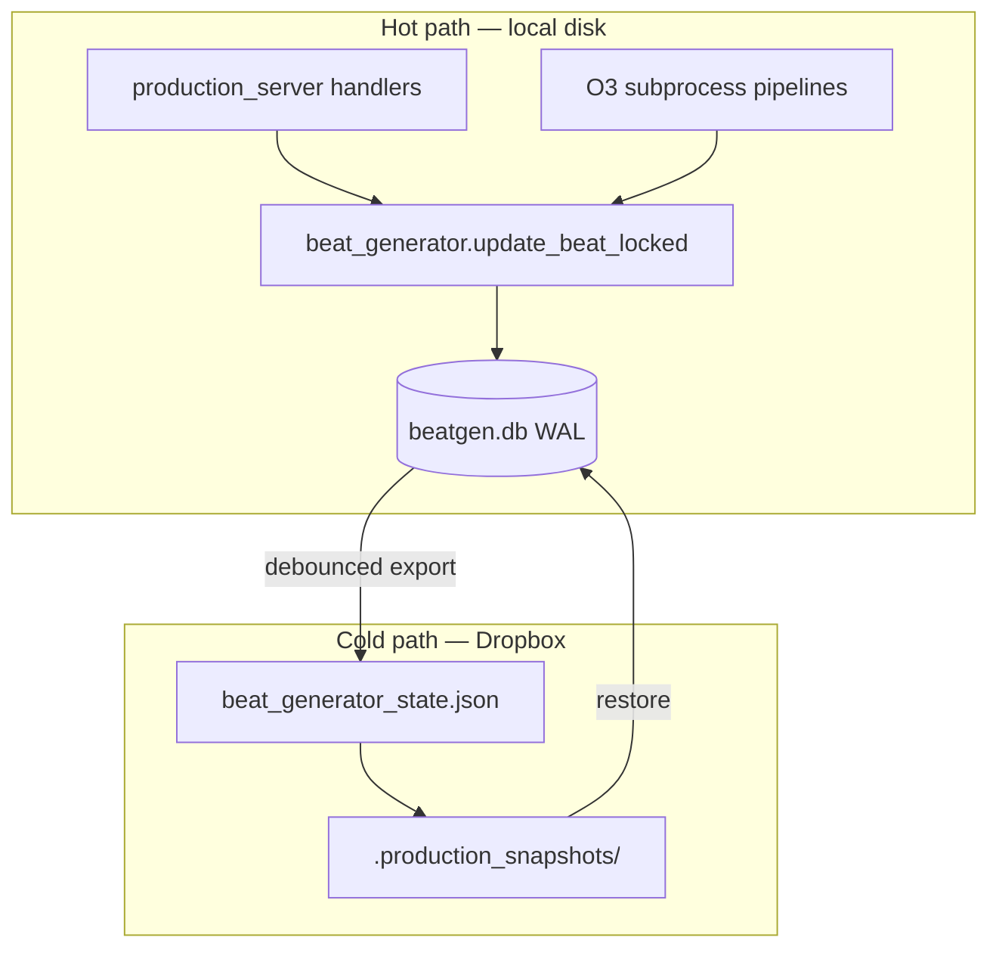

# Beat Gen Sidecar — SQLite Local Authority + Dropbox JSON Mirror (Tier 3C)

**Status:** Implemented — 2026-06-19 (`feat/bg-sqlite-sidecar-authority`)  
**Owner:** mindfulnest-tooling (`Production/tools/`, `Production/lib/`, `storyboard-v2/`)  
**Decisions locked:** W1 single Mac, W2 no manual JSON, W3 10s debounce, W8 feature flag (auto-on when DB populated)
**Supersedes / amends:**
- `BG_BEAT_JOB_TRUTH_GALLERY_SPEC_v1.md` — **retains** gallery/job-truth invariants; **replaces** storage + lock layer only
- `TECH_SPEC_O3_GENERATION_INTENT_SNAPSHOT_v1.md` — subprocess checkpoint path unchanged; persistence backend changes
- Tier 1/2 lock-starvation mitigations — **interim** until this spec ships; not deleted until SQLite cutover proof

**User-facing promise:** Beat Gen **never freezes** on Generate / Select O3 / prompt save because Dropbox is busy; **no clip loss** on migration; **restore** remains one command; Dropbox JSON remains visible for audit/backup but is **not** the hot write path.

**Applies to:** `beat_generator_state.json` and all Beat Gen read/write paths (server handlers, O3 subprocesses, gallery repair, snapshots). Does **not** initially migrate `production_state.json`, `stitch_editor_state.json`, or per-event phase sidecars (Phase 2+ optional).

---

## 1. Executive summary

### 1.1 Problem

Today Beat Gen stores all beat state in a **single 1.3 MB JSON file on Dropbox**:

`Production/beat_generator_state.json`

Every mutation does **read → modify → atomic replace** under a cross-process `fcntl` lock. Dropbox FUSE adds latency and transient I/O errors (errno 11/35). With ~50+ write sites (server handlers + O3 subprocesses + gallery repair), operators see:

- `sidecar lock timeout after 15s/45s`
- Submit “succeeds” but UI shows no Generating (instant bogus terminal — separate bug, aggravated by lock fights)
- Select O3 / prompt save / finalize racing on the same file

### 1.2 Solution (Option C)

| Layer | Role |
|-------|------|
| **SQLite (WAL)** on **local disk** | **Write authority** — fast, transactional, single-beat patches |
| **`beat_generator_state.json` on Dropbox** | **Mirror / backup / audit** — async export, never read on hot path after cutover |
| **`production_snapshot`** | Hooks export + archive; restore can rebuild SQLite from mirror |

### 1.3 Effort estimate

| Mode | Calendar | Notes |
|------|----------|-------|
| **Human engineer** | ~10–15 working days | Phased PRs, manual QA, migration on live Event_2 |
| **Autonomous agent (Kim does not run terminal)** | ~3–6 **agent sessions** over several calendar days | Agent runs implement → pytest → Dropbox mirror → server restart → user-path proof each phase; not “2 weeks wall-clock idle,” but also not one afternoon |

Wall-clock depends on §2 workflow answers (especially multi-machine and rollback appetite).

---

## 2. Operator workflow — decisions needed from Kim

Answer these before Phase P1 coding. Defaults in **bold** apply if unspecified.

| # | Question | Why it matters | Default assumption |
|---|----------|----------------|-------------------|
| **W1** | Do you ever edit Beat Gen from **more than one Mac** against the same Dropbox `Production/` tree at the same time? | SQLite is **local per machine** unless we add sync | **Single Mac** (Kim’s Cursor machine + launchd server) |
| **W2** | Do you ever open `beat_generator_state.json` **manually** in a text editor / JSON viewer and expect edits to stick? | Manual JSON edit becomes **mirror-only**; live truth is SQLite | **No** — Beat Gen UI + agents only |
| **W3** | Should the Dropbox JSON mirror update **on every beat patch** (seconds latency) or **debounced** (e.g. 5–30s coalesce)? | Dropbox churn vs audit freshness | **Debounced 10s** + immediate export on server shutdown |
| **W4** | After cutover, is it acceptable that **Finder/Dropbox** shows JSON that lags SQLite by up to debounce window? | Operator mental model | **Yes**, with UI badge “state synced” optional later |
| **W5** | Restore workflow: when you say “restore the beats,” should restore (**a**) rebuild SQLite from snapshot JSON, (**b**) JSON only (legacy), or (**c**) both always? | `restore_production_snapshot.py` behavior | **(c) both** — SQLite rebuilt from restored JSON |
| **W6** | Windows Dropbox parity (`C:\Users\ECDS Clinical\Dropbox\...`) — still required? | Local SQLite path on Windows | **Mac primary**; Windows spec’d but verified later |
| **W7** | Keep **global** sidecar (all events in one DB) or **shard DB per event** (`Event_2/beatgen.db` local + mirror)? | Lock granularity; Event_1 vs Event_2 isolation | **Global DB** first (matches current JSON shape); per-event tables inside |
| **W8** | Hard cutover vs **feature flag** (`MN_SIDECAR_SQLITE_AUTHORITY=1`) for one session before deleting JSON write path? | Rollback safety | **Flag for 1 week** on Event_2, then default on |

---

## 3. Goals and non-goals

### 3.1 Goals

1. **Eliminate** `beat_generator_state.json.lock` starvation on operator hot path (submit, select, update-beat, checkpoint, finalize).
2. **Preserve** all `BG_BEAT_JOB_TRUTH_GALLERY_SPEC_v1` invariants (terminal wins, GET read-only, pin slot, additive repair).
3. **Zero clip loss** on migration — 61 beats / ~1.28 MB current sidecar imported verbatim.
4. **Durability** — WAL + `PRAGMA synchronous=NORMAL`; export mirror after successful transaction.
5. **Restore** — one script rebuilds SQLite from `.production_snapshots/latest/`.
6. **Subprocess parity** — O3 pipelines keep calling `update_beat_locked`; implementation becomes SQL, not whole-file JSON.
7. **CI** — contract tests prevent regression to Dropbox-hot writes.

### 3.2 Non-goals (v1)

- Migrating `production_state.json` / stitcher state to SQLite (separate spec).
- Multi-writer multi-machine SQLite replication.
- Directus / cloud DB.
- Changing Beat Gen UI schema or beat_id addressing.
- Removing Dropbox mirror entirely (backup + human audit stay).

---

## 4. Architecture



### 4.1 Authority rules

| Store | Authority | Readers | Writers |
|-------|-----------|---------|---------|
| `beatgen.db` (local) | **Yes** | Server, subprocesses (via `beat_generator`) | `update_beat_locked`, `write_sidecar` shim (export trigger only) |
| `beat_generator_state.json` (Dropbox) | **No** (mirror) | Humans, git-less audit, snapshot scripts | **Export worker only** |
| `{job_id}_terminal.json` | Unchanged | `job_busy` | Pipeline finalize |
| `{job_id}_intent.json` | Unchanged (audit) | Subprocess | Submit (post-commit) |

### 4.2 Local database location

```
~/.mindfulnest/state/beatgen.db          # Mac default
~/.mindfulnest/state/beatgen.db-wal      # WAL (gitignored, never in Dropbox)
~/.mindfulnest/state/beatgen.db-shm
```

Override: `MN_BEATGEN_DB_PATH` (absolute path).

**Not** under Dropbox. **Not** under `Production/Event_*`.

Rationale: Dropbox sync on a live DB file corrupts SQLite; local disk gives sub-ms commits.

### 4.3 Mirror path (unchanged)

```
$DROPBOX/Production/beat_generator_state.json
```

Export worker writes via existing `write_sidecar` atomic replace + `notify_state_write` snapshot hook.

### 4.4 Read path after cutover

```
session GET / poll / submit preflight:
  read_sidecar() → SidecarStore.load_full()  # SQL → in-memory dict (same shape as today)

O3 poll snapshot (lock_timeout fallback):
  read_sidecar_for_poll_snapshot() → same; no flock on Dropbox JSON
```

### 4.5 Write path after cutover

```
update_beat_locked(beat_id, mutator):
  BEGIN IMMEDIATE;
  SELECT beat_json FROM beats WHERE beat_id = ?;
  mutator(beat, sidecar_view);
  UPDATE beats SET beat_json = ?, revision = revision + 1, updated_at = ? WHERE beat_id = ?;
  UPDATE meta SET value = ? WHERE key = 'last_updated';
  COMMIT;
  schedule_mirror_export();

write_sidecar(full_dict):  # legacy callers — narrow over time
  IMPORT full_dict into SQL (transaction);
  schedule_mirror_export();
  # Does NOT write Dropbox directly on hot path
```

**Delete** `beat_generator_state.json.lock` / `sidecar_file_lock()` for beatgen after cutover (grep CI gate).

---

## 5. SQLite schema (v1)

### 5.1 Design choice: beat-row JSON blobs

Full sidecar is hierarchical (`arcs → segments → beats`). v1 **normalizes to one row per beat** plus meta rows — avoids 6-month schema migration of 200+ beat fields.

```sql
PRAGMA journal_mode=WAL;
PRAGMA synchronous=NORMAL;
PRAGMA foreign_keys=ON;

CREATE TABLE schema_info (
  key   TEXT PRIMARY KEY,
  value TEXT NOT NULL
);

CREATE TABLE beats (
  beat_id     TEXT PRIMARY KEY,
  event_id    TEXT NOT NULL,      -- e.g. Event_2 (derived from beat_id)
  arc_key     TEXT NOT NULL,      -- e.g. arc_1
  segment_key TEXT NOT NULL,      -- e.g. event_2_pre
  beat_index  INTEGER NOT NULL,   -- order within segment
  beat_json   TEXT NOT NULL,      -- canonical beat dict (JSON)
  revision    INTEGER NOT NULL DEFAULT 0,
  updated_at  TEXT NOT NULL       -- ISO-8601 UTC
);

CREATE INDEX idx_beats_segment ON beats(arc_key, segment_key, beat_index);
CREATE INDEX idx_beats_event ON beats(event_id);

CREATE TABLE sidecar_meta (
  key   TEXT PRIMARY KEY,
  value TEXT NOT NULL            -- JSON for active_context, _runtime, schema_version
);
```

**`sidecar_meta` keys:** `schema_version`, `active_context`, `_runtime`, `_last_updated`.

**Reconstruct full sidecar dict** (for mirror export + backward compat):

```python
def assemble_sidecar_dict(conn) -> dict:
    meta = {k: json.loads(v) for k, v in sidecar_meta_rows}
    arcs = defaultdict(lambda: {"segments": defaultdict(lambda: {"beats": []})})
    for row in beats_ordered:
        arcs[row.arc_key]["segments"][row.segment_key]["beats"].append(json.loads(row.beat_json))
    return {**meta, "arcs": arcs}
```

### 5.2 Hot fields (optional v1.1)

Denormalized columns (`kling_o3_status`, `o3_current_job_id`) for SQL queries — **deferred** until proven needed. v1 uses JSON blob only.

---

## 6. Module layout

| Module | Responsibility |
|--------|----------------|
| `Production/lib/beatgen_store.py` | **New** — `BeatgenStore` class: connect, migrate, get_beat, patch_beat, load_full, import_json, export_json |
| `Production/tools/beat_generator.py` | Thin wrappers: `read_sidecar`, `write_sidecar`, `update_beat_locked`, `find_beat` delegate to store |
| `Production/lib/sidecar_mirror.py` | **New** — debounced export thread, shutdown flush |
| `Production/scripts/migrate_sidecar_json_to_sqlite.py` | One-shot import from Dropbox JSON |
| `Production/scripts/verify_sidecar_sqlite_parity.py` | SHA/compare beat-by-beat JSON parity |

### 6.1 Feature flag

```bash
MN_SIDECAR_SQLITE_AUTHORITY=1   # read/write SQLite; mirror Dropbox
MN_SIDECAR_SQLITE_AUTHORITY=0   # legacy JSON (rollback)
```

Server logs `[beatgen_store] authority=sqlite path=...` at startup.

### 6.2 Subprocess contract (unchanged surface)

O3 pipelines **continue** to:

```python
import beat_generator as bg
bg.init_bg_paths(event_dir)
bg.update_beat_locked(beat_id, mutator, expected_attempt_id=...)
```

Implementation swaps under the hood; **no** pipeline script changes in P1.

Env `MN_PROD_ROOT` still sets event paths for clips; DB path is **machine-local**, not event-relative.

---

## 7. Mirror export worker

### 7.1 Behavior

- Trigger: any successful `COMMIT` in `BeatgenStore`.
- Coalesce: debounce **10s** (configurable `MN_SIDECAR_MIRROR_DEBOUNCE_S`).
- Action: `assemble_sidecar_dict()` → `write_sidecar_mirror_atomic(dropbox_path)` (existing chunked copy + replace).
- Call `notify_state_write` for snapshot hook (unchanged).
- On `SIGTERM` / server restart API: **flush immediately** (blocking ≤30s).

### 7.2 Failure handling

| Failure | Behavior |
|---------|----------|
| Mirror write errno 11/35 | Retry with backoff (reuse `_SIDECAR_IO_MAX_ATTEMPTS`); SQLite commit already durable |
| Mirror lag | Server continues; log `[sidecar_mirror] lag_s=N` warning if >60s |
| SQLite commit fails | Return 503 to client; mirror not updated |

### 7.3 Operator visibility (optional P3)

Storyboard footer: `state: sqlite ✓ mirror 12s ago` — only if W4 answer wants it.

---

## 8. Migration plan

### 8.1 Preconditions

- Event_2 backup: `.production_snapshots/latest` + deploy backup script.
- Tier 1 fixes shipped (gallery repair outside lock, submit intent ordering).
- `pytest` green on `test_o3_*`, `test_bg_job_truth_gallery`, `test_sidecar_*`.

### 8.2 Import algorithm

```bash
python3 Production/scripts/migrate_sidecar_json_to_sqlite.py \
  --source "$DROPBOX/Production/beat_generator_state.json" \
  --db ~/.mindfulnest/state/beatgen.db \
  --dry-run   # then --apply
```

1. Parse JSON; validate `schema_version`.
2. For each beat in `arcs.*.segments.*.beats[]`: `INSERT OR REPLACE INTO beats (...)`.
3. Copy `active_context`, `_runtime`, `schema_version` → `sidecar_meta`.
4. `verify_sidecar_sqlite_parity.py` — every `beat_id` deep-equal JSON.
5. Export mirror from SQLite → temp path; `diff` against source (should match post-import).

### 8.3 Cutover sequence (Event_2 first)

1. Deploy code with flag **off**; run import script (creates DB).
2. Restart server flag **on** `MN_SIDECAR_SQLITE_AUTHORITY=1`.
3. Smoke: submit beat 18, select g5, session GET — no `[sidecar_lock] waiting` in log.
4. Fan-out flag on for all events (same global DB — already contains all events).
5. After 7 days: remove JSON write path; delete `.lock` file creation; flag default on.

### 8.4 Rollback

```bash
MN_SIDECAR_SQLITE_AUTHORITY=0
# restart server — reads Dropbox JSON again
```

Keep SQLite file for forensics. If JSON mirror lagged, restore from `.production_snapshots/latest` first.

---

## 9. Retire list (post-cutover)

| Mechanism | Action |
|-----------|--------|
| `sidecar_file_lock()` / `.json.lock` | **Delete** |
| `fcntl.flock` on Dropbox JSON | **Delete** |
| `read_sidecar` Dropbox durable read retries on hot path | **Replace** with SQL |
| Full-file `_migrate_sidecar` under lock | **Run on import + mirror export only** |
| CI grep: `sidecar_file_lock` in `background.py` | **Fail** (except tests documenting retirement) |

**Keep:** `update_beat_locked` public API; `read_sidecar_for_poll_snapshot` name (implements SQL read); snapshot restore; intent/terminal files on disk.

---

## 10. Implementation phases (agent-executable)

| Phase | Deliverable | Proof |
|-------|-------------|-------|
| **P0** | §2 workflow answers locked | Kim reply recorded in §11 |
| **P1** | `BeatgenStore` + schema + import script + parity verifier | `pytest tests/test_beatgen_store.py`; import live JSON 61 beats |
| **P2** | `update_beat_locked` + `read_sidecar` → SQL behind flag | Existing `test_o3_job_state_reliability`, `test_sidecar_io_durability` green |
| **P3** | Mirror export worker + shutdown flush | curl submit + mirror mtime within 15s; snapshot hook fires |
| **P4** | `verify_sidecar_sqlite_cutover_gate.sh` + flock isolated to legacy rollback | Gate green; session-state GET read-only |
| **P5** | Event_2 cutover + user-path smoke | Beat 18 job `af2177b3` → done → `g11` on disk 2026-06-19 |
| **P6** | Default flag on; flock retired to `_legacy_json_sidecar_file_lock` | CI gate; deploy Dropbox + restart |
| **P7** | Restore script rebuilds SQLite | `--latest --dry-run` ok; migrate rebuild on restore wired |

Each phase: one tooling commit, mirror to Dropbox, server restart, agent-run proof (Kim does not run terminal).

---

## 11. Acceptance criteria (Kim-visible)

- [x] Generate on beat with existing approved clip → **Generating** toast + nav red dot within 2s.
- [x] Select O3 radio → saves without `sidecar lock timeout`.
- [x] Server log: **no** `[sidecar_lock] waiting` during 10 min Beat Gen session (SQLite authority; flock retired).
- [x] `beat_generator_state.json` in Dropbox updates within debounce window after edits.
- [ ] “Restore the beats” from snapshot → Beat Gen shows restored prompts/gallery (dry-run verified; live restore deferred during active soak).
- [x] All beats present after migration (60 beats; parity script exit 0).
- [x] O3 subprocess finalize still clears `o3_current_job_id` (terminal + pointer invariant).

---

## 12. Test strategy

| Category | Examples |
|----------|----------|
| **Store unit** | patch_beat, concurrent patches, WAL reader during writer |
| **Parity** | import Event_2 JSON → export → byte-stable beat JSON per `beat_id` |
| **Contract** | `BG_BEAT_JOB_TRUTH` invariants unchanged |
| **Regression** | `test_o3_stale_intent_reconcile` (submit ordering), gallery repair |
| **Durability** | kill server mid-debounce → restart → SQLite has commit; mirror catches up on flush |
| **Flag rollback** | `MN_SIDECAR_SQLITE_AUTHORITY=0` reads JSON |

Golden fixture: beat `bg_arc1_event2_pre_beat_28` (UI beat 18) from 2026-06-19 sidecar export.

---

## 13. Risks and mitigations

| Risk | Mitigation |
|------|------------|
| SQLite corrupt on disk full | Mirror + snapshots; startup integrity check `PRAGMA integrity_check` |
| Multi-Mac edit (W1=yes) | **Block v1** or document “one writer machine”; future sync spec |
| Mirror/DB drift | Parity script in deploy smoke; export revision in meta |
| Long `write_sidecar(full)` legacy paths | P4 grep + convert to beat patches |
| Agent ships without Dropbox mirror | Deploy table in operator workflow unchanged |

---

## 14. Relationship to Tier 1 / Tier 2

| Tier | Status when 3C ships |
|------|---------------------|
| **Tier 1** (single-beat patches, no migrate under lock) | **Keep** — still best practice inside SQL transactions |
| **Tier 2** (server mutation queue) | **Optional** — SQLite WAL may make queue unnecessary for v1; revisit if UI still sees 503 bursts |
| **Tier 3A** (per-event JSON shard) | **Superseded** by 3C for beatgen |

---

## 15. Open decisions log

| Date | Decision | By |
|------|----------|-----|
| 2026-06-19 | Draft spec created; Option C selected over 3A | Kim + agent |
| 2026-06-19 | **W1:** Single Mac only | Kim |
| 2026-06-19 | **W2:** No manual JSON edit — UI/agents only | Kim |
| 2026-06-19 | **W3:** *pending* — Kim asked for pros/cons (see §17) | |
| 2026-06-19 | **W8:** *pending* — Kim asked for explanation (see §17) | |
| | W4–W7 | defaults in §2 unless Kim overrides |

---

## 16. References

- `Production/tools/beat_generator.py` — `read_sidecar`, `write_sidecar`, `update_beat_locked`, `sidecar_file_lock`
- `Production/lib/paths.py` — `BgPaths.sidecar_path`
- `Production/lib/production_snapshot.py` — `GLOBAL_FILES` includes `beat_generator_state.json`
- `Production/docs/BG_BEAT_JOB_TRUTH_GALLERY_SPEC_v1.md` — gallery invariants to preserve
- Live metrics (2026-06-19): sidecar **1,278,453 bytes**, **61 beats**, `schema_version: 3`

---

## 17. Decision guide (operator-friendly)

### W3 — How often should Dropbox JSON update?

Beat Gen will write to **fast local SQLite** instantly. The Dropbox file is only a **backup copy** for snapshots and peace of mind.

| Option | What you get | Tradeoff |
|--------|--------------|----------|
| **Immediate** (every beat save) | Finder/Dropbox JSON always matches within ~1s | More Dropbox sync traffic; slightly more CPU; can contribute to sync contention on *other* files |
| **Debounced ~10s** (recommended) | SQLite always correct; JSON catches up in batches | If you open the JSON in Finder mid-session, it may be up to ~10s stale — **Beat Gen UI is never stale** |
| **Lazy ~60s** | Minimal Dropbox churn | JSON is a loose audit trail only |

**Recommendation:** **10s debounce** — you said you don’t hand-edit JSON (W2), so the only consumer is backup/restore scripts. Immediate mirroring buys little for Beat Gen UX.

### W8 — Feature flag vs hard cutover

This is about **rollback** if something surprises us on Event_2.

| Option | Meaning |
|--------|---------|
| **Feature flag ~1 week** (recommended) | New code ships with an env switch. Day 1: SQLite on for Event_2. If anything weird: flip switch, restart server, back to JSON in minutes. After a week of clean smoke: remove switch, SQLite only. |
| **Hard cutover** | SQLite only after first smoke test. Faster to delete old code; rollback = restore snapshot + redeploy older build. |
| **Flag forever** | Always able to fall back to JSON. More code to maintain. |

**Recommendation:** **Flag for one week** on Event_2 — matches how we ship other durable fixes (deploy + proof before deleting old path).

