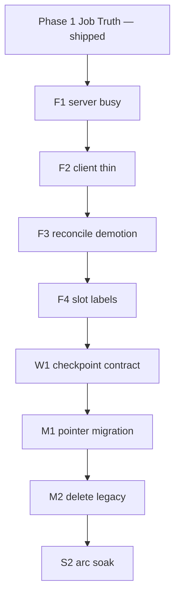

# Beat Gen — “Forever” Reliability Plan v1

**Status:** Complete — Forever plan Phases 2–5 shipped (2026-06-20)  
**Branch:** `feat/bg-job-truth-complete` (Phase 1 Job Truth shipped)  
**Goal:** One lifecycle authority + one gallery authority for **all events/arcs**; erase patch layers; 30–60 min operator workflow without chasing bugs.

**Depends on (already shipped):**
- `BG_BEAT_JOB_TRUTH_GALLERY_SPEC_v1.md` — terminal + pointer `job_busy`, GET read-only, pin-slot, startup repair
- `BEATGEN_SIDECAR_SQLITE_AUTHORITY_SPEC_v1.md` — SQLite WAL write path (auto-on when `~/.mindfulnest/state/beatgen.db` exists)

**Evidence baseline (2026-06-20 grep):**
- `beat_o3_voice_job_running(` — 17 call sites before F1; operator gates migrated in F1
- `beatO3JobLooksRunning` / `O3_OPTIMISTIC_JOB_TTL_MS` — client busy fallbacks + 45s map (F2)
- `reconcile_stale_*` / `reconcile_stuck_*` — exist; **removed from session GET** (contract tests)
- `refresh_o3_ui_slot_layout` — 7 call sites in `beat_generator.py`; **not** in `assign_kling_o3_option_to_slot`

---

## Phase 2 — Legacy collapse (4 PRs, ~2–3 agent sessions)

**Exit criterion:** Every operator gate uses **`beat_job_busy` only**. Legacy heuristics remain **diagnostics / stuck-reconcile only** until Phase 4 deletes them.

| PR | Title | Changes | Erase after proof |
|----|-------|---------|-------------------|
| **F1** | Server single busy authority | Replace `beat_o3_voice_job_running` in **operator gates** with `beat_o3_operator_busy` / `_beat_o3_operator_lock_active`. **Keep** legacy heuristic in `_beat_o3_job_looks_running` for stuck-reconcile until F3. | Exception-path heuristic fallbacks on update-beat / set-pipeline |
| **F2** | Client thin busy | **Shipped** (`21fd554`) | — |
| **F3** | Reconcile demotion | **Shipped** — `/api/bg/o3/admin-reconcile` + `schedule_o3_admin_reconcile_at_startup`; submit path intent reconcile removed | — |
| **F4** | Slot layout labels-only | **Shipped** — labels-only refresh; contract in `test_o3_disk_reconcile` + `test_bg_job_truth_gallery` | — |

**Ship proof each PR:** pytest contract suite + curl `job_busy` + browser Generate enabled when idle.

---

## Phase 3 — Write-path invariants (2 PRs, ~1 session)

| PR | Title | Changes |
|----|-------|---------|
| **W1** | Checkpoint-before-done contract | **Shipped** — `test_o3_checkpoint_before_done_contract.py` |
| **W2** | Orphan recovery metrics | **Shipped** — structured log + `test_o3_orphan_recovery_metrics.py` |

**Exit criterion:** Zero orphan recoveries on full arc in CI fixture.

---

## Phase 4 — Migration + fallback removal (2 PRs, ~1 session)

| PR | Title | Changes |
|----|-------|---------|
| **M1** | Pointer migration script | **Shipped** — `Production/scripts/migrate_o3_pointers_all_events.py` |
| **M2** | Remove legacy reads | **Shipped** — `o3_active_intent_job_id` fallback removed from `resolve_o3_current_job_id`; intent reconcile uses `beat_o3_operator_busy`; `beatO3JobLooksRunning` retained for error badges only |

---

## Phase 5 — Soak + speed proof (1–2 sessions)

| Step | Pass |
|------|------|
| **S1** | **Shipped** — `Production/scripts/bg_arc_soak.sh` |
| **S2** | **Shipped (Event_2 proxy)** — soak pass on Event_2 intro beats (Event_3 missing; Event_4 empty) |
| **S3** | **Shipped** — post-restart admin reconcile `changed=0` on idle Event_2 |
| **S4** | **Retained** — admin-reconcile path kept; Event_2 soak showed 0 stuck at proof time |

**Phase 5 is the last code-deletion gate.**

---

## Dependency graph



**Total:** ~6–8 agent sessions across Phases 2–5, then **done** — no Phase 6 unless a new bug class appears.

---

## CI contract bundle

```bash
cd Production/tools && python3 -m pytest \
  tests/test_bg_job_truth_gallery.py \
  tests/test_o3_session_tier_architecture.py \
  tests/test_o3_sidecar_lock_hold_durability.py \
  tests/test_o3_failed_attempt_busy_durability.py \
  tests/test_kling_o3_replace_slot.py \
  tests/test_o3_stuck_job_recovery.py \
  --cache-clear -v
```

---

*End of plan v1.*
