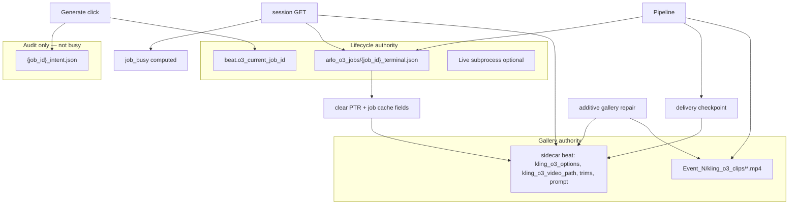

# Beat Gen — Job Truth + Gallery Spec v1

**Status:** Implemented — 2026-06-20 (`feat/bg-job-truth-complete`, P0–P7)  
**Owner:** mindfulnest-tooling (`Production/tools/`, `storyboard-v2/`)  
**Supersedes / amends:**
- `TECH_SPEC_O3_GENERATION_INTENT_SNAPSHOT_v1.md` — **intent demoted** from lock/busy authority to audit snapshot (see §5)
- `O3_PAID_OUTPUT_VISIBILITY_SPEC_v1.md` — **slot layout** changes from generation-sort to pin-slot (see §7); reconcile trigger changes (see §8)
- Partial Tier A/B shipped on `feat/bg-o3-per-option-cut-trim` (`f900c99`, `4279427`, `90122a5`) — **replaced** by read-only GET model in §6

**User-facing promise:** Clips you paid for **appear in the three UI slots** you expect; Generate is **busy only while a job is actually open**; refresh and overnight sleep **never fight** finalize; **no regeneration** required to recover legacy clips.

**Applies to:** All long-running Beat Gen jobs (Element O3, voice-first O3, still render, GPT batch where applicable) — **not** Arlo-O3-specific hacks.

---

## 1. Conversation decisions (locked)

| # | Decision | Notes |
|---|----------|--------|
| 1 | **Option A — terminal + pointer + gallery sidecar** | Single lifecycle authority; sidecar = gallery + operator draft only |
| 2 | **Session GET does not persist** | Eliminates refresh-vs-finalize lock fight; GET does not “heal” gallery into a lying response |
| 3 | **Server `job_busy` per beat** | Client stops inferring busy from sidecar cache / log paths / poll maps |
| 4 | **Additive automatic gallery repair** | Disk ⊃ sidecar → append missing option rows; **never delete** mp4s or existing options |
| 5 | **Pin replace slot** | New delivery overwrites **only** `kling_o3_replace_slot_index` (0/1/2); other two slots **unchanged**; no generation-sort reshuffle |
| 6 | **Intent = audit only** | `{job_id}_intent.json` frozen at submit; **not** pipeline lock, **not** `beat_has_active_intent` gate for UI |
| 7 | **No new truth source** | Collapse/remove: log-path → job id, `o3_active_intent_*` locks, client `beatO3JobLooksRunning` as authority, GET heal persist chain |
| 8 | **No video loss on migration** | Event_2 and all events: repair links existing `kling_o3_clips/*.mp4` into `kling_o3_options`; regen only if operator clicks Generate |
| 9 | **Prevention before repair** | Gallery drift is a **write-path bug**, not random corruption — fix checkpoint/finalize + GET read-only first; additive repair is safety net only |
| 10 | **Automatic repair on load** | When disk has deliveries sidecar lacks → append rows and populate UI slots — **no** manual “Repair from disk” button required |
| 11 | **No healed-response projection** | GET never returns gallery fields that differ from disk; only `job_busy` is derived (terminal + pointer), not stale sidecar cache |

---

## 2. Problem statement (consolidated)

### 2.1 Symptoms operators see

- **“Generating…”** with clip already in Finder / sometimes visible in tiles (beats 4, 14, 21, overnight tab sleep).
- **Videos not in UI** though delivery mp4 exists on disk.
- **Replace slot radio** does not match where new clip lands (newest sorted into slot 0).
- **Refresh** sometimes makes state flicker (heal persisted vs not).

### 2.2 Root causes (evidence-based)

| Layer | Mechanism |
|-------|-----------|
| **Dual lifecycle truth** | Sidecar job fields (`ui_job_id`, `voice_fix_status`, log path), intent locks (`o3_active_intent_*`), terminal files, `_ARLO_O3_JOBS`, client `activeO3Jobs` all infer “running” differently |
| **Lock fight** | Session GET persist (even debounced delta) competes with subprocess `update_beat_locked` finalize → `[sidecar_lock] waiting…`, delayed pointer clear |
| **Gallery drift** | Delivery checkpoint or finalize fails/skips; GET clobber races; option row never written while mp4 exists |
| **Display drift** | `refresh_o3_ui_slot_layout` + `buildFixedO3OptionSlots` sort by **generation**, ignoring replace-slot pin |
| **Client drift** | Tab-throttled poll timers; TS/Python busy parity mismatch; optimistic 45s TTL |

### 2.3 Why gallery rows drift (not “mystery corruption”)

| Stage | Failure mode | Operator symptom |
|-------|--------------|------------------|
| **Delivery checkpoint** skipped / lock timeout | mp4 on disk, no `kling_o3_options` row | New gen invisible in tiles |
| **Finalize** blocked by GET persist | terminal `done`, pointer not cleared | Stuck Generating |
| **GET persist** races subprocess | one writer wins; other's gallery patch lost | Missing or stale option row |
| **Tab sleep** | sidecar OK; client poll throttled | Feels like non-delivery |
| **Generation-sort** (`refresh_o3_ui_slot_layout`) | rows exist; wrong slot | “Clip in wrong holder” |

**Primary fix:** single-writer gallery path (checkpoint → finalize only) + GET read-only + pin slot + `job_busy`.  
**Safety net:** additive repair when `disk deliveries ⊃ sidecar options`.

### 2.4 “Videos not delivered to UI” — three layers

| Symptom | Layer | Fix in this spec |
|---------|-------|------------------|
| Generating forever, old tiles | Client busy / tab sleep | `job_busy` + wake `refreshState` (keep `90122a5`) |
| Finder has mp4, no tile | Missing option row | Stronger checkpoint; auto-repair append |
| Tile wrong holder | Display sort | Pin replace slot §7 |

### 2.5 What we are not doing

- Adding a sixth “busy” source (e.g. expanding `beat_has_active_intent` as primary gate).
- Per-refresh full sidecar heal persist chain (current `handle_bg_session_state` in-memory + delta persist).
- **Projecting healed gallery** in GET JSON while disk stays stale (dual view) — GET **reports** disk; repair **writes** when disk ⊃ sidecar.
- Regenerating clips to fix legacy sidecar rows.
- Manual per-beat repair as the primary operator workflow (automatic on load is default).

---

## 3. Architecture — two authorities only



| Store | Holds | Writers | Readers |
|-------|--------|---------|---------|
| **`{job_id}_terminal.json`** | `status`: `running` \| `done` \| `failed` \| `cancelled` \| `done_with_warning` | Pipeline finalize (and optional explicit `running` at spawn) | `job_busy`, poll API, ops audit |
| **`beat.o3_current_job_id`** | Active attempt id while job open | Submit (set), finalize (clear) | `job_busy`, repair skip guard |
| **Sidecar gallery** | `kling_o3_options[]`, `kling_o3_video_path`, trims, prompt, refs | Checkpoint, finalize, select-o3, trim, repair, operator `update-beat` | Beat Gen tiles, Stitcher export |
| **`{job_id}_intent.json`** | Frozen submit snapshot (prompt, refs, mode, slot, duration) | **Once** at submit | Subprocess payload, audit, dispute debug — **not** busy |
| **Client `activeO3Jobs`** | Optimistic poll id ≤ few seconds | Submit response only | Poll loop — **not** busy authority |

---

## 4. Lifecycle truth (Option A) — detailed

### 4.1 Field: `o3_current_job_id`

- **Set:** On successful Generate submit (all pipelines that spawn async work).
- **Clear:** When `{job_id}_terminal.json` exists with `status ∈ INTENT_TERMINAL_STATUSES` and finalize has run (or repair clears stale pointer when terminal proves done).
- **Replaces for busy purposes:** `o3_active_intent_job_id`, `o3_active_intent_id` as **locks** (fields may remain briefly for migration reads then removed).

### 4.2 Terminal file contract

Path: `{event_dir}/arlo_o3_jobs/{job_id}_terminal.json`

```json
{
  "schema_version": 1,
  "job_id": "69104d9d",
  "beat_id": "bg_arc1_event2_pre_beat_04",
  "status": "done",
  "terminal_at": "2026-06-19T06:07:59.493715+00:00",
  "delivered": { "video_path": "/.../bg_arc1_event2_pre_beat_04_g12_element_o3_master_delivery.mp4" }
}
```

**Statuses:** `running` (open attempt), then terminal: `done`, `failed`, `cancelled`, `done_with_warning` (see `o3_job_status_contract.py`).

**v2 liveness:** optional `status: "running"` at submit; busy uses terminal `running` + PID/heartbeat liveness (`o3_generation_intent.o3_subprocess_is_live`), not log mtime alone.

### 4.3 `job_busy` (server-computed, per beat)

**Algorithm** (Python, single function `beat_job_busy(beat, event_dir) -> bool`):

1. If `o3_current_job_id` empty → **not busy** (gallery-only beat).
2. Load `{job_id}_terminal.json` for that job id.
3. If terminal `status` is terminal (done/failed/cancelled/done_with_warning) → **not busy** (repair clears stale pointer if still set).
4. If terminal `status == "running"` and subprocess/PID+heartbeat is live → **busy**.
5. If terminal missing and intent committed < 15s ago (spawn window) → **busy**.
6. Else → **not busy**; close attempt via `close_o3_attempt` on poll/reconcile/startup.
7. **Ignore** for busy: `kling_o3_voice_fix_ui_job_id`, log-path mtime grace, `o3_active_intent_*`, `beat_has_active_intent` submit gate, sidecar `voice_fix_status` alone.

**Session GET:** each beat in scope includes `"job_busy": true|false` (and optionally `"o3_current_job_id": "…"|null` for dev).

**Poll API:** `status` derived from terminal + subprocess; attach `job_busy` on embedded `beat` snapshot.

### 4.4 Intent demotion (§5)

- **Keep:** `{job_id}_intent.json` at submit (immutable prompt/refs/mode/slot).
- **Remove:** `beat_has_active_intent()` as UI/pipeline **block**; `reconcile_stale_o3_intent_locks_all_events` on every session GET.
- **Submit handler:** stop writing `o3_active_intent_id` / `o3_active_intent_job_id` as locks; write `o3_current_job_id` instead.
- **Subprocess:** continues to read intent file for Kling payload — unchanged.

### 4.5 `kling_o3_voice_fix_attempt_id` (subprocess race guard only)

- **Keep** for `update_beat_locked(..., expected_attempt_id=…)` — stale subprocess must not overwrite a newer generation.
- **Not** used for `job_busy`, UI display, or session reconcile.
- Set at submit with new attempt; cleared on finalize with pointer (§4.5 job cache).

### 4.6 Job cache fields (clear on finalize)

Remove or stop writing when terminal lands:

- `kling_o3_voice_fix_ui_job_id`
- `kling_o3_voice_fix_job_log_path` (audit may move to terminal only)
- `kling_o3_voice_fix_phase` (or set once in terminal metadata)
- `o3_active_intent_id`, `o3_active_intent_job_id`
- Stale `kling_o3_voice_fix_status` running values when terminal says `done`

**Do not clear:** `kling_o3_options`, `kling_o3_video_path`, trims, generation labels, `kling_o3_status: approved`.

---

## 5. Gallery truth — prevention first

### 5.1 Write paths (only these may mutate gallery)

| Event | Function | Lock |
|-------|----------|------|
| Post-encode checkpoint | `persist_o3_delivery_option_checkpoint` → `assign_kling_o3_option_to_slot` | `update_beat_locked` |
| Finalize | pipeline `persist()` / `update_beat_locked` | same |
| Select O3 / approve | `handle_bg_select_o3_video` | sidecar lock |
| Trim / cut | `bg_kling_o3_trim` | sidecar lock |
| Additive repair | `reconcile_beat_gallery_from_disk` (§8) | sidecar lock |
| Operator edit | `update-beat` (prompt/refs) | sidecar lock |

**Banned from gallery writes:** `handle_bg_session_state` GET (entire persist block removed).

### 5.2 Delivery checkpoint (mandatory)

After every delivery mp4 is verified on disk:

1. `persist_o3_delivery_option_checkpoint(beat_id, video_path=…, slot_index=replace_slot_index, …)`
2. Must succeed or retry / `recover_orphan_o3_delivery` before terminal `done`.
3. **On success:** option row exists **before** finalize clears job pointer.

**Idempotency:** same `video_path` → same option `key` (`_kling_o3_option_key` hash).

### 5.3 Finalize (mandatory)

Single locked transaction:

1. Write terminal `done` / `failed`.
2. Patch gallery (approved path, status) if not already set by checkpoint.
3. Clear `o3_current_job_id` and job cache fields (§4.5).
4. On failure: terminal `failed` + `recover_orphan_o3_delivery` path; **never** leave pointer set without terminal.

---

## 6. Session GET — read-only on disk

### 6.1 New behavior

```
GET /api/bg/session-state?scope_event_id=Event_N&scope_video_role=pre
```

1. `read_sidecar_for_poll_snapshot(lock_timeout_s=5)` — unchanged.
2. **No** `reconcile_stuck_o3_voice_beats`, terminal reconcile, rehydrate, intent lock scans on GET (retire from hot path).
3. For each beat in scope:
   - Compute `job_busy` from §4.3 (read terminal + pointer; optional subprocess check).
   - Attach `job_busy` to beat dict in **response**.
4. **Optional once per server process / event / debounced:** run additive gallery repair (§8) **with lock** — not every GET if debounce active.
5. **Do not** `write_sidecar` for heals on GET.

### 6.2 What GET does not do

- No “healed response” overlay for gallery fields.
- No `rehydrate_o3_ui_job_ids`.
- No `reconcile_stale_o3_intent_locks_all_events`.
- No delta persist / debounce signature (`f900c99` path retired).

### 6.3 Explicit reconcile entry points (keep)

| Trigger | Use |
|---------|-----|
| `force_reconcile_o3=1` on GET | Operator/dev one-shot full disk reconcile (existing flag) |
| Post-deploy script | `reconcile_all_events_gallery_from_disk()` once per deploy |
| Finalize / checkpoint failure | `recover_orphan_o3_delivery` |

---

## 7. Pin replace slot (display)

### 7.1 Operator model

- Three **fixed containers** 0, 1, 2 on the beat card.
- **Replace slot** radio chooses which container the **next** Generate overwrites.
- Existing clips in the other two containers **stay put** (no resort by generation).

### 7.2 Code changes

| Location | Change |
|----------|--------|
| `assign_kling_o3_option_to_slot` | Write option at `slot_index`; update `slot_index` on that option only; clear prior occupant of **that slot only** |
| **`refresh_o3_ui_slot_layout`** | **Do not call** after assign/checkpoint/reconcile for O3 voice beats (or reduce to label sync only, no reorder) |
| `buildFixedO3OptionSlots` (TS) | `slots[i] = option where option.slot_index === i` (fallback: empty) |
| `build_fixed_o3_ui_slots` (Py) | Same — align with TS |
| `find_o3_option_by_slot_index` | Use stored `slot_index`, not generation-sorted layout |
| Footer hint | Update copy: “Replace slot chooses which tile the next gen overwrites” (not “newest 3 by gen”) |

### 7.3 Submit / checkpoint

- `generation.replace_slot_index` from intent already flows to `persist_o3_delivery_option_checkpoint(..., slot_index=int(generation.get("replace_slot_index") or 0))` — **keep**; behavior now matches UI after §7.2.

### 7.4 Migration display

- Existing beats: first additive repair + optional one-time “normalize slot_index from generation sort” **only if** operator requests; default repair **preserves** current tile contents by mapping current 3 newest into slots 0,1,2 once, then pin rules apply going forward.

---

## 8. Additive automatic gallery repair

### 8.1 Function

`reconcile_beat_gallery_from_disk(beat, event_dir) -> bool`  
Evolve existing `reconcile_o3_disk_deliveries_for_beat` (do not duplicate).

### 8.2 Algorithm (strictly additive)

1. `disk_paths = list_o3_element_delivery_paths_on_disk(beat_id, event_dir)` (+ voice-first delivery patterns per `is_user_selectable_o3_video`).
2. For each path not in `kling_o3_options[].video_path`:
   - Append option row (label, generation from filename, `source: kling_o3_disk_reconcile`).
   - **Do not assign slot_index** unless missing — prefer leaving slot placement to operator or §7.4 one-time normalize.
3. If `kling_o3_video_path` set but file missing → point to highest-generation delivery on disk **only if** current path missing.
4. **Never:** delete options, delete mp4s, prune on voice_id mismatch.
5. If `job_busy` → skip pointer clears that could race; still allow append missing options (read-only safe).

### 8.3 When it runs (Kim: automatic on load)

| When | Action |
|------|--------|
| **First session GET per server process per `Event_N`** | Run additive repair for beats in scope — **automatic**, no operator button |
| **Post-deploy** | Same repair once for `Event_2` (and active events) so legacy gaps heal immediately |
| **`force_reconcile_o3=1`** | Full reconcile (dev escape hatch; same algorithm) |
| **Every GET** | **No** full scan — use `_runtime.o3_gallery_repair_done_events` (or equivalent) to run once per event per process |

**Not chosen:** manual “Repair from disk” per beat as primary UX — automatic on load is the default.

### 8.4 No regeneration guarantee

Repair **only adds** `kling_o3_options` rows for files already under `kling_o3_clips/`. Operator-approved paths and trims preserved. Event_2 beats 3, 4, 14, 21, etc. retain all g1–g12 files.

---

## 9. Client changes (`storyboard-v2`)

### 9.1 Busy

| Before | After |
|--------|--------|
| `beatO3JobBusy(beat, activeO3Jobs, pending)` | `beat.job_busy \|\| o3SubmitPending` (short, submit-only) |
| `beatO3JobLooksRunning` for Generate guard | **Removed** from guard; keep for dev diagnostics only or delete |
| `activeO3Jobs` + 45s optimistic | Poll until terminal; **or** drop optimistic when response includes `job_busy: false` |
| `visibilitychange` → `refreshState` | **Keep** (`90122a5`) — still needed for gallery fields |

### 9.2 Tiles

- `buildFixedO3OptionSlots` per §7.2.
- Generate button disabled when `beat.job_busy`.
- Nav dot uses `beat.job_busy` (not sidecar running heuristics).

### 9.3 Types

- Extend `BgBeat` with `job_busy?: boolean`, `o3_current_job_id?: string | null`.

---

## 10. Server modules — file map

| File | Changes |
|------|---------|
| `o3_job_status_contract.py` | `beat_job_busy()`; update Tier C doc; deprecate sidecar-only running |
| `o3_generation_intent.py` | Stop intent lock reconcile on GET path; `sidecar_fields_from_intent` writes `o3_current_job_id` not `o3_active_intent_*` |
| `beat_generator.py` | Pin-slot assign; retire post-assign `refresh_o3_ui_slot_layout`; repair function §8 |
| `kling_o3_element_beat_pipeline.py` | Finalize clears `o3_current_job_id`; terminal before pointer clear |
| `arlo_o3_voice_pipeline.py` | Same checkpoint/finalize contract (voice-first) |
| `server_handlers/background.py` | Strip GET heal persist; add `job_busy` enrichment; simplify poll |
| `storyboard-v2/.../BgTab.tsx` | §9 |
| `storyboard-v2/.../o3JobStatusContract.ts` | Thin wrappers or remove busy inference |
| `storyboard-v2/.../bgBeatNavStatus.ts` | Use `job_busy` |

---

## 11. Retire list (explicit)

| Mechanism | Action |
|-----------|--------|
| GET persist heal block (`persist_heals` → `write_sidecar`) | **Remove** |
| `rehydrate_o3_ui_job_ids` on GET | **Remove** |
| `reconcile_stale_o3_intent_locks_all_events` on GET | **Remove** |
| `beat_has_active_intent` for UI lock | **Remove** |
| Log-path → active job id (client + server busy) | **Remove** |
| `refresh_o3_ui_slot_layout` after assign | **Remove** (O3 voice) |
| Generation-sort in `buildFixedO3OptionSlots` | **Replace** with slot_index |
| Client `beatO3JobLooksRunning` as authority | **Remove** |
| `f900c99` debounced GET persist | **Superseded** by §6 |

**Keep (refine):** `recover_orphan_o3_delivery`, `persist_o3_delivery_option_checkpoint`, intent snapshot at submit, `visibilitychange` refresh, terminal poll enrichment.

---

## 12. Implementation phases (dependency order)

| Phase | Deliverable | Depends on |
|-------|-------------|------------|
| **P0** | Spec + parity tests for `beat_job_busy` + terminal fixtures | — |
| **P1** | Pin-slot §7 (assign + TS/Py slot layout) | — |
| **P2** | `o3_current_job_id` submit/finalize; terminal contract §4 | P1 optional parallel |
| **P3** | GET read-only §6; remove GET persist | P2 |
| **P4** | `job_busy` on session GET + client §9 | P2, P3 |
| **P5** | Additive repair §8 + post-deploy script Event_2 | P1 |
| **P6** | Intent demotion §5; remove intent lock reconcile | P4 |
| **P7** | Delete retired paths §11; update old specs | P3–P6 |

**Ship proof each phase:** pytest contract + `build-sha` + one beat user-path (curl session `job_busy`, slot index, clip path).

---

## 13. Invariants (CI / pytest)

1. **Terminal wins:** If `{job_id}_terminal.json` status is terminal → `beat_job_busy` is false.
2. **Pointer consistency:** `o3_current_job_id` set ⇒ terminal absent or status non-terminal; after finalize ⇒ pointer null.
3. **Gallery never shrinks on repair:** Repair adds options; count of distinct `video_path` on disk ≤ options length; mp4 files never deleted by repair.
4. **Pin slot:** After assign to slot 2, `options[slot_index=2].video_path` is new delivery; slot 0/1 paths unchanged unless same slot overwritten.
5. **GET no write:** Session GET does not call `write_sidecar` (grep/contract test).
6. **Checkpoint before done:** Terminal `done` implies delivery path present in `kling_o3_options` or repair ran.
7. **Client trusts server:** When `job_busy === false`, Generate enabled (modulo `o3SubmitPending` &lt; 3s).
8. **Cross-event:** `event_dir_for_beat_id(beat_id)` for repair and terminal paths (not server pin alone).

---

## 14. Migration — Event_2 (no regen)

1. Deploy P1+P5 to Dropbox; restart server.
2. Run `reconcile_event_gallery_from_disk.sh Event_2` (adds missing option rows from `kling_o3_clips/`).
3. Optional one-time script: set `slot_index` 0,1,2 from current three newest per beat **once** (document in runbook).
4. Clear stale pointers: for each beat with terminal `done` for `o3_current_job_id`, clear pointer + job cache fields.
5. Kim hard-refreshes Beat Gen; verifies beats 3, 4, 14, 21 — clips in tiles, not busy.

**Rollback:** Git revert; sidecar backup under `.deploy_backups/` from `deploy_storyboard_v59.sh`.

---

## 15. Acceptance criteria (Kim-visible)

- [ ] Beat 4 (and overnight case): after wake/refresh, **not** “Generating” when terminal `done` and g12 on disk.
- [ ] Three tiles show options by **slot_index**; replace slot 2 → next gen lands in **third tile** only.
- [ ] Finder deliveries not in sidecar appear in UI after one load/repair **without** regen.
- [ ] Beat Gen refresh does not log `[sidecar_lock] waiting` during idle tab polling (finalize not blocked by GET).
- [ ] `job_busy` in session JSON matches operator expectation for running vs done beats.
- [ ] `build-sha` matches tooling commit after deploy.

---

## 16. Relationship to shipped work (2026-06-19)

| Commit | Keep | Supersede |
|--------|------|-----------|
| `4279427` | Client prune, log-path guard, no intent reconcile in persist lock | Client-side busy as authority |
| `f900c99` | Delta-merge **idea** for finalize-only writes | GET debounced persist |
| `90122a5` | `visibilitychange` / `focus` → `refreshState` | — |
| `o3_job_status_contract.py` Tier C doc | Terminal/pointer model | `beat_has_active_intent` as lock |

---

## 17. Implementation QA workflow

When implementing phases §12, classify fixes per `.cursor/rules/beatgen-durability-invariants.mdc` and `durable-if-appropriate` skill:

| Category | Examples in this spec |
|----------|----------------------|
| **Cat 1 — invariant** | GET no-write test, terminal-wins `job_busy`, checkpoint-before-done |
| **Cat 2 — disk/sidecar** | Event_2 pointer cleanup, one-shot repair (operator-visible; commit only if scripted) |
| **Cat 3 — code** | Pin slot, read-only GET, `beat_job_busy`, retire heal chain |

Ship proof: pytest + `build-sha` + user-path curl per phase §12.

## 18. Open questions (none blocking P1/P4)

- Write explicit `running` terminal at spawn vs infer busy from pointer-only until terminal exists → **default: pointer-only** until first terminal write at end (simpler).
- Voice-first delivery filename patterns in repair — include `*_voice_lipsync_delivery.mp4` per `is_user_selectable_o3_video` rules.
- Intent snapshot **during** in-flight job: UI may still **display** intent prompt/refs for audit (read intent file by `o3_current_job_id`) — editable draft returns after `job_busy` false; intent is **not** a lock preventing sidecar prompt edits for the *next* submit.

## 19. Prior spec — intent snapshot amendment

`TECH_SPEC_O3_GENERATION_INTENT_SNAPSHOT_v1.md` §“Active intent wins” is **replaced** by:

- Intent frozen at submit for **Kling payload + audit** (unchanged).
- **No** `beat_has_active_intent` UI lock; **no** canonical heal blocked by active intent on GET.
- Operator draft on sidecar remains editable for the next Generate; only the **in-flight** subprocess reads committed intent file.

---

*End of spec v1.*
