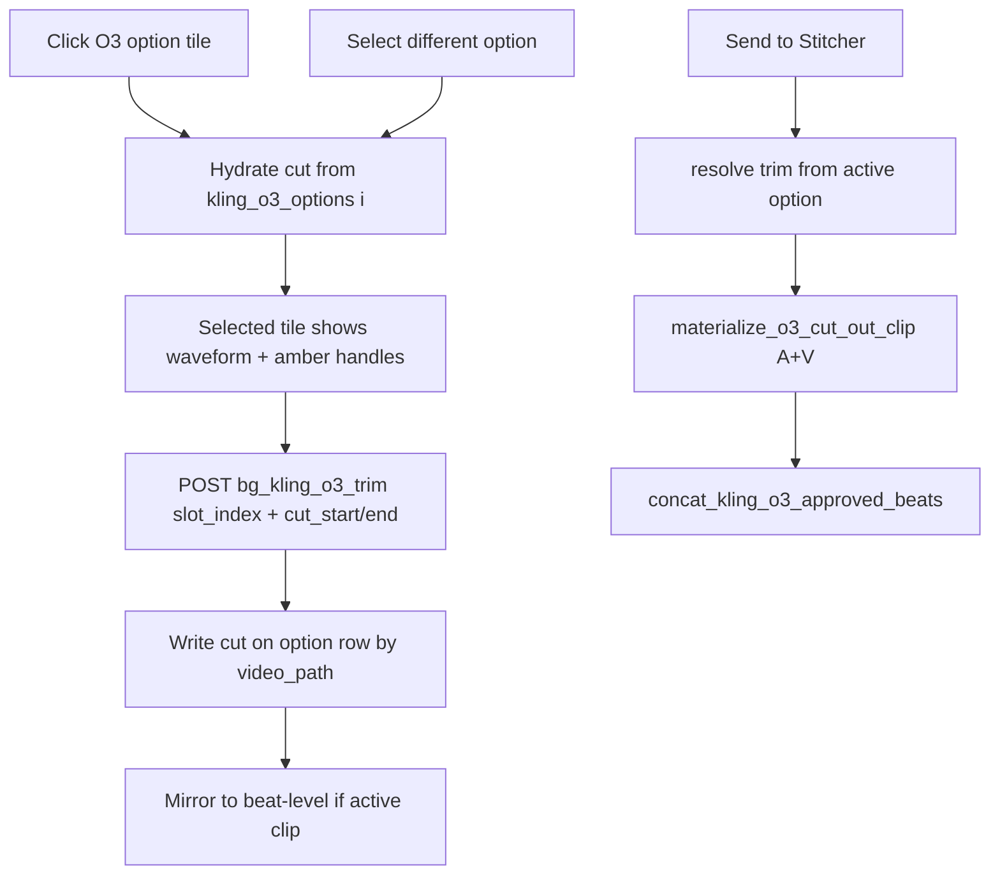

# Beat Gen — Per-Option O3 Cut Trim (Phase A/B Parity) — Tech Spec v1

**Status:** Draft — awaiting Kim sign-off  
**Owner:** mindfulnest-tooling (`storyboard-v2`, `beat_generator.py`, `server_handlers/background.py`)  
**Repo:** `~/Projects/mindfulnest-tooling` (not MindfulNest app)  
**Deploy path:** mirror tooling → Dropbox `Production/tools/` + storyboard `npm run build` → restart `production_server.py` on `:5111`

---

## Problem statement

Operators trim Kling O3 clips in Beat Gen to remove dead air, bad takes, or interior junk. Today:

| Gap | Impact |
|-----|--------|
| Trim is **beat-level** (`kling_o3_trim_start` / `kling_o3_trim_back`) | Switching option 0 → 1 → 0 **loses** prior trims (`clear_kling_o3_beat_trim` on select) |
| UI is **numeric front/back** only | No Phase A/B amber drag; cannot express **middle removal** |
| Trim semantics are **keep-window** (head/tail) | Phase A/B amber = **cut-out** region — different mental model |
| Controls only on **selected** tile | Correct per Kim — but persistence must survive option switches |

### Kim requirements (locked for this spec)

1. **Amber = removed** — same semantics as Phase A/B voice stem cut.
2. **Trim UI on selected tile only** — click option to select, then trim.
3. **Replace numeric trim row** — keep old controls in a restorable, zero-guesswork location.
4. **Simplest persistence** — no new option-key subsystem; trims must **not** be lost when switching between the 3 options.
5. **Send to Stitcher** — uses **currently selected** option + its trim; after export, **all** per-option trims remain in sidecar.

---

## Executive recommendation (post-debate consensus)

| Decision | Choice | Why |
|----------|--------|-----|
| Trim semantics | **Cut-out window** (`cut_start_s`, `cut_end_s`) | Matches Phase A/B amber; head/tail are degenerate cases (handle at edge) |
| UI surface | **Compact waveform under selected video only** | Reuses `WaveformTimeline` stem-cut handles verbatim; no new preview container |
| Persistence | **`cut_start_s` / `cut_end_s` on each `kling_o3_options[]` row** | Rides existing array merge; keyed by `video_path` identity |
| API | Extend `bg_kling_o3_trim` with `slot_index` + cut fields | No `option_key` required on wire |
| Beat-level fields | **Denormalized mirror** of active option’s cut | Keeps export/Accept-All paths stable with small resolver change |
| Apply timing | **Metadata until export** (current O3 pattern) | Materialize at Send to Stitcher + optional preview scratch |
| Numeric UI | Move to `BgO3TrimNumericControls.deprecated.tsx` + `BG_O3_TRIM_SHOW_NUMERIC=1` | One env flag restores without archaeology |

**Not chosen:** thumbnail-only overlay without waveform — rejected in debate (see §4).

---

## Architecture (target state)



---

## §4 — Four-agent debate (research-backed)

Four specialists reviewed Phase A/B (`WaveformTimeline`, `phases.py`) and Beat Gen (`BgTab`, `beat_generator.py`, `background.py`). Each section: **position → counter → resolution**.

---

### Round 1 — Waveform below video vs thumbnail overlay

**Agent A — UI/UX Lead**  
*Position:* Put a **single compact waveform row directly under the selected option’s `<video>`** (inside the same `mn-bg-option` card). Reuse `WaveformTimeline` with `stemCutEditable`, `stemCutStartMs`, `stemCutEndMs`, `onStemCutChange`. Enter trim automatically when a video option is selected (no separate “Trim voice stem” button — Beat Gen tiles are already explicit selection).

*Counter (Agent B — Backend):* Waveform needs an audio source. Kling O3 MP4 has audio — extract via existing `/files?path=` URL; WaveSurfer loads it. No new endpoint.

*Counter (Agent C — Durability):* Waveform adds ~80px height to **one** card when selected. Kim said “no change otherwise” — this is visible layout change on selection only, not a new container.

*Counter (Agent D — Operator):* Thumbnail overlay without waveform is imprecise on 5–10s clips; Phase A/B trained operators on waveform + amber.

**Resolution:** **Waveform-under-selected-video wins.** Thumbnail overlay alone loses precision and duplicates handle math without reuse. Waveform appears **only on selected tile with video** — other two tiles unchanged.

| Approach | Effort | Phase parity | Layout impact |
|----------|--------|--------------|---------------|
| Thumbnail overlay only | Medium-high (new component) | Low | Minimal |
| **Waveform under selected video** | **Medium (reuse)** | **High** | **+1 row on selected tile** |
| Waveform under all 3 always | Low reuse cost | High | Violates “no change otherwise” |

---

### Round 2 — Cut-out (amber) vs extend head/tail trim

**Agent B — Backend/FFmpeg**  
*Position:* Kim wants amber = removed. Phase A/B uses `cut_start_s` / `cut_end_s` (region to remove). Beat Gen today uses `trim_start` + `trim_back` (keep middle). **Do not reinterpret** head/tail fields as amber — operators with saved trims would get wrong exports.

*Counter (Agent A):* Could map amber box to front/back keep window instead — smaller backend change.

*Counter (Agent D):* Operator intent is “remove this dead section in the middle,” which head/tail cannot express in one gesture.

*Counter (Agent C):* `_materialize_cut_out_audio` in `phases.py` already implements head / tail / **middle** for audio. Video needs parallel `materialize_o3_cut_out_clip()` with `trim`+`setpts` on **both** streams and `concat=n=2:v=1:a=1`, re-encode x264/aac like `materialize_kling_o3_trimmed_clip`.

**Resolution:** **New cut-out fields** on options:

```json
"cut_start_s": 1.2,
"cut_end_s": 3.8
```

Meaning: remove `[cut_start_s, cut_end_s)` from the clip. Degenerate cases:

| Handles | Effect |
|---------|--------|
| `cut_start_s ≈ 0` | Remove head (keep tail) |
| `cut_end_s ≈ duration` | Remove tail (keep head) |
| Interior window | Remove middle (concat head + tail) |

**Legacy:** Keep `kling_o3_trim_start` / `kling_o3_trim_back` read-only for old sidecars until migration helper runs; new UI writes cut fields only. `heal_invalid_o3_cut()` clears cut when window invalid for clip duration.

---

### Round 3 — Per-option persistence (simplest schema)

**Agent C — Durability**  
*Position:* Store `cut_start_s` / `cut_end_s` **on each `kling_o3_options[]` dict** whose `video_path` identifies the clip. Whole array already in `SIDECAR_MERGE_PRESERVE_FIELDS` — no new top-level preserve keys.

*Counter (Agent B):* `slot_index` reorders when g6 arrives — must not be sole identity. Trim binds to **`video_path`** on the option row; `slot_index` is wire/UI index only.

*Counter (Agent A):* Parallel array `kling_o3_option_cuts[3]` is simpler to read — rejected: drifts from `video_path` on reconcile.

*Counter (Agent D):* On `bg_select_o3_video`, **replace** `clear_kling_o3_beat_trim()` with **hydrate**:

```python
opt = find_option_by_video_path(beat, video_path)
if opt and opt has cut fields:
    mirror cut to beat-level cache
else:
    clear beat-level cut cache
heal_invalid_o3_cut(beat)
```

**Resolution:** Per-option cut on option rows + beat-level mirror for active clip. **`slot_index` on API** resolves which row to write when UI trims selected tile.

---

### Round 4 — Apply timing, stitcher, and numeric UI retirement

**Agent D — Operator**  
*Position:* Two-step like Phase A/B: (1) drag handles persist cut selection to sidecar; (2) **Apply Cut** button runs preview/export materialization. Do **not** bake into source MP4 on Apply (except still-insert existing bake path).

*Counter (Agent B):* Metadata-only + materialize at `_kling_o3_export_clip_path` matches today’s Send to Stitcher durability.

*Counter (Agent C):* After stitcher export, sidecar must remain untouched — export reads trim, writes stitch slot file, does not clear option cuts.

*Counter (Agent A):* Numeric row removal: extract current `mn-bg-o3-trim-controls` block to:

```
storyboard-v2/src/components/bg/BgO3TrimNumericControls.deprecated.tsx
```

Restore instructions (in file header comment):

1. Set `localStorage.BG_O3_TRIM_SHOW_NUMERIC = '1'` or build-time `VITE_BG_O3_TRIM_SHOW_NUMERIC=1`
2. Import and render `<BgO3TrimNumericControls />` in `BgOptionTile` when flag true
3. No server changes required — numeric path can call same API with cut→legacy conversion if needed

**Resolution:** Persist on handle release (patch); **Apply Cut** triggers preview scratch MP4; Send to Stitcher materializes active option cut. Numeric UI deprecated behind flag.

---

## Data contract

### Sidecar — per option (`kling_o3_options[]`)

| Field | Type | Meaning |
|-------|------|---------|
| `cut_start_s` | float, optional | Start of region **to remove** (seconds) |
| `cut_end_s` | float, optional | End of region **to remove** (seconds) |
| *(unchanged)* | `video_path`, `key`, `slot_index`, … | Identity + layout |

**Inactive cut:** omit both fields, or `cut_start_s: 0` and `cut_end_s: 0`, or `cut_end_s <= cut_start_s + 0.25` (match `MIN_STEM_CUT_MS` = 250ms).

### Sidecar — beat-level cache (active clip only)

| Field | Type | Meaning |
|-------|------|---------|
| `kling_o3_cut_start_s` | float | Mirror of active option |
| `kling_o3_cut_end_s` | float | Mirror of active option |

Legacy `kling_o3_trim_start` / `kling_o3_trim_back` remain in preserve lists for backward compatibility; resolver prefers cut fields when present.

### API — `POST /api/bg/kling-o3-trim`

**Request (extended):**

```json
{
  "beat_id": "bg_arc1_event2_pre_beat_18",
  "slot_index": 1,
  "cut_start_s": 1.2,
  "cut_end_s": 3.8,
  "clear": false,
  "preview_only": false,
  "apply_cut": false
}
```

| Field | Required | Notes |
|-------|----------|-------|
| `beat_id` | yes | |
| `slot_index` | yes when writing cut | 0–2 UI slot |
| `cut_start_s` / `cut_end_s` | when setting cut | Region to remove |
| `clear` | optional | Clears cut on resolved option |
| `preview_only` | optional | Scratch preview MP4 only |
| `apply_cut` | optional | Force materialized scratch (UI “Apply Cut” button) |

**Response:**

```json
{
  "ok": true,
  "cut_start_s": 1.2,
  "cut_end_s": 3.8,
  "raw_duration_s": 8.04,
  "effective_duration_s": 5.64,
  "preview_video_url": "/files?path=..._ui_preview.mp4"
}
```

### Scratch token

Extend `kling_o3_trim_scratch_token(beat, option)`:

```
{beat_id}_g{gen}_{sha1(video_path)[:8]}_c{cut_start}_c{cut_end}_ui_preview.mp4
```

Prevents collision when two options on same beat have different cuts.

---

## FFmpeg — `materialize_o3_cut_out_clip`

New function in `beat_generator.py`, modeled on `phases._materialize_cut_out_audio`:

| Case | Strategy |
|------|----------|
| No active cut | Copy source |
| Head removal (`cut_start ≈ 0`) | `-ss cut_end` re-encode |
| Tail removal (`cut_end ≈ dur`) | `-t cut_start` re-encode |
| Middle removal | `filter_complex`: video `trim`+`setpts` + audio `atrim`+`asetpts`, `concat=n=2:v=1:a=1`, x264/aac |

Wire into:

- `_kling_o3_export_clip_path` (Send to Stitcher)
- `handle_bg_kling_o3_trim` preview path
- `heal_invalid_o3_cut` on load / select / session reconcile

**Order of operations:** If legacy head/tail trim exists on old sidecar, migration converts to equivalent cut-out once; new UI does not write head/tail.

---

## UI specification

### `BgOptionTile` (selected + has video)

```
┌─────────────────────────────┐
│  <video> 16:9               │
├─────────────────────────────┤
│  WaveformTimeline           │  ← only when selected
│  [amber cut block + handles]│
├─────────────────────────────┤
│  [Apply Cut] [Clear] [Preview]│  ← compact toolbar, Phase-style
└─────────────────────────────┘
```

**Behavior:**

1. Click tile → select O3 option (existing) → hydrate cut from option row → show waveform.
2. Drag gold handles → amber region = remove; draft while dragging; persist `cut_*` on pointer-up (debounced PATCH).
3. **Apply Cut** → `apply_cut: true` → scratch preview; toast with effective duration.
4. **Clear** → `clear: true` on that slot.
5. **Preview** → play scratch or seek linked video to kept regions (optional v1: scratch only).

**Reuse:**

- `WaveformTimeline` props: `stemCutStartMs`, `stemCutEndMs`, `stemCutEditable={selected}`, `onStemCutChange`
- CSS: `.mn-waveform-stem-trim-block`, `.mn-waveform-stem-trim-handle` (already in `app.css`)
- New wrapper: `BgO3CutWaveform.tsx` — loads audio from option `video_path` via `/files?path=`

**Not shown:** numeric `mn-bg-o3-trim-controls` (moved to deprecated file).

### `BgTab` state wiring

```tsx
// Per tile — read from option row, not beat-level
cutStartS={opt?.cut_start_s ?? 0}
cutEndS={opt?.cut_end_s ?? 0}

onApplyO3Cut(beatId, slotIndex, cutStartS, cutEndS, opts)
```

---

## Server touch points (implementation order)

| # | File | Change |
|---|------|--------|
| 1 | `beat_generator.py` | `materialize_o3_cut_out_clip`, `resolve_o3_cut_window`, `set_o3_option_cut`, `find_option_by_video_path`, `heal_invalid_o3_cut`, update `_kling_o3_export_clip_path` |
| 2 | `server_handlers/background.py` | `handle_bg_kling_o3_trim`: accept `slot_index`, cut fields; write option row + mirror; `handle_bg_select_o3_video`: hydrate not clear |
| 3 | `storyboard-v2/.../BgO3CutWaveform.tsx` | New thin wrapper |
| 4 | `storyboard-v2/.../BgTab.tsx` | Wire waveform + toolbar; remove inline numeric block |
| 5 | `storyboard-v2/.../BgO3TrimNumericControls.deprecated.tsx` | Extracted legacy UI + restore header |
| 6 | `tests/test_kling_o3_trim_durability.py` | Per-option persistence + export uses active cut only |
| 7 | `tests/test_o3_cut_out_clip.py` | **New** — ffmpeg middle/head/tail on fixture mp4 |

---

## Test plan (acceptance)

| # | Scenario | Expected |
|---|----------|----------|
| T1 | Trim option 0 (middle cut), select option 1, re-select 0 | Option 0 cut restored from sidecar |
| T2 | Trim option 1 only; Send to Stitcher with option 0 selected | Export uses option 0 cut (or none), not option 1 |
| T3 | Trim option 2; select option 2; Send to Stitcher | Export duration = raw − (cut_end − cut_start) |
| T4 | After stitcher export | All three option cuts still in sidecar |
| T5 | Re-extract beats | `kling_o3_options` cuts preserved (merge) |
| T6 | Invalid cut (cut_end > duration) | `heal_invalid_o3_cut` clears on load |
| T7 | Middle cut 1.0–3.0 on 8s clip | ffmpeg output ≈ 6s ±0.1, A/V probe ok |
| T8 | `BG_O3_TRIM_SHOW_NUMERIC=1` | Numeric row renders; API still works |

---

## Risks and mitigations

| Risk | Mitigation |
|------|------------|
| Middle-cut visual jump at splice | Expected — same as Phase stem cut; no crossfade in v1 |
| A/V desync at concat join | Re-encode both streams with `setpts`/`asetpts`; contract test with ffprobe |
| Shorter beat shifts stitcher fades | Document; duration from materialized export (existing behavior) |
| Legacy head/tail trims on disk | One-time `migrate_trim_to_cut_on_read` in session reconcile |
| Waveform load failure | Toast + fallback “Apply Cut disabled until audio loads” |
| Dropbox deploy drift | `verify_tooling_dropbox_parity.py` + restart proof |

---

## Effort estimate

| Layer | Days |
|-------|------|
| Backend cut-out ffmpeg + resolver | 1–1.5 |
| API + select hydrate + heal | 0.5–1 |
| UI waveform wrapper + toolbar | 1–1.5 |
| Tests + deploy smoke | 0.5–1 |
| **Total** | **~3–5 days** |

---

## Open questions for Kim (non-blocking defaults in parentheses)

1. **Auto-enter trim on select** vs explicit “Trim clip” button? *(Default: show waveform whenever selected video tile is active.)*
2. **Persist on every handle release** vs only on Apply Cut? *(Default: persist on release like Phase A/B; Apply Cut = preview/materialize.)*
3. **Migrate existing `kling_o3_trim_start/back`** to cut equivalents automatically? *(Default: yes on read for active option only.)*

---

## Summary answer: “Can we do that simply?”

**Yes — with one intentional scope line:** simple persistence is **cut fields on each `kling_o3_options` row** + hydrate on select (not a new option-key system). Phase A/B parity requires **cut-out ffmpeg for video**, not reuse of today’s head/tail-only trim. The **simplest UI path** is a **waveform under the selected thumbnail** (reusing `WaveformTimeline`), not a thumbnail-only overlay — slightly more vertical space on one card, but far less custom code and matches operator muscle memory.

---

## References (code)

| Area | Path |
|------|------|
| Phase A/B amber UI | `storyboard-v2/src/components/phase/WaveformTimeline.tsx` |
| Phase A/B apply cut | `server_handlers/phases.py` → `_materialize_cut_out_audio` |
| Beat Gen tiles | `storyboard-v2/src/components/BgTab.tsx` → `BgOptionTile` |
| O3 trim handler | `server_handlers/background.py` → `handle_bg_kling_o3_trim` |
| O3 export | `beat_generator.py` → `_kling_o3_export_clip_path`, `concat_kling_o3_approved_beats` |
| Select clears trim today | `background.py` → `handle_bg_select_o3_video` ~L5393 |
| Durability tests | `tests/test_kling_o3_trim_durability.py` |
