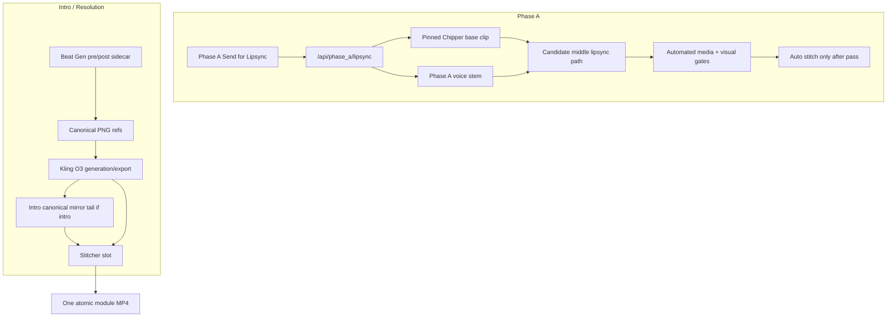

# Chipper Video Reliability Spec v1

Status: ACTIVE DRAFT  
Date: 2026-06-09  
Scope: Chipper wing/hand-safe video generation for Phase A, intro, and resolution  
Enforcement goal: direct verification, source parity, automated QA gates, and explicit human review packets

---

## 1. Purpose

This spec exists because recent Chipper work exposed a process failure: generated files and metadata were treated as proof that the output was good. That is not sufficient for Chipper.

The goal is a repeatable production process where:

1. Chipper wing/hands are either not shown or shown as approved feather-tip wings.
2. Chipper has no human hands, fingers, claws, teeth, duplicate body, or hallucinated anatomy.
3. Phase A lipsync does not produce sleepy eyes, choppy joins, or audio drift.
4. Intro and resolution Chipper beats cannot regress because an Element, ref image, prompt, or deployed source changed silently.
5. No expensive generation or stitch/export step is trusted until the relevant assumptions are directly verified.

This spec is intentionally not based on chat memory. Claims are either tied to inspected files/artifacts or marked as disputed/unknown.

---

## 2. Source Of Truth Policy

There are four separate truth layers. The system is unreliable unless all four are reconciled before generation.

| Layer | Meaning | Current status | Required rule |
|---|---|---|---|
| Tooling git | Source that should be committed and reviewed | Diverged from Dropbox for Phase A and O3 paths | Must be reconciled before deploy |
| Dropbox Production | Runtime source and data used by Storyboard server | Contains operational code/assets not fully represented in git | Must be audited before every pipeline claim |
| Event state/assets | `Event_1/production_state.json`, sidecars, MP4s, refs | Contains the active pins and latest run outputs | Must drive preflight checks |
| Generated artifacts | Run dirs, manifests, audits, QA frames, assembled clips | Some audits are metadata-only | Must not be treated as visual QA proof |

Do not call a pipeline "locked" unless:

1. Tooling git and Dropbox runtime source agree for that pipeline.
2. The operator-facing docs agree with the active code.
3. The state fields point at the expected assets.
4. Automated gates verify more than file existence.

---

## 3. Evidence Register

| Claim | Status | Evidence |
|---|---|---|
| Dropbox runtime Phase A is ByteDance-based when a base clip exists | Verified | `/Users/kimberlysmith/Library/CloudStorage/Dropbox/Claude Mindfulnest Project Files/Production/tools/server_handlers/phases.py` routes `POST /api/phase_a/lipsync` to `run_phase_a_base_clip_bytedance_lipsync` |
| `mindfulnest-tooling` Phase A handler differs from Dropbox | Verified | `/Users/kimberlysmith/Projects/mindfulnest-tooling/Production/tools/server_handlers/phases.py` routes base-clip Phase A to Kling `run_phase_a_base_clip_lipsync` |
| Current Event 1 state points at chained ByteDance output | Verified | `/Users/kimberlysmith/Library/CloudStorage/Dropbox/Claude Mindfulnest Project Files/Production/Event_1/production_state.json` has `phase_a_lipsync_method: base_clip_bytedance_chained_v1` and `phase_a_lipsync_file: phase_a_lipsync_20260609-205720.mp4` |
| Current chained ByteDance seed video can freeze frames | Verified | `/Users/kimberlysmith/Library/CloudStorage/Dropbox/Claude Mindfulnest Project Files/Production/tools/phase_a_chipper_bytedance_lipsync.py` uses `tpad=stop_mode=clone` in `build_chained_video_from_gap_end` |
| Current Phase A audit is not visual QA | Verified | `/Users/kimberlysmith/Library/CloudStorage/Dropbox/Claude Mindfulnest Project Files/Production/scripts/audit_phase_a_chained_run.py` checks manifests, method flags, chunks, state, and loose duration drift, not eyes/seams/wing integrity |
| Chipper active Element is feather-tip/no-hands | Verified | `/Users/kimberlysmith/Library/CloudStorage/Dropbox/Claude Mindfulnest Project Files/Production/character_subjects.json` and `/Users/kimberlysmith/Projects/mindfulnest-tooling/Production/character_subjects.json` both use `312987294498500` with canonical neutral frontal and branch refer image |
| Dropbox has extra Chipper Element guard code | Verified | Dropbox `phase_a_chipper_lipsync_base.py` has `assert_chipper_feather_element`; tooling copy lacks those symbols |
| Intro operational state uses Beat Gen/Kling O3 artifacts | Verified | `/Users/kimberlysmith/Library/CloudStorage/Dropbox/Claude Mindfulnest Project Files/Production/beat_generator_state.json`, `Event_1/kling_o3_clips/`, and `Event_1/assembled/intro_kling_o3_*.mp4` |
| Intro canonical mirror tail is frozen to a single canonical variant | Verified | `/Users/kimberlysmith/Library/CloudStorage/Dropbox/Claude Mindfulnest Project Files/Production/templates/chipper_teleport_intro/canonical_registry.json` has `single_canonical: true` and slot 0 |
| Kling O3 source code is missing from checked-in tooling | Verified unknown/blocker | Direct source search found O3 state/artifacts in Dropbox but no matching `kling_o3` implementation in checked-in tooling source |
| Resolution completion path is fully O3-only | Unknown | `beat_generator_state.json` shows mixed `kling_o3_*` fields and legacy resolution clips |

---

## 4. Do Not Proceed Conditions

Any of these must block paid generation, state mutation to `done`, stitch export, or deploy:

1. Dropbox runtime source and tooling git differ for `server_handlers/phases.py`, Phase A lipsync routing, or Chipper Element guards.
2. A doc says Phase A is Kling while active runtime is ByteDance, or vice versa.
3. The active Chipper Element is not `312987294498500`.
4. Chipper `refer_images` include anatomy sheets, pose sheets, hand sheets, or any non-canonical gesture-heavy reference.
5. Phase A base clip hash equals a known bad/claw archive hash.
6. Phase A run method is `base_clip_bytedance_chained_v1` and no replacement visual gate explicitly approves the run.
7. Intro/resolution Chipper beat uses a non-canonical character reference.
8. Canonical mirror tail is scheduled for rebuild without a specific approval packet.
9. A metadata-only audit is the only evidence offered for visual quality.
10. The O3 production code used for intro/resolution cannot be found, restored, or reimplemented in reviewed tooling source.

---

## 5. Pipeline Map



---

## 6. Phase A Reliability Contract

### 6.1 Current Runtime Truth

The active Dropbox runtime path for base-clip Phase A is:

1. `POST /api/phase_a/lipsync`
2. Resolve `base_clip_id` from request, `phase_a_chipper_sitting_clip_id`, or `phase_a_empty_desk_bg_id`
3. Resolve MP4 from `Production/assets/lipsync_bases/`
4. Run `phase_a_middle_permanent.run_phase_a_base_clip_bytedance_lipsync`
5. Run ByteDance chunks through `phase_a_chipper_bytedance_lipsync.run_bytedance_tight_lipsync`
6. Upscale/pad/trim
7. Write `phase_a_lipsync_*`
8. Auto-stitch to `phase_a_stitched_*`
9. Mutate state to `done`

This path is not reliable enough as the final production contract because the current chained implementation can clone a gap-tail frame into the seed video. If that tail frame contains a blink or bad pose, the generated chunk can inherit the defect.

### 6.2 Disqualified Default

`base_clip_bytedance_chained_v1` is disqualified as the default Phase A production method.

Reason:

```text
phase_a_chipper_bytedance_lipsync.build_chained_video_from_gap_end
  -> extracts last 0.5s of prior idle gap
  -> pads the remainder with tpad=stop_mode=clone
```

That is a structural reason for sleepy/frozen frames. It can pass duration and manifest audits while failing human-visible output.

### 6.3 Candidate Replacement Paths

All candidate paths must pass the same gates before adoption.

| Candidate | Purpose | Current status | Gate requirement |
|---|---|---|---|
| Continuous-driver ByteDance | Preserve wing pixels while avoiding frozen chained seeds | Recommended first candidate | Must use moving driver windows, no `tpad=clone` speech seeds |
| Non-chained ByteDance with overlap | Simpler comparison baseline | Existing helpers partly present | Must preserve pauses and avoid hard seam spikes |
| Kling base-clip lipsync | Smooth single pass if anatomy holds | Present in tooling handler/doc, risky from prior bird results | Must pass wing/hand and teeth gates on short proof and full run |
| Rhubarb/rigged beak | Deterministic no-AI lipsync cost | Tooling has Rhubarb processor and docs; prior compositing quality concerns remain | Must pass visual quality, not just phoneme timing |

### 6.4 Phase A Button Contract

The Phase A button may mark a run `done` only after:

1. Preflight gates pass.
2. Middle generation completes.
3. Media gates pass.
4. Visual/perceptual gates pass.
5. Human review packet is generated.
6. Stitch succeeds.
7. Stitched preview path is written.

State mutation rule:

| State field | Allowed timing |
|---|---|
| `phase_a_lipsync_status: running` | When job starts |
| `phase_a_lipsync_file` | After middle file exists and media gates pass |
| `phase_a_lipsync_status: qa_failed` | If media/visual gates fail |
| `phase_a_lipsync_status: done` | Only after middle gates pass and stitch succeeds |
| `phase_a_stitched_file` | Only after approved middle is stitched |

Auto-stitch must not run immediately after raw middle output unless the middle passes gates.

---

## 7. Intro And Resolution Reliability Contract

### 7.1 Current Operational Truth

Operational Dropbox artifacts show intro/resolution work has been using Beat Gen sidecars, Kling O3 clips, canonical PNG refs, and Stitcher export. Intro also uses a single frozen canonical mirror tail.

This is safer than Phase A for Chipper because clips are shorter and anatomy is driven by PNG refs, but it is not automatically safe.

### 7.2 Source Recovery Requirement

The operational O3 path is not fully represented in checked-in tooling source. Before future intro/resolution work is called reliable, one of these must happen:

1. Recover the missing O3 source and tests into `mindfulnest-tooling`.
2. Reimplement the O3 export/source path from the verified spec and artifacts.
3. Mark O3 generation as manual/unsupported and use only the checked-in Storyboard scene assembly path.

Until then, O3 state/artifacts can be trusted as historical evidence, but not as a reproducible code path.

### 7.3 Chipper Beat Rules

For any future Chipper intro or resolution beat:

1. Use only canonical Chipper refs:
   - `Production/Chipper/poses/chipper_canonical_neutral.png`
   - `Production/Chipper/poses/chipper_canonical_branch.png`
   - `Production/Chipper/poses/chipper_mirror_teleport_studio.png` only for approved mirror-tail work
2. Never use anatomy sheets or pose sheets as character refs.
3. Add explicit prompt constraints when Chipper is visible:
   - "feather-tip wings only"
   - "wings folded at sides unless the approved reference shows otherwise"
   - "no human hands"
   - "no fingers"
   - "no claws"
   - "no hand-like gestures"
   - "tooth-free keratin beak"
4. Avoid ambiguous action words unless needed:
   - avoid "gestures toward camera"
   - avoid "flapping wings" for dialogue beats
   - avoid "holds" unless a reference clearly shows the approved pose

### 7.4 Canonical Mirror Tail Rules

The intro mirror tail is a preserved asset, not routine generation.

Do not rebuild it unless:

1. The current registry and manifest are backed up.
2. The Chipper refs are verified.
3. The speak source is verified.
4. The glass burst source is verified.
5. A before/after QA packet is generated.
6. The previous tail remains restorable.

---

## 8. QA Ladder

### 8.1 Preflight Gates

Run before any paid API call.

| Gate | Applies to | Pass condition |
|---|---|---|
| Source parity | All | Dropbox runtime and tooling git agree for touched pipeline files |
| Doc parity | All | Active docs match active code |
| Element ID | Chipper paths | Chipper element is `312987294498500` |
| Banned refs | Chipper paths | No anatomy/pose/hand refs |
| Base hash | Phase A | Base hash is known-good or explicitly approved |
| Voice stem | Phase A | `phase_a_voice_stem_file` exists |
| Bookends | Phase A | `phase_a_flyin_file` and `phase_a_flyout_file` exist |
| O3 source | Intro/resolution | O3 implementation is present or path is explicitly marked manual |
| Canonical tail lock | Intro | Registry points at approved single canonical tail |

### 8.2 Media Gates

Run immediately after generation, before stitch.

| Gate | Pass condition |
|---|---|
| Video stream | Output has a video stream |
| Audio stream | Lipsync output has an audio stream unless intentionally silent |
| Duration gap | Video/audio gap <= 100 ms for final middle and stitched preview |
| Resolution | Matches expected target or documented normalization target |
| FPS | Stable expected FPS |
| Non-empty frames | Keyframes decode at required timestamps |
| Manifest consistency | Sidecar method, output name, base hash, and state agree |
| API count | Spend accounting matches actual API calls, including multi-chunk ByteDance |

### 8.3 Visual/Perceptual Gates

These are required because media gates cannot detect "choppy mess" failures.

| Gate | Applies to | Required behavior |
|---|---|---|
| Eye/blink run | Phase A | No long closed-eye run during speech; max run threshold must be configurable |
| Seam spike | Chunked outputs | Frame-diff or optical-flow spike around each join below threshold |
| Non-mouth body drift | Chipper outputs | Body/wing/background outside mouth ROI stays within threshold |
| Wing/hand integrity | Chipper outputs | No detected/visible human hands, fingers, claws, or hand-like wing forms |
| Teeth check | Chipper outputs | No teeth/fangs/dental shapes |
| Duplicate character | O3 Chipper | Exactly one Chipper in frame |
| Lip timing packet | Lipsync outputs | Short review clip around high-energy speech plus waveform/audio alignment summary |

If a visual gate cannot be automated yet, the run must be labeled `needs_manual_visual_review`, not `done`.

### 8.4 Human Review Packet

Every Phase A full run must produce:

1. Manifest JSON
2. Audit JSON
3. Middle preview URL
4. Stitched preview URL if stitch ran
5. Keyframes from at least 12s, 15s, 17s, 19s, 22s, and 38s
6. Short clips around every chunk join
7. A summary of method, base hash, chunk count, gap count, audio duration, video duration, and A/V gap
8. Explicit status:
   - `pass`
   - `qa_failed`
   - `needs_manual_visual_review`
   - `blocked_source_drift`

---

## 9. Required Tests

### 9.1 Source/Drift Tests

Add tests or scripts that fail if:

1. Dropbox and tooling `server_handlers/phases.py` disagree on Phase A lipsync routing.
2. Dropbox and tooling `phase_a_chipper_lipsync_base.py` disagree on Chipper Element guard symbols.
3. Active Phase A doc vendor does not match active handler vendor.
4. O3 docs claim a source path that is absent from tooling.

### 9.2 Phase A Tests

Add or update tests for:

1. Chained ByteDance cannot be selected as default production method.
2. `build_chained_video_from_gap_end` is not used for production speech seeds.
3. Duration gap threshold is <= 100 ms, not 3 seconds.
4. Audit fails if `chained_chunks` is true and no explicit override is present.
5. Spend accounting reflects actual ByteDance chunk count.
6. `POST /api/phase_a/lipsync` integration route records the same method it actually ran.

### 9.3 Chipper Ref Tests

Add tests for:

1. Chipper Element ID is `312987294498500`.
2. Chipper `refer_images` allowlist contains only approved canonical refs.
3. O3 Chipper beat refs are canonical.
4. Prompt contains wing/hand guard boilerplate for Chipper beats.
5. Anatomy sheets and pose sheets are banned from Element and O3 beat refs.

### 9.4 Rhubarb/Deterministic Path Tests

Existing Rhubarb tests verify phoneme lookup and sprite resolution. Additional gates are required before Rhubarb can be production default:

1. Composite output duration equals audio duration within threshold.
2. Overlay region is stable and does not create ghost/double-bird artifacts.
3. Beak sprites blend acceptably at the target resolution.
4. Static-body limitation is acknowledged in the review packet.

### 9.5 Current QA Coverage Matrix

Direct QA verification found that current coverage is strongest for metadata, routing, and ffmpeg structure. It is not visual/perceptual QA.

| Tier | Current reuse | Required addition |
|---|---|---|
| Tier 0: Phase A metadata and routing | `test_phase_a_av_post.py`, `test_phase_a_stitch_resolve.py`, `test_phase_a_idle_lipsync.py`, Playwright Phase A routing specs | Bring Dropbox-only ByteDance gap/chaining tests into tooling git and CI |
| Tier 0: Stitcher slots and assembly contracts | `test_stitch_canonical_job.py`, `test_beat_is_assemblable.py`, `verify_stitcher_lockin_20260528.py` | Keep slot-order checks in smoke CI |
| Tier 1: Intro/resolution export | `test_preview_stitched.py`, `test_preview_stitched_real_ffmpeg.py`, `test_per_beat_fade_override.py` | Recreate missing canonical-tail/O3 tests referenced only by stale pytest cache |
| Tier 2: Post-stitch metadata | Existing ffprobe patterns in tests and audit scripts | Add a thin exported-MP4 audit for stream presence, 1280x720/H.264/yuv420p/24fps, duration sum, and bitrate/size |
| Tier 3: Perceptual QA | Fixed-time PNG extraction only | Add golden-frame diff, seam/luma checks, eye/blink checks, body-drift checks, or require manual visual acceptance |

Files that must not be mistaken for Chipper video QA include app Jest tests, LD/process audits, patch invariant audits, and geometry-only magic path tests.

---

## 10. Operator Workflow

### 10.1 Phase A

1. Preflight source parity and state/assets.
2. Run short proof clip for the selected candidate method.
3. Run automated media and visual gates on proof clip.
4. If proof passes, run full middle.
5. Run media and visual gates on full middle.
6. Generate review packet.
7. Stitch only after gates pass or manual review explicitly approves.
8. Export to Stitcher only from approved stitched preview.

### 10.2 Intro/Resolution

1. Verify O3 source path exists or mark O3 as manual/unsupported.
2. Verify each Chipper beat uses canonical refs.
3. Verify Chipper prompt guards.
4. Submit one Chipper beat first, not a batch.
5. Review first/last frames and short clip.
6. Lock accepted refs.
7. Batch only after the single-beat proof passes.
8. Do not rebuild canonical mirror tail unless the mirror-tail rebuild protocol is followed.

---

## 11. Implementation Backlog

P0 blockers:

1. Reconcile Dropbox and tooling `server_handlers/phases.py`.
2. Reconcile Dropbox and tooling Phase A docs.
3. Port Dropbox-only `assert_chipper_feather_element` to tooling or replace it with a shared guard.
4. Recover or reimplement O3 source and tests in tooling, or mark O3 generation as manual.
5. Disable `base_clip_bytedance_chained_v1` as the default Phase A production method.

P1 gates:

1. Add source parity checks.
2. Tighten A/V duration drift threshold.
3. Add Phase A route integration test.
4. Add Chipper ref allowlist tests.
5. Add review packet generation before stitch/export.
6. Recreate intro canonical-tail and Kling O3 export tests that are referenced only in stale pytest cache.
7. Add post-stitch exported-MP4 metadata audit.

P2 visual automation:

1. Eye/blink detector.
2. Seam/frame-diff detector.
3. Non-mouth body-drift detector.
4. Wing/hand integrity detector or structured manual review checklist.
5. Teeth/beak anomaly detector.

---

## 12. Acceptance Criteria

The reliability program is complete only when:

1. The checked-in tooling repo can reproduce the deployed production behavior.
2. Dropbox deployment cannot silently change Phase A vendor or method.
3. Phase A cannot mark `done` before media and visual gates pass.
4. Intro/resolution cannot regenerate Chipper with non-canonical refs.
5. Canonical mirror tail cannot be rebuilt accidentally.
6. Metadata-only audits are never presented as visual quality proof.
7. Every generated run has a review packet.
8. Every major claim in this spec remains tied to a file, state record, run artifact, or explicitly marked unknown.

---

## 13. Current Decision

Until the P0 blockers are fixed:

1. Do not treat current Phase A output as production-approved.
2. Do not deploy `mindfulnest-tooling` over Dropbox without resolving Phase A handler drift.
3. Do not batch future intro/resolution Chipper beats.
4. Do not rebuild the canonical mirror tail.
5. Do not call a new Chipper pipeline reliable until it passes this spec's QA ladder.
