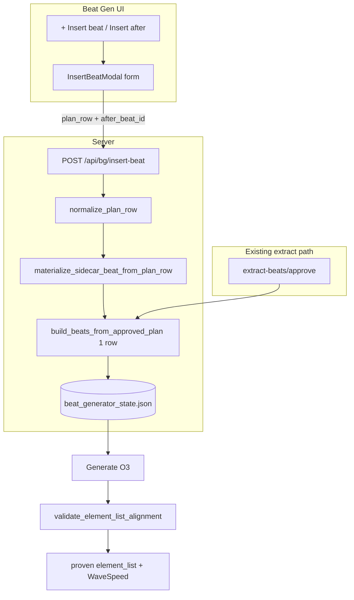

# Insert Beat (Form-First) — Tech Spec v1

**Status:** Implemented — form-first insert (`fa1777b`); char-ref gate + durability gates in follow-up commit on this branch  
**Owner:** mindfulnest-tooling  
**Incident driver:** Event 2 Beat 13 (`bg_arc1_event2_pre_beat_27`) — manual insert never shared extract wiring; 18+ O3 gens with male voice  
**User-facing promise:** **No half-built beats.** Operator fills a short form; the server creates a sidecar row through the **same materialization path as Claude extract** — then Generate behaves identically to Beat 18.

---

## Problem statement

Today, **+ Add empty beat** creates a sidecar row immediately via `create_blank_bg_beat()`:

- `speaker` is empty at birth  
- `apply_kling_o3_defaults_to_beat()` runs against an empty speaker → `"Character"` prompt shell  
- Operator fills speaker/dialogue later; backend never re-runs extract-equivalent materialization  
- Band-aids (`o3_voice_stack_pin`, char-ref copy, validation bypass) tried to patch the gap and failed  

**Extract beats** are born complete: speaker, dialogue, emotion, scene, refs, and prompt are set in one pass via `build_beats_from_approved_plan()`.

### Root cause (one line)

Two beat factories exist. Manual insert uses the wrong one.

### What we are not doing

- Patching blank rows with `wire_manual_insert_*` hooks (old three-phase spec)  
- Keeping `create_blank_bg_beat()` as a parallel pipeline  
- One-off sidecar surgery on poisoned `beat_27`  
- Treating emotion tags as voice identity  

---

## Design decision: Option B (form-first)

**Replace blank-row insert with a modal form.** The sidecar row is created **only when the form validates** and the server materializes through the shared builder.

| | Old (blank row) | New (form-first) |
|---|-----------------|------------------|
| Row created when | Click + | Form submit |
| Speaker at materialize | Often empty | Always set |
| Builder | `create_blank_bg_beat` | `build_beats_from_approved_plan` (single row) |
| Half-wired states | Yes | **No** |
| `manual_insert_v1` patches | Many | **Zero** |

---

## Goals

1. **One factory:** Every new dialogue beat row (extract batch or operator insert) comes from `build_beats_from_approved_plan()` or a thin wrapper around it.  
2. **Identical sidecar shape** before first Generate: speaker, dialogue, emotion, scene, `reference_image`, `bg_ref_image`, `kling_o3_prompt`, duration, pipeline — same fields extract produces.  
3. **Identical submit gates:** No `o3_voice_stack_pin` bypass; same `validate_element_list_alignment` for insert and extract.  
4. **Practice proof:** Recreate Beat 13 via form → one Generate → female Lorelai matching Beat 18.

## Non-goals

- Changing extract / approve flow  
- Claude author pass on every manual insert (v1 uses the same **no-Claude-prompt** branch extract uses when `prompt_by_index` is empty)  
- Re-registering Kling Elements (optional follow-up if proven contract still drifts)  
- Auto-migrating poisoned `beat_27` in place — operator deletes or ignores, inserts fresh  

---

## Invariants

1. **NO_BLANK_BEAT_ROWS_V1** — `POST /api/bg/insert-beat` rejects requests without validated `plan_row.speaker` and `plan_row.dialogue_text` (dialogue beats).  
2. **UNIFIED_MATERIALIZE_V1** — Insert path calls `materialize_sidecar_beat_from_plan_row()` which delegates to `build_beats_from_approved_plan()` for exactly one row.  
3. **NO_PIN_ON_INSERT_V1** — New inserts never write `o3_voice_stack_pin`. Registry `proven_o3_bind` is authority.  
4. **NO_BOX_LAW_ON_INSERT_V1** — System-built prompts never carry `o3_prompt_box_law` at creation.  
5. **FULL_VALIDATION_V1** — `validate_element_list_alignment()` never skips because of a pin.  
6. **PROVEN_ELEMENT_LIST_V1** — O3 submit replays registry proven triple when `proven_o3_bind` exists (`element_id`, `kling_voice_id`, `proven_element_name`).  
7. **DEPRECATE_BLANK_ADD_V1** — `create_blank_bg_beat` and `+ Add empty beat` removed; no code path creates speaker-empty O3 rows.

---

## Operator UX

### Entry points (both open the same modal)

1. Toolbar: **`+ Insert beat`** (replaces `+ Add empty beat`) — inserts after last beat in segment  
2. Per-card: **`Insert beat after`** (existing `onInsertAfter`) — modal opens with `after_beat_id` preset  

### Modal: **Insert beat**

| Field | Required | Notes |
|-------|----------|-------|
| Speaker | Yes | `KNOWN_SPEAKERS` dropdown; no blank option |
| Dialogue | Yes | Same textarea conventions as beat card |
| Emotion | No | Default `neutral` |
| Scene notes | No | Staging; humanized like extract |
| Beat type | Hidden v1 | Default `dialogue`; stage still = separate future spec |

**Actions:** Cancel | **Insert beat**

**On success:** Modal closes; new beat appears in list after anchor beat; toast shows `beat_id`; card is ready to Generate (no “pick speaker first” step).

**On validation error:** Inline + toast; **no sidecar write**.

### Empty segment copy

Update empty state: mention **Extract** or **Insert beat** — not “add empty beat”.

---

## Architecture



**Key property:** `build` node is shared. Insert and extract differ only in **plan row source** (operator form vs Claude plan).

---

## API

### New: `POST /api/bg/insert-beat`

**Request:**

```json
{
  "after_beat_id": "bg_arc1_event2_pre_beat_12",
  "segment": "event_2_pre",
  "plan_row": {
    "speaker": "Lorelai",
    "dialogue_text": "…",
    "emotion": "neutral",
    "scene_notes": "close-up head and torso, warm light",
    "beat_type": "dialogue"
  }
}
```

**Scope:** Same segment derivation and scope validation as current `handle_bg_add_beat` (client `segment` → sidecar `active_context` → scope fallback).

**Success `200`:**

```json
{
  "ok": true,
  "beat": { "...full sidecar beat..." },
  "segment": "event_2_pre",
  "arc_number": 1,
  "beat_id": "bg_arc1_event2_pre_beat_28"
}
```

**Errors:**

| Code | When |
|------|------|
| `INSERT_PLAN_INVALID` | Missing speaker/dialogue; speaker `Character`; normalization failed |
| `INSERT_SPEAKER_NOT_VOICE_READY` | Element speaker without registry voice bind (optional hard block v1) |
| `BG_SEGMENT_UNRESOLVED` | Same as today |
| Scope errors | Same as today |

**Sidecar lock:** `sidecar_file_lock()` for entire read → materialize → insert → write (same as add-beat fix 2026-06-14).

### Deprecated: `POST /api/bg/add-beat`

- **v1 implementation:** Return `410` with `INSERT_BEAT_FORM_REQUIRED` and message pointing to new endpoint  
- Remove `create_blank_bg_beat` call entirely  
- Update `endpoints.ts`: `bg_insert_beat` replaces `bg_add_beat`  

---

## Server implementation

### 1. `materialize_sidecar_beat_from_plan_row(...)`

**File:** `Production/tools/beat_generator.py`

```python
def materialize_sidecar_beat_from_plan_row(
    plan_row: dict,
    *,
    beat_id: str,
    arc_number: int,
    event_id: str,
    phase: str,
    prompt_by_index: dict[int, str] | None = None,
    beat_plan_source: str = "operator_insert_v1",
) -> dict:
    """Single-row extract-equivalent beat. Assigns explicit beat_id after build."""
```

**Steps:**

1. `normalize_plan_row(plan_row, beat_index=_synthetic_index)` via `beat_extract_policy`  
2. `built = build_beats_from_approved_plan([normalized], prompt_by_index or {}, ...)`  
3. Assert `len(built) == 1`  
4. `beat = built[0]`  
5. **Override** `beat["beat_id"] = beat_id` (preserve max+1 gap-safe ID scheme from current add-beat)  
6. Set `beat["beat_plan_source"] = beat_plan_source` (replaces `manual_insert_v1` for new rows)  
7. Set `beat["status"] = "draft"` (match extract, not `"new"`)  
8. **Do not set** `o3_voice_stack_pin`, `o3_prompt_box_law`  
9. For Element speakers with `proven_o3_bind`: char ref resolves via `align_beat_reference_to_element` inside builder (speaker known) — optionally **copy locked ref path** from `proven_from_beat_id` if align alone differs from proven beat (see § Proven stack)  
10. Return beat  

**Why override `beat_id`:** Current insert uses `max(existing_nums)+1`, not plan index. Extract uses plan index for ID. Insert keeps gap-safe numbering; builder uses synthetic index only for internal prompt header strings.

### 2. `handle_bg_insert_beat(h, body)`

**File:** `Production/tools/server_handlers/background.py`

Replace logic in `handle_bg_add_beat` with:

1. Resolve segment (unchanged)  
2. Parse `plan_row`; reject if not dict  
3. `normalize_plan_row` → collect warnings for response  
4. Validate speaker ≠ `""`, ≠ `Character` (dialogue beats)  
5. Validate dialogue non-empty (dialogue beats)  
6. Compute `new_beat_id` (unchanged max+1 logic)  
7. `new_beat = materialize_sidecar_beat_from_plan_row(...)`  
8. Insert after `after_beat_id` in segment beats list  
9. `write_sidecar`  
10. Return beat + warnings  

**Delete:** `create_blank_bg_beat()` usage. Function body may remain temporarily for legacy tests with deprecation warning, then removed.

### 3. Proven stack at materialize (Lorelai / Arlo)

When `reg.resolve_proven_o3_bind(speaker)` exists:

1. After materialize, assert `validate_proven_o3_element_submit(beat, speaker, element_id)` passes  
2. Copy `reference_image` from `proven_from_beat_id` sidecar row if present; set `reference_image_locked = True`  
3. Copy `bg_ref_image` from proven source if beat lacks locked bg  
4. Re-run **only** `apply_kling_o3_defaults_to_beat` if ref copy changed prompt inputs (speaker already set — safe)  

This is not a separate “manual insert hook”; it is **`finalize_proven_element_beat(beat, sidecar, speaker)`** called from materialize for **any** beat born with Element speaker (extract could call it too later; v1 minimum: insert path + shared helper).

### 4. Registry: `proven_element_name`

**File:** `Production/character_subjects.json`

Extend Lorelai `proven_o3_bind`:

```json
"proven_element_name": "Laurel"
```

Captured from approved female submit log (Beat 18 g7). `get_proven_element_list_entry(speaker)` returns this at O3 submit.

### 5. Validation: remove pin bypass

**File:** `Production/tools/kling_o3_prompt.py`

Remove early return in `validate_element_list_alignment()` when `o3_voice_stack_pin` present.

**File:** `Production/tools/beat_generator.py`

`resolve_o3_element_list_entry()` prefers proven registry entry over stale pin fields.

### 6. Generate path cleanup

**File:** `server_handlers/background.py` — `handle_bg_update_beat`

Remove insert-specific branches:

- `apply_proven_char_ref_from_pin_source` only when pin active  
- Stamping new `o3_voice_stack_pin` on manual insert  
- `o3_prompt_box_law` on auto-rebuild for `operator_insert_v1`  

Generate for insert beats uses **same** path as `claude_extract_v1` beats.

---

## Client implementation

### New: `InsertBeatModal.tsx`

- Props: `open`, `afterBeatId`, `segment`, `onClose`, `onInserted(beat)`  
- Fields: speaker select, dialogue textarea, emotion input, scene notes textarea  
- Submit → `pathappPatch(..., 'bg_insert_beat', { after_beat_id, segment, plan_row })`  
- `data-testid`: `bg-insert-modal`, `bg-insert-submit`, `bg-insert-speaker`, etc.

### `BgTab.tsx` changes

| Remove | Add |
|--------|-----|
| `onAddBeat` blank POST | `openInsertBeatModal(afterBeatId)` |
| `+ Add empty beat` button | `+ Insert beat` → opens modal |
| `bg_add_beat` endpoint usage | `bg_insert_beat` |

Keep `onInsertAfter={() => openInsertBeatModal(b.beat_id)}` on `BeatGenCard`.

### `endpoints.ts`

```typescript
bg_insert_beat: `${SERVER_BASE}/api/bg/insert-beat`,
```

Remove or alias `bg_add_beat` → 410 handler only.

---

## Sidecar field parity checklist

After successful insert, before Generate, beat must match extract-equivalent row:

| Field | Expected |
|-------|----------|
| `beat_plan_source` | `operator_insert_v1` |
| `pipeline` | `kling_o3_omni` |
| `speaker` | canonical (e.g. `Lorelai`) |
| `dialogue_text` | form value, normalized |
| `emotion` | form or `neutral` |
| `scene_notes` | form value, humanized |
| `kling_o3_prompt` | from `build_kling_o3_prompt` + normalize (not Character shell) |
| `reference_image` | aligned / proven copy, locked for Element |
| `bg_ref_image` | segment or proven copy |
| `kling_o3_duration` | resolved from prompt |
| `kling_o3_status` | `draft` |
| `o3_voice_stack_pin` | **absent** |
| `o3_prompt_box_law` | **absent** |

**pytest:** `assert insert_beat_fields == extract_beat_fields` modulo `beat_id`, `beat_plan_source`, dialogue text.

---

## Post-insert edits

| Edit | Behavior |
|------|----------|
| Dialogue / scene text | Existing `onUpdateBeatText` + prompt heal (same as extract) |
| Speaker change | **v1:** Disallow in UI after insert (show “Delete and re-insert to change speaker”) **or** call `materialize_sidecar_beat_from_plan_row` in place with new speaker — pick one at implement time; recommend **disallow** for simplicity |
| Char ref drop | Existing confirm modal; realign via `align_beat_reference_to_element` |

No second birth pipeline on speaker change.

---

## Legacy / migration

| Artifact | Action |
|----------|--------|
| `beat_27` (poisoned Beat 13) | Operator deletes or leaves archived; do not Generate |
| Existing `manual_insert_v1` rows | Keep in sidecar; optional `scripts/heal_legacy_manual_insert_beats.py` re-materializes via form values |
| `create_blank_bg_beat` | Delete after cutover |
| `MANUAL_INSERT_O3_PARITY_SPEC_v1.md` | Superseded by this doc |
| `patch_v49_add_beat_button.py` | Legacy HTML patch — do not extend |

---

## Test plan

### Unit (pytest)

| Test | Assert |
|------|--------|
| `test_insert_beat_rejects_empty_speaker` | 400, no sidecar change |
| `test_insert_beat_rejects_empty_dialogue` | 400 |
| `test_insert_beat_materializes_lorelai` | same prompt/ref shape as extract row for same dialogue |
| `test_insert_beat_id_gap_safe` | after delete beat_05, next id is max+1 |
| `test_insert_beat_sidecar_lock` | uses `sidecar_file_lock` |
| `test_add_beat_endpoint_deprecated` | 410 |
| `test_validate_alignment_no_pin_bypass` | errors with stale pin |
| `test_proven_element_list_uses_laurel` | Lorelai submit contract |
| `test_insert_vs_extract_field_parity` | deep equality on materialized fields |

### Integration (agent-run, Event_2)

1. Deploy + restart server  
2. Hard refresh `?event=Event_2`  
3. Open Insert modal after Beat 12  
4. Lorelai + Beat 13 dialogue + scene  
5. Insert → verify sidecar fields via session-state GET  
6. Generate once → job log alignment + proven element_list  
7. **Kim:** female voice matches Beat 18  

---

## Durability — never regress

Three layers lock this spec in place:

| Layer | What | When it runs |
|-------|------|----------------|
| **pytest** | `Production/tools/tests/test_insert_beat_form_first.py` — materialize parity, proven Laurel contract, insert handler wiring, char-ref gate sync, auto-register hook | `verify_o3_intro_contract.sh`, deploy step (d.6), CI-adjacent smoke |
| **Source guards** | `Production/scripts/verify_insert_beat_form_first_durability.sh` — greps ban blank rows, require `maybe_auto_register_beat_char_ref` on insert, forbid finalize sync-only-in-else | Agent/operator before merge; optional manual after backup restore |
| **Cursor rule** | `.cursor/rules/insert-beat-form-first.mdc` — one factory, banned pin/box_law, char-ref auto-register on insert | Every agent edit in mindfulnest-tooling |

**Do not remove** without replacing:

- `materialize_sidecar_beat_from_plan_row` → `build_beats_from_approved_plan`
- `finalize_proven_element_beat` + unconditional `sync_element_char_ref_status`
- `maybe_auto_register_beat_char_ref` on `handle_bg_insert_beat` (parity with drag-drop on `handle_bg_update_beat`)
- `410 INSERT_BEAT_FORM_REQUIRED` on legacy `add-beat`
- `InsertBeatModal` / `bg_insert_beat` (no `+ Add empty beat`)

**Char-ref parity contract:** Insert must behave like dropping char ref on an extract beat — gate fields (`element_char_ref_ok`, `element_char_ref_error`) persisted on sidecar before insert response returns.

---

## Practice playbook — recreate Beat 13

**Preconditions:** This spec implemented; storyboard build deployed; server live on Event_2.

1. Hard refresh Beat Gen (`localhost:5111/?event=Event_2`)  
2. *(Optional)* Delete archived `beat_27` if still present  
3. On Beat 12 card → **Insert beat after** (or toolbar **+ Insert beat** if Beat 12 is last)  
4. Modal: Speaker **Lorelai**, Dialogue *(Beat 13 line)*, Scene *(match Beat 18 framing)*  
5. **Insert beat** — confirm toast shows new `beat_id`  
6. Inspect card: char ref locked, prompt has `@Image1` + voice line — not empty Character shell  
7. **Generate once** (g1 only)  
8. Listen — **pass** = female, matches Beat 18  

**Fail:** Capture job log `element_list` + prompt header; do not blind regen.

---

## Implementation sequence (single phase)

1. `materialize_sidecar_beat_from_plan_row` + `finalize_proven_element_beat`  
2. `handle_bg_insert_beat` + route in `production_server.py`  
3. Deprecate `handle_bg_add_beat` → 410  
4. Remove pin validation bypass + proven element_list helper  
5. `InsertBeatModal` + `BgTab` wire-up  
6. pytest + deploy script smoke  
7. Operator Beat 13 practice  

No separate “Phase A/B/C” — form-first **is** the wiring fix.

---

## Code map

| Layer | File | Symbol |
|-------|------|--------|
| Materialize | `beat_generator.py` | `materialize_sidecar_beat_from_plan_row`, `finalize_proven_element_beat` |
| Builder (existing) | `beat_generator.py` | `build_beats_from_approved_plan` |
| Normalize (existing) | `beat_extract_policy.py` | `normalize_plan_row` |
| Server | `server_handlers/background.py` | `handle_bg_insert_beat` |
| Validate | `kling_o3_prompt.py` | `validate_element_list_alignment` |
| Registry | `kling_character_registry.py` | `get_proven_element_list_entry` |
| Data | `character_subjects.json` | `proven_element_name` |
| UI | `InsertBeatModal.tsx`, `BgTab.tsx` | modal + toolbar/card triggers |
| API | `endpoints.ts` | `bg_insert_beat` |
| Tests | `tests/test_insert_beat_form_first.py` | new |
| Durability | `scripts/verify_insert_beat_form_first_durability.sh` | source guards + pytest |
| Rule | `.cursor/rules/insert-beat-form-first.mdc` | agent guardrail |

---

## Rollback

- Revert UI to call old endpoint only if server still supported blank add (not recommended)  
- `operator_insert_v1` rows remain valid in sidecar  
- Keep `build_beats_from_approved_plan` unchanged — rollback is UI + handler only  

---

## Success criteria

- [ ] No code path creates speaker-empty O3 beat rows  
- [ ] Insert + extract Lorelai rows match on materialized fields (pytest)  
- [ ] New Beat 13 insert → one Generate → female voice (Kim sign-off)  
- [ ] Beat 18 extract regen still female (regression)  
- [ ] Old `+ Add empty beat` gone from UI  
- [ ] Spec + cursor rule committed on tooling branch  

---

*Supersedes: `MANUAL_INSERT_O3_PARITY_SPEC_v1.md`. Related: `O3_PAID_OUTPUT_VISIBILITY_SPEC_v1.md`, Lorelai `proven_o3_bind` → `bg_arc1_event2_pre_beat_18`, incident logs Beat 18 g7 (female) vs Beat 27 g18 (male).*
