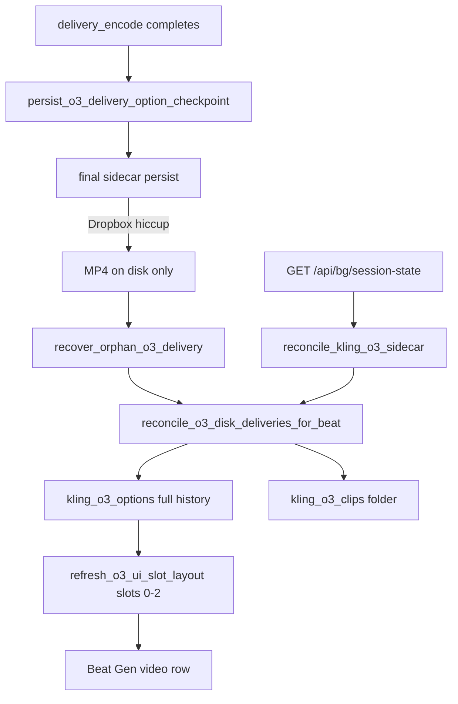

# O3 Paid Output Visibility — Tech Spec v1

**Status:** Implemented (tooling, 2026-06-14)  
**Owner:** mindfulnest-tooling  
**User-facing promise:** Every Kling O3 Element delivery you pay for appears in Beat Gen. Disk is source of truth; sidecar/UI cannot hide paid MP4s.

---

## Problem statement

Operators regenerated O3 clips, paid for outputs, and saw only one (or zero) clips in Beat Gen while many MP4s existed on disk. This felt endless and scary because spend was invisible.

### Root causes (confirmed)

| # | Cause | Effect |
|---|--------|--------|
| 1 | `assign_kling_o3_option_to_slot()` replaced `kling_o3_options` with only 3 rows | History wiped on every slot assign |
| 2 | `prune_stale_o3_voice_options()` dropped rows when voice/element bind ≠ registry | Paid clips deleted from sidecar after voice churn |
| 3 | `[:3]` caps in stash/restore paths | Older gens discarded |
| 4 | Sidecar persist failed after encode (Dropbox errno 11) | File on disk, not in sidecar |
| 5 | `recover_orphan_o3_delivery()` recovered one log path only | Partial recovery |
| 6 | Session reconcile/enrich used **server-pinned** `Event_1` dir for **Event_2** beats | Wrong disk counts, wrong Finder path in UI |

---

## Invariants (must never regress)

1. **Disk authority** — Any `{beat_id}_g{N}_element_o3_master_delivery.mp4` under `Event_N/kling_o3_clips/` is imported into `kling_o3_options` on reconcile.
2. **Checkpoint before finalize** — After encode, `persist_o3_delivery_option_checkpoint()` writes the option row before heavy finalize persist.
3. **Merge, never wipe** — `assign_kling_o3_option_to_slot()` appends/merges full history; UI slots 0–2 are a *view*, not the full list.
4. **Prune missing files only** — `prune_stale_o3_voice_options()` drops rows only when `video_path` is not a file. Never drop on voice_id mismatch.
5. **Per-beat Event_N** — Reconcile and enrich use `event_dir_for_beat_id(beat_id)`, not the storyboard server pin alone.
6. **Job log binding** — Recovered options bind from job log `o3_submit`, not current registry alone.

---

## Operator: review ALL paid clips

**Folder (Finder):**

```
Production/Event_N/kling_o3_clips/
```

**Event 2 examples:**

| Beat Gen label | Internal beat_id | Finder filter |
|----------------|------------------|---------------|
| Beat 13 (Loral) | `bg_arc1_event2_pre_beat_27` | `*beat_27*` |
| Beat 22 (Arlo) | `bg_arc1_event2_pre_beat_24` | `*beat_24*` |

**Filename pattern:**

```
{beat_id}_g{generation}_element_o3_master_delivery.mp4
```

Beat Gen shows the **newest 3** in video containers 0–2. All others remain in sidecar history and in this folder.

After storyboard UI deploy, each beat shows a hint line: paid clip count + full Finder path.

---

## Architecture



---

## Code map

| Layer | File | Function |
|-------|------|----------|
| Sidecar | `beat_generator.py` | `reconcile_o3_disk_deliveries_for_beat`, `refresh_o3_ui_slot_layout`, `event_dir_for_beat_id` |
| Sidecar | `beat_generator.py` | `persist_o3_delivery_option_checkpoint`, `assign_kling_o3_option_to_slot`, `prune_stale_o3_voice_options` |
| Pipeline | `kling_o3_element_beat_pipeline.py` | checkpoint before finalize |
| Server | `server_handlers/background.py` | `handle_bg_session_state` → `reconcile_kling_o3_sidecar` on load |
| UI | `storyboard-v2/.../BgTab.tsx` | disk count + Finder path hint |
| Tests | `tests/test_o3_disk_reconcile.py` | disk import, prune, merge, per-beat event dir |
| Rule | `.cursor/rules/o3-delivery-disk-reconcile.mdc` | agent guardrail |

---

## Verification checklist

1. `pytest Production/tools/tests/test_o3_disk_reconcile.py` — green
2. Restart `production_server.py` — HTTP 200 on `:5111`
3. Hard refresh Beat Gen for Event 2 intro
4. Beat 13: `kling_o3_options` length = on-disk delivery count (14 as of 2026-06-14)
5. Beat 22: same (7 as of 2026-06-14)
6. Newest 3 in slots 0–2; Finder folder lists all

---

## Out of scope (separate tracks)

- **Voice quality / bind drift** — wrong gender or clone on regen; `VOICE_BIND_DRIFT` gate
- **UI browse-all** — scrolling gallery of every gen in Beat Gen (future; folder + sidecar suffice for now)
- **Stitcher / app playback** — this spec covers Beat Gen visibility only

---

## Deploy

| Change | Action |
|--------|--------|
| Python only | Server restart |
| BgTab hint | `npm run build` + `deploy_storyboard_v59.sh --event Event_N` |

Cursor rule: `.cursor/rules/o3-delivery-disk-reconcile.mdc`
