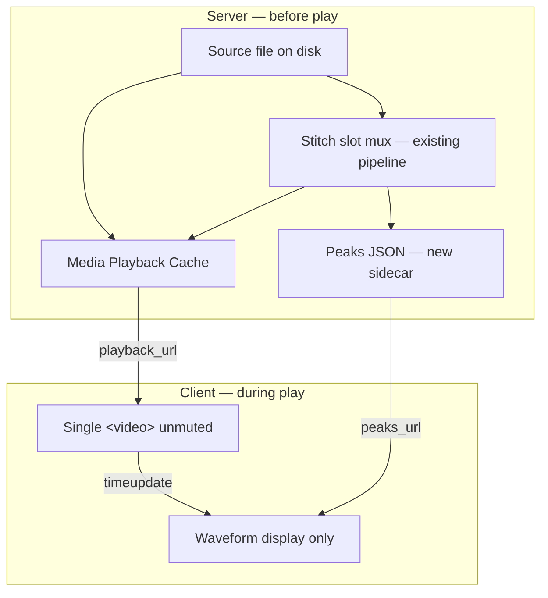

# Storyboard Unified Playback — Tech Spec v1

**Status:** SPEC — awaiting Kim sign-off before implementation  
**Date:** 2026-06-19  
**Owner:** mindfulnest-tooling (`storyboard-v2`, `production_server.py`, `server_handlers/`)  
**Repo:** `~/Projects/mindfulnest-tooling` (kid app repo is out of scope)  
**Deploy path:** mirror tooling → Dropbox `Production/tools/` + `storyboard-v2 npm run build` → `Event_N/storyboard_v59_prod.html` → restart `production_server.py`

**Related specs (unchanged by this work):**

- `STITCHER_SFX_TIMELINE_SPEC_v1.md` — SFX cue data model + resize handles (this spec changes **how** slot audio is heard, not cue persistence)
- `BG_O3_PER_OPTION_CUT_TRIM_SPEC_v1.md` — per-option cut metadata + export materialization (playback cache is orthogonal; cut preview must not swap `src` during play)

---

## 1. Problem statement

### 1.1 Operator symptoms

| Surface | What Kim sees | Audio behavior |
|---------|---------------|----------------|
| **Beat Gen** (e.g. Beat 3, no trim/cut) | `<video>` freezes at **random** timestamps mid-clip | **Stops with video** (both freeze) |
| **Stitcher slot composer** | Picture freezes at random timestamps | **Keeps playing** on waveform |

These look like one bug but are **two architectures** with **one shared infrastructure weakness**.

### 1.2 Root causes (structural — not trim)

**RC-A — Dual playback clock (Stitcher only)**  
Slot composer runs:

- Muted `<video>` streaming raw slot MP4 from `/files?path=…` (Dropbox-backed)
- WaveSurfer playing a **different** cached MP3 from `stitch_audio_extract` (speech + ambient + SFX mix)

Two decode pipelines, two clocks, ~200+ lines of sync glue (`linkedVideo`, drift correction, stall ticks, event suppress refs). When the video path stalls, audio **must** continue — they are not the same element.

**RC-B — Live cloud streaming at play time (both surfaces)**  
Both Beat Gen and Stitcher video use `GET /files?path=…` → `_serve_mp4_with_range` → read from Dropbox with `Cache-Control: no-store`. The browser performs incremental range reads while decoding in real time. Under load (many Beat Gen tiles, concurrent extracts, tab churn), the decoder buffer underruns → frozen frame.

**RC-C — Fan-out of concurrent media elements (Beat Gen)**  
Each beat row mounts up to **three** `<video preload="metadata">` elements. Selecting one beat can mean dozens of elements on screen, each opening range requests against Dropbox.

### 1.3 What is NOT the root cause

| Suspected cause | Verdict |
|-----------------|---------|
| Export trim (`kling_o3_trim_start/back`) | **No** for tile playback — only materialized on Send to Stitcher |
| Per-option cut metadata on Beat 3 | **No** — Beat 3 has no saved cut |
| Corrupt delivery MP4 | **No** — ffprobe shows aligned A/V on affected clips |
| `stitch_preview` re-encode in composer | **Partially fixed** (`6eaad55` uses raw video) — but fix **reinforced** RC-A by keeping WaveSurfer as audio master |

### 1.4 Why additive patches are the wrong fix

Stall listeners, frozen-frame tick counters, drift seekers, and “press play again” toasts **manage symptoms** without removing RC-A or RC-B. They increase complexity and will regress.

**This spec replaces patches with removal.**

---

## 2. Design principles (locked)

| # | Principle | Meaning |
|---|-----------|---------|
| P1 | **One clock** | Exactly one `HTMLMediaElement` owns playback time per preview surface |
| P2 | **One file** | That element plays one muxed bytesource (speech + ambient + SFX already baked for Stitcher) |
| P3 | **Local bytes** | Playback never reads Dropbox directly per range request; server serves from a **warm local cache** with cache-friendly HTTP |
| P4 | **Waveform = display** | Timeline UI shows peaks + playhead; it does **not** decode audio in parallel |
| P5 | **Delete sync code** | If two players need syncing, the design is wrong — fix the design, not the sync |

---

## 3. Non-goals

- Changing kid-app `expo-video` module playback (LD-280) — storyboard operator tooling only
- Changing Send to Stitcher export semantics or per-option cut materialization
- Re-encoding delivery MP4s on every Beat Gen page load
- Module-level full-reel preview UX (intro→resolution) — slot composer is in scope; module preview may follow same cache layer later
- Replacing WaveSurfer library entirely in Phase A/B producers (they already use single-audio-path patterns; optional follow-up)

---

## 4. Current architecture (reference)

### 4.1 Beat Gen (`BgOptionTile`)

```
option.video_path → /files?path=Production/Event_N/.../delivery.mp4
                 → <video controls> (muxed A+V, one element per tile)
                 → preload="metadata" on ALL tiles
```

### 4.2 Stitcher slot composer (today)

```
video:  resolveStitchSlotSourceVideoUrl → /files raw slot MP4 (muted)
audio:  stitch_audio_extract → stitch_audio_{hash}.mp3 → WaveSurfer.play()
sync:   WaveformTimeline linkedVideo + audioprocess drift/stall recovery
```

`buildSlotPreview()` + `stitch_preview` API already produce a **muxed slot MP4** in `Production/stitch_editor_cache/stitch_preview_{hash}.mp4` via `_stitch_build_pipeline` (normalize → ambient/SFX mix). Composer **does not use it for playback** after `6eaad55` (decode-weight workaround that preserved RC-A).

### 4.3 Existing assets to reuse (do not reinvent)

| Asset | Location | Reuse |
|-------|----------|-------|
| Slot mux pipeline | `production_server._stitch_build_pipeline` | **Playback master** for Stitcher composer |
| Per-slot preview API | `POST stitch_preview` with `{ name, slot, slots: [one] }` | Debounced rebuild trigger |
| Preview file serve | `GET /api/stitch_editor/preview_file/{hash}` | Serve from local cache dir |
| Cut materialization | `materialize_o3_cut_out_clip` | Export + explicit preview only |
| Waveform UI chrome | `WaveformTimeline` cue blocks, drag-seek layer | Keep; strip audio engine |

---

## 5. Target architecture

### 5.1 Unified model



### 5.2 Beat Gen target

- **One mounted `<video>` per beat row** — only on the **selected** option tile; other tiles show thumbnail/poster (no `<video>` element).
- `playback_url` from Media Playback Cache — not raw Dropbox `/files` path.
- Native `<video controls>` remains the only player; no WaveSurfer on Beat Gen O3 tiles.

### 5.3 Stitcher slot composer target

- **One unmuted `<video>`** plays muxed slot preview MP4 (`stitch_preview` output for that slot).
- Waveform shows peaks + SFX cue blocks; playhead driven by `video.currentTime`.
- **No** `linkedVideo`, **no** `stitch_audio_extract` for playback, **no** WaveSurfer `play()`.

### 5.4 Stitcher compact grid strips (unchanged UX, simpler internals)

Per-slot strips in the bottom grid remain **drop/seek only** (`playbackDisabled`). They may load peaks for cue placement without starting audio decode.

---

## 6. Phase 0 — Media Playback Cache (MPP)

Shared server layer used by Beat Gen and Stitcher (and optionally Phase previews later).

### 6.1 Responsibilities

1. Given a canonical source path (absolute under Dropbox root), produce a **stable cache file** under event-local storage.
2. Serve cache via a dedicated endpoint with **immutable cache headers**.
3. Never read Dropbox cloud path per HTTP range request during playback.

### 6.2 Cache location

```
Production/Event_{N}/.playback_cache/
  {sha256_prefix}_{basename}.mp4      # Beat Gen delivery clips
  slot_{slot}_{preview_hash}.mp4      # Stitcher muxed slot previews (may alias stitch_editor_cache)
```

**Decision:** Stitcher muxed files **remain** in `Production/stitch_editor_cache/stitch_preview_{hash}.mp4` (existing LRU). MPP **references** them by URL; no duplicate copy. Beat Gen copies **delivery** files into `.playback_cache/` because they are not already in a cache dir.

### 6.3 Cache key (Beat Gen)

```python
def playback_cache_key(source_path: Path) -> str:
    stat = source_path.stat()
    digest = sha256(f"{source_path.resolve()}:{stat.st_mtime_ns}:{stat.st_size}")
    return digest.hexdigest()[:16]
```

Filename: `pb_{digest}_{safe_basename}.mp4`

Invalidation: mtime+size change on source → new cache entry; LRU cleanup `keep=50` per event.

### 6.4 Materialization rules

| Trigger | Action |
|---------|--------|
| First `resolve_playback_url` for source | `copy_file_durable` or `shutil.copy2` source → cache (stream copy, no re-encode) |
| Source missing | 404 — no partial cache |
| Cut/trim preview scratch | **Separate** path (`assembled/_kling_o3_trim_scratch/`) — never auto-swapped during play (see §8.3) |

Beat Gen cache is **byte-identical** to delivery MP4. No ffmpeg on cache warm.

### 6.5 HTTP serve contract

**New endpoint:**

```
GET /api/media/playback/{event_id}/{cache_token}
```

| Header | Value |
|--------|-------|
| `Accept-Ranges` | `bytes` |
| `Cache-Control` | `public, max-age=86400, immutable` |
| `ETag` | `"${cache_token}"` |

Implementation: reuse `_serve_mp4_with_range` body logic but **without** `no-store`. Range reads hit local SSD file under event dir.

**New helper (Python):**

```python
def resolve_playback_url(source_path: str, *, event_dir: Path) -> dict:
    """Returns { playback_url, cache_token, duration_s, from_cache: bool }"""
```

### 6.6 Client URL resolution

Storyboard client **never** constructs `/files?path=…` for operator playback surfaces covered by this spec. Use `playback_url` from:

- Beat Gen session payload (optional eager field on `kling_o3_options[].video_path`), or
- Lazy `POST /api/media/playback_resolve` `{ path }` → `{ playback_url }`

---

## 7. Phase 1 — Beat Gen simplification

### 7.1 UI changes (`BgOptionTile`)

| Before | After |
|--------|-------|
| `<video>` on every option tile with clip | `<video>` **only** when `selected && hasClipVideo` |
| `src={/files?path=…}` | `src={playback_url}` from MPP |
| `preload="metadata"` on all tiles | No video element on unselected tiles → **zero** preload |
| `onPlay` triggers cut preview swap | Cut preview only on **explicit** “Preview cut” action |

Unselected tiles: show existing thumb / first-frame poster (`` or `canvas` snapshot optional — not required for v1).

### 7.2 Server changes

- `handle_bg_session` / beat serialization: add optional `playback_url` per `kling_o3_options[]` row when `video_path` exists (resolve via MPP at session build, or lazy on client — **prefer lazy** to keep session fast).
- New: `POST /api/media/playback_resolve` in `production_server.py` (thin wrapper around `resolve_playback_url`).

### 7.3 Cut/trim interaction (compatibility)

Per `BG_O3_PER_OPTION_CUT_TRIM_SPEC_v1.md`:

- Cut metadata remains sidecar-only until export.
- **Remove** auto `useEffect` that calls `onApplyO3Cut(previewOnly)` on select — replaces mid-play src swap (RC footgun).
- Explicit “Preview cut” button materializes scratch MP4 and sets `playback_url` to scratch **before** play.
- Send to Stitcher still uses `materialize_o3_cut_out_clip` — unchanged.

### 7.4 Numeric trim controls

- `attachTrimStopListener` on generic `onPlay` **removed**.
- Trim preview only via explicit **Preview Trim** button (already exists).

---

## 8. Phase 2 — Stitcher slot composer simplification

### 8.1 Playback master

Composer `<video>`:

```typescript
// One element, unmuted, single clock
<video
  ref={composerVideoRef}
  controls
  preload="auto"
  src={slotPlaybackUrl}  // muxed preview from stitch_preview
/>
```

`slotPlaybackUrl` = `resolveServerMediaUrl(preview_url)` from per-slot preview build.

**Restore** use of muxed preview for composer (reverses `6eaad55` raw-video decision) **because** RC-A is eliminated — there is no second audio player.

### 8.2 Preview build lifecycle

| Event | Behavior |
|-------|----------|
| Slot focused / composer mounted | Debounced `buildSlotPreview(slot, { quiet: true })` if cache miss |
| `ambient_bed` change | Debounce 400ms → rebuild preview |
| `sfx_cues` add/move/resize/delete | Debounce 400ms → rebuild preview |
| `video_path` change | Invalidate slot preview cache entry → rebuild |
| Preview building | Composer shows last good URL or slot poster + “Remixing…” label; **▶ disabled** until `preview_url` ready |

Use existing `buildSlotPreview` + `readCachedStitcherPreview` / `writeCachedStitcherPreview` localStorage hints; server hash remains source of truth.

### 8.3 Waveform in composer

Replace WaveSurfer-as-audio-engine with **WaveformDisplay** mode (see §9).  
`StitcherSlotWaveform` in composer (`compact={false}`):

- `playbackDisabled={false}` for ▶ on **video** only — or video native controls only (v1: **native video controls**; waveform ▶ removed).
- SFX drop/resize still works on peaks timeline.

**Delete from composer path:**

- `linkedVideo={composerVideoRef}`
- `linkedVideoEventSuppressRef`
- `playbackControl={composerPlaybackRef}` — or repurpose as video-only seek bus if needed for beat timeline click
- `composerPlaybackRef` WaveSurfer play/pause coupling

### 8.4 Beat timeline seek

`onTimelineClick` → `video.currentTime = ratio * video.duration` (already partially implemented). No WaveSurfer `seekToMs`.

### 8.5 Compact grid strips

Keep `playbackDisabled={true}`. Peaks-only waveform for cue editing; no audio decode.

---

## 9. Phase 3 — Waveform display-only layer

### 9.1 Extraction

Extend `stitch_audio_extract` response (or new `stitch_waveform_peaks`) to include:

```json
{
  "peaks_url": "/api/stitch_editor/peaks_file/{hash}",
  "duration_ms": 62041,
  "video_dur_ms": 62041,
  "audio_url": "…"  // DEPRECATED for playback — keep 1 release for rollback
}
```

Peaks generation: ffmpeg `astats` / `showwavespic` pipeline or reuse WaveSurfer's peak extractor server-side once at mix time. Store:

```
Production/stitch_editor_cache/stitch_peaks_{hash}.json
```

Format:

```json
{ "version": 1, "channels": 1, "length": 1200, "data": [0.0, 0.12, …] }
```

`length` ≈ 1200 bins — matches WaveSurfer normalize expectations.

### 9.2 `WaveformTimeline` modes

Add prop: `displayOnly?: boolean`

When `displayOnly === true`:

- WaveSurfer created with `peaks` + `duration` — **no `url`**
- `ws.play()` / `ws.pause()` **not used**
- Playhead: `ws.setTime(videoCurrentTime)` on `timeupdate` from parent video ref
- Drag-seek on waveform → `onSeek?(ms)` callback → parent sets `video.currentTime`
- ▶ Play button **hidden** in composer (video controls own play)

When `displayOnly === false` (Phase A/B producers): **unchanged** for this spec v1.

### 9.3 Code deletion target (`WaveformTimeline.tsx`)

Remove after Stitcher migration:

- `linkedVideo` prop and all `suppressLinkedVideoEvents` branches in `audioprocess`
- `linkedVideoStallTicks` recovery
- `linkedVideoEventSuppressRef`
- Dual play in `startPlayback` (lv.play alongside ws.play)

Estimated **net −150 LOC** in WaveformTimeline + StitcherTab.

---

## 10. API summary

| Endpoint | Method | Purpose |
|----------|--------|---------|
| `/api/media/playback_resolve` | POST | `{ path }` → `{ playback_url, duration_s }` |
| `/api/media/playback/{event}/{token}` | GET | Range-capable cached MP4 serve |
| `/api/stitch_editor/preview` | POST | **Existing** — muxed slot preview |
| `/api/stitch_editor/preview_file/{hash}` | GET | **Existing** — serve muxed preview |
| `/api/stitch_editor/audio_extract` | POST | **Extend** — add `peaks_url` |
| `/api/stitch_editor/peaks_file/{hash}` | GET | **New** — serve peaks JSON |
| `/files?path=…` | GET | **Demote** — images/thumbs only in Beat Gen + Stitcher playback paths |

---

## 11. Client data contracts

### 11.1 Beat Gen option tile

```typescript
interface GptOption {
  video_path?: string;
  playback_url?: string;  // NEW — from MPP; preferred over /files
  // cut_start_s, cut_end_s unchanged
}
```

### 11.2 Stitcher composer state

```typescript
interface SlotComposerPlayback {
  preview_url: string | null;   // muxed MP4 — sole audio+video source
  peaks_url: string | null;     // waveform display
  preview_loading: boolean;
  preview_error: string | null;
}
```

---

## 12. Explicit removal list (durable — do not re-add)

| Remove | File(s) | Reason |
|--------|---------|--------|
| `linkedVideo` sync | `WaveformTimeline.tsx`, `StitcherSlotWaveform.tsx`, `StitcherTab.tsx` | RC-A |
| `composerVideoUrl = viewerSourceUrl` raw /files path | `StitcherTab.tsx` | Replaced by muxed preview |
| `stitch_audio_extract` as WaveSurfer `audioSrc` in composer | `StitcherSlotWaveform.tsx` | RC-A |
| Auto cut preview on select `useEffect` | `BgTab.tsx` `BgOptionTile` | Src swap mid-play |
| `attachTrimStopListener` on generic `onPlay` | `BgTab.tsx` | Accidental early stop |
| `Cache-Control: no-store` on playback cache serve | `production_server.py` | RC-B |
| Stall/drift patch code added after `6eaad55` | same files | Symptom management |

**Keep but repurpose:**

- `buildSlotPreview` — becomes the **primary** composer URL builder, not fallback
- `stitch_audio_extract` — peaks generation only (deprecate `audio_url` after rollout)

---

## 13. Implementation phases & order

| Phase | Scope | User-visible win |
|-------|-------|------------------|
| **0** | MPP server module + `playback_resolve` + tests | Foundation |
| **1** | Beat Gen lazy video + playback URLs | Beat 3 random freeze ↓ dramatically |
| **2** | Stitcher composer muxed video + delete linkedVideo | Audio-over-frozen-frame **eliminated** |
| **3** | Peaks-only waveform + remove WaveSurfer play in Stitcher | Code simplification, CPU ↓ |
| **4** | Remove deprecated APIs + delete sync tests | Durability |

**Do not ship Phase 2 without Phase 0** — muxed preview alone still hits `/files` or preview serve without cache headers if not wired through MPP.

Parallel work allowed: Phase 0 + Phase 3 peaks generator (server).

---

## 14. Acceptance criteria

### 14.1 Beat Gen

1. Beat 3 (no cut/trim): play 10 consecutive times from t=0 — **zero** mid-clip freezes in 10/10 on localhost:5112.
2. Unselected option tiles: DOM contains **zero** `<video>` elements.
3. Selected tile: exactly **one** `<video>`; `src` host is `/api/media/playback/…` not `/files`.
4. Switching option 0→1→2: no audio ghosting; previous video element unmounted.
5. Explicit cut preview: pressing ▶ after preview does not swap `src` during playback.

### 14.2 Stitcher composer

1. Play slot intro 60s continuous — video and audio **never diverge** > 100ms (ear test + `video.currentTime` vs wall clock).
2. While playing, **no** WaveSurfer `isPlaying()` true in composer (display-only).
3. Move SFX cue during play → playback pauses OR completes current preview before remix (document chosen UX in impl — **default: pause + rebuild + resume at same offset**).
4. `linkedVideo` string absent from production bundle (CI grep).

### 14.3 Infrastructure

1. `playback_resolve` p50 < 50ms on cache hit (local copy exists).
2. Cache miss first resolve < 2s for 6s 720p delivery clip (copy only).
3. Dropbox path not opened during range requests after cache warm (strace/log proof in test).

### 14.4 Contract tests (pytest + dist guards)

| Test file | Asserts |
|-----------|---------|
| `test_media_playback_cache.py` | key stability, mtime invalidation, serve headers |
| `test_beat_gen_lazy_video.py` | dist: one video mount pattern; no `/files` in BgOptionTile playback src |
| `test_stitch_composer_unified_clock.py` | dist: no `linkedVideo` in StitcherTab; `STITCH_UNIFIED_PLAYBACK_V1` marker present |
| `test_stitch_slot_preview_video_playable.py` | update: composer uses `preview_url` not raw slot /files |

Runtime marker strings (Vite-safe):

```
data-playback-cache-v1="PLAYBACK_CACHE_V1"
data-stitch-unified-playback="STITCH_UNIFIED_PLAYBACK_V1"
data-waveform-display-only="WAVEFORM_DISPLAY_ONLY_V1"
```

---

## 15. Rollout & rollback

### 15.1 Deploy

1. Implement in `mindfulnest-tooling` on feature branch `feat/unified-playback-v1`
2. `bash Production/scripts/deploy_storyboard_v59.sh` (or post_tooling_change_smoke step 3+)
3. Verify `build-sha` in served HTML matches branch HEAD
4. Hard refresh storyboard — **not** soft refresh

### 15.2 Rollback

- Storyboard bundle revert → previous `storyboard_v59_prod.html`
- Server handlers are backward compatible if `playback_url` optional and `/files` fallback removed only after bake-in period

**Feature flag (optional, `localStorage`):**

```
STORYBOARD_UNIFIED_PLAYBACK=0  → legacy path (one release only, then delete)
```

Default: **on** after sign-off.

### 15.3 Operator communication

One line: *“Play button now plays one cached file — waveform is visual only in Stitcher.”*

---

## 16. Risks & mitigations

| Risk | Mitigation |
|------|------------|
| Muxed preview rebuild latency when dragging SFX | Debounce 400ms; show remix spinner; cache hit is instant |
| `stitch_preview` re-encode decode weight | Preview is 720p H.264 ≤1.9Mbps +faststart (LD-284) — same as delivery; **one** decode path is lighter than dual |
| Disk usage in `.playback_cache/` | LRU 50/event; delivery clips ~5–15MB each |
| Phase A/B WaveformTimeline regression | `displayOnly` is opt-in; producer paths unchanged in v1 |
| Peaks JSON size | ~1200 floats × 4B ≈ 5KB per slot — trivial |

---

## 17. Success metrics (definition of done)

- [ ] Kim reproduces Beat 3 freeze **0/10** after Phase 1 on Event 2
- [ ] Stitcher “audio continues over frozen frame” **impossible** by architecture
- [ ] `rg 'linkedVideo' storyboard-v2/src/components/StitcherTab.tsx` → **0 matches**
- [ ] Net LOC in playback path **decreases** vs `main` (excluding new MPP module)
- [ ] No new stall/drift/timer handlers added

---

## 18. Open questions for Kim (defaults in parentheses)

1. **SFX drag during play:** pause and rebuild preview, or block edits until paused? **(Default: pause)**  
2. **Beat Gen unselected tiles:** static thumb only, or first-frame canvas? **(Default: existing thumb)**  
3. **Module full-reel preview:** include in v1 or follow-up? **(Default: follow-up)**  
4. **Keep legacy `/files` fallback one release? **(Default: yes, behind flag)**

---

## 19. Document history

| Version | Date | Change |
|---------|------|--------|
| v1 | 2026-06-19 | Initial spec from playback freeze root-cause analysis |
