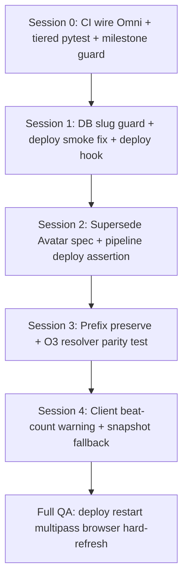

# TECH_SPEC — Beat Gen Category-Fix Arc V1 (“It Actually Works”)

**Status:** Approved — execution in progress  
**Branch:** `fix/beatgen-category-fix-arc-v1` (extends `fix/beatgen-per-event-sqlite-v1`)  
**Goal:** Close the storage / pipeline / gate bug classes that made Avatar Pro → Omni restore feel like infinite whack-a-mole. Reach **boring operator loop**: draft beats → Generate → approve → Send to Stitcher → reload / cross-event / restart — **no beat loss, no mode confusion, CI catches regressions**.

**Depends on (shipped or in-flight):**
- `TECH_SPEC_BEATGEN_PER_EVENT_SQLITE_V1.md` — I1–I4 per-event SQLite
- `TECH_SPEC_BEATGEN_JSON_MIRROR_UNION_BOOTSTRAP_V1.md` — I5–I7 monotonic mirror
- `BG_O3_JOB_LIVENESS_AUDIT_SPEC_v2.md` — terminal.json busy authority
- `BG_BEAT_GEN_FOREVER_PLAN_v1.md` — job truth (complete; superseded on storage scope only)

---

## 1. Category-unlocker (arc-level)

- **Bug category:** Storage topology mismatch + pipeline mode pollution + inverted test pyramid — fixes do not stick event-to-event because partition keys, merge preserve lists, and CI gates do not enforce the same invariants production assumes.
- **Category fix:** Five-session arc locking storage invariants, wiring existing contract tests into CI/deploy, collapsing operator-visible pipeline to Omni, tiered CI expansion, structural preserve + O3 job-dir parity, client beat-count drop warning, deploy multipass on dedicated ports.
- **Fix type:** CATEGORY

---

## 2. Agent debate — 2×2 matrix (Adversary × Advocate synthesis)

Each work item placed in **one** quadrant. Verdict = consensus after debate.

| ID | Work item | Quadrant | Verdict |
|----|-----------|----------|---------|
| **WI-1** | Per-event SQLite + JSON mirror union + monotonic export | High blast / **High value** | **FOR** — load-bearing; finish + prove on live :5112/:5113 |
| **WI-2** | Wire `test_beatgen_omni_restore.py` + `test_heal_avatar_pro_poisoned_prompt.py` into CI | Low blast / **High value** | **FOR** — zero production risk; closes Avatar→Omni regression class |
| **WI-3** | Collapse default pipeline (`element_native` only in UI; Avatar env-only; supersede Avatar spec) | High blast / **High value** | **FOR WITH CONDITIONS** — UI already stripped; do not touch Phase B lipsync; no constant deletion |
| **WI-4** | CI parity — tiered ~20 files (not flat 60) + deploy smoke (not GitHub CI) | Low blast / Lower value | **FOR tiered** — adversary rejected naive 60-file glob (flaky vendor tests) |
| **WI-5** | Prefix preserve + O3 job-dir parity + snapshot fallback + client beat-count warning | Mixed | **FOR decomposed** — preserve/resolver after WI-1; client warning last |

### Cross-cutting gates (mandatory)

| Gate | Blast | Verdict | Implementation |
|------|-------|---------|----------------|
| **X-A** Milestone never bootstraps SQLite | Low | **FOR** — test exists (`test_milestone_init_never_bootstraps_sqlite`); add to CI | Session 0 |
| **X-B** `verify_beatgen_deploy_smoke.sh` per-event DB + :5113 relaunch | Low | **FOR** — reconcile with per-event durability script | Session 1 |
| **X-C** Startup `MN_BEATGEN_DB_PATH` slug ↔ `--event-id` cross-check | Low | **FOR** — one guard closes wrong-DB class | Session 1 |
| **X-D** Deploy multipass on :5112 + :5113 after `deploy_storyboard_v59.sh` | Low | **FOR** — self-hosted only, not GitHub Actions | Session 1 |

### Debate notes (condensed)

- **Adversary:** WI-4 as “60 pytest files in smoke.yml” is **against** — many tests need fixtures/network. **Advocate:** tiered 20-file bundle + deploy-only live smoke is the correct split.
- **Adversary:** WI-5 bundled in one PR is **against** — bisect risk. **Advocate:** four sub-commits within Session 3–4.
- **Both:** WI-1 must land before WI-5 preserve changes interact with SQLite `replace_full`.

---

## 3. Session plan (dependency order)

### Session 0 — CI safety net (no production code)

| Deliverable | Files |
|-------------|-------|
| Omni restore tests in `smoke.yml` session-lockin job | `.github/workflows/smoke.yml` |
| Same tests in `verify_o3_intro_contract.sh` | `Production/scripts/verify_o3_intro_contract.sh` |
| Milestone bootstrap guard in CI | `test_milestone_init_bg_paths_authority_guard.py` |
| Tier R1 pytest (+8): job truth, store, export order, milestone scope | `smoke.yml` |

**Acceptance:** `python3 -m pytest` on added files green locally; CI job passes on PR.

### Session 1 — Storage invariant enforcement

| Deliverable | Files |
|-------------|-------|
| `assert_beatgen_db_path_matches_event(event_id)` — FATAL on mismatch | `beat_generator.py`, `production_server.py` |
| Per-event DB path in deploy smoke; :5113 relaunch mirror :5112 | `verify_beatgen_deploy_smoke.sh` |
| Deploy hook: smoke :5112 + :5113 post-restart | `deploy_storyboard_v59.sh` |
| Unit test for slug guard | `test_beatgen_per_event_sqlite.py` |

**Multipass proof (mandatory):**
1. `verify_beatgen_per_event_sqlite_durability.sh` — Event_2/3/4 live
2. `MN_BEATGEN_DB_PATH=.../beatgen_event3.db` restart Event_2 server → FATAL or refuse start
3. Hard refresh `http://localhost:5113/?event=Event_3` — intro beats ≥ mirror count

### Session 2 — Pipeline surface collapse (doc + deploy assertion)

| Deliverable | Files |
|-------------|-------|
| Mark `TECH_SPEC_BEAT_GEN_AVATAR_PRO_v1.md` **Superseded** (Omni default) | docs |
| Deploy smoke: no `o3_generate_mode=avatar_pro` on intro beats when Avatar disabled | `verify_beatgen_deploy_smoke.sh` |
| Phase B lipsync Avatar path unchanged | verified by existing test |

**Non-goals:** Delete `O3_GENERATE_MODE_AVATAR` constants; touch `handle_phase_b_lipsync`.

### Session 3 — Structural preserve + O3 resolver

| Deliverable | Files |
|-------------|-------|
| `sidecar_merge_preserve_keys(beat)` — union tuple + `kling_o3_*` / `o3_*` prefixes | `beat_generator.py` |
| Contract test: new `o3_foo` field survives merge | `test_sidecar_merge_preserves_o3_job_cache.py` |
| O3 job-dir parity: milestone `event3b` beat uses `resolve_o3_job_event_dir_candidates` on submit path | existing tests + grep gate doc |

### Session 4 — Operator-visible durability UX

| Deliverable | Files |
|-------------|-------|
| Toast when session beat count drops vs cached row | `bgSessionStore.ts` + unit test |
| Snapshot fallback when mirror segment empty but `.production_snapshots/latest` has beats | `beat_generator.py` reconcile path |
| Vitest/jest test for drop warning | `storyboard-v2/src/state/__tests__/` |

---

## 4. Mandatory proof checklist (Full QA — all sessions)

### A. Scope / identity
- URL under test (port + query)
- `/api/event/current` matches URL
- Dedicated port: `event/load` to sibling event → **409**
- Hard refresh same URL before manual heal

### B. Beat Gen / sidecar persistence
- `/api/bg/session-state` beat count > 0, no disk I/O error
- `PRAGMA integrity_check` on `~/.mindfulnest/state/beatgen_eventN.db`
- Milestone scope: `_MILESTONE_SIDECAR_JSON_ONLY` — no SQLite bootstrap

### C. In-flight Generate (if touched)
- Milestone beat `event3b` — `job_busy` within 2s, spinner UI, artifacts under correct Event_N dir

### D. Deploy / server
- Mirror tooling → Dropbox; restart; HTTP 200; `build-sha` = git HEAD
- `verify_beatgen_deploy_smoke.sh 5112` and `5113` exit 0

### E. Regression class scan
- Primary category named; sibling bugs listed; gates that would have caught earlier

---

## 5. Durability gates (Part 3 — always when touching Beat Gen)

| Gate | Session | Test / script |
|------|---------|---------------|
| A. Milestone SQLite contract | 0 | `test_milestone_init_never_bootstraps_sqlite` |
| B. Deploy smoke | 1 | `verify_beatgen_deploy_smoke.sh PORT` |
| C. Dual-server `MN_BEATGEN_DB_PATH` | 1 | launchagent + startup slug guard |
| D. Recovery hardening | 1 | existing corrupt DB recover in bootstrap |
| E. O3 job event-dir single resolver | 3 | `test_milestone_o3_job_busy.py` |
| F. Cross-surface parity sweep | 3 | grep `event_dir_for_beat_id` alone on job paths |
| G. Dedicated-port restart | 1 | 60s relaunch fallback in deploy smoke |

---

## 6. Sibling categories still open after arc

| Category | Status after arc |
|----------|------------------|
| Beat list shrink / cross-event loss | **Closed** by WI-1 + mirror union |
| Avatar prompt pollution | **Closed** by WI-2 CI + heal on migrate |
| Pipeline mode confusion | **Closed** by WI-3 doc + env pin |
| Silent CI regressions | **Mitigated** by WI-4 tiered bundle |
| Preserve field drift | **Mitigated** by WI-5 prefix union |
| Stitch milestone clobber | Out of scope — separate stitch arc |
| Real WaveSpeed Generate E2E in CI | Out of scope — requires self-hosted + API spend |

---

## 7. Success criteria (“it actually works”)

Kim can, without agent intervention:

1. Open Event_3 on `:5113`, hard refresh — **same beat count** as before refresh
2. Switch Project dropdown to Event_2 on `:5112` — **no beat loss** on either event
3. Generate on milestone beat — busy UI + terminal artifacts in correct dir
4. Deploy storyboard — **build-sha matches commit**, deploy smoke passes on :5112 and :5113
5. See **warning toast** if beat count ever drops unexpectedly (Session 4)

**Arc complete when:** all session commits on `fix/beatgen-category-fix-arc-v1`, deploy smoke green, browser proof recorded in Full QA report, PR opened with CI green.
