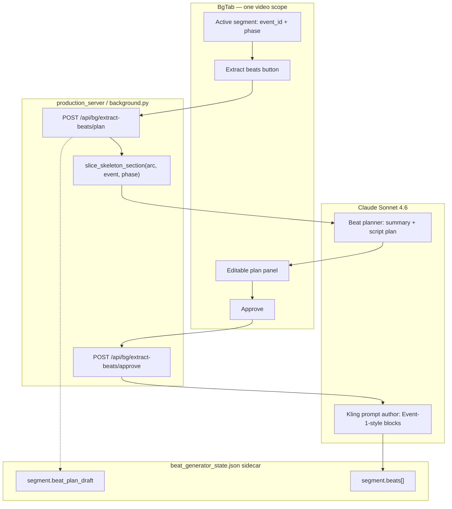

# Tech Spec — Claude Extract-Beats Workflow (Skeleton → Beat Plan → Kling O3)

**Version:** v1  
**Status:** IMPLEMENTED (2026-06-13)  
**Authority:** Kim decisions Q1–Q10 (2026-06-13)  
**Repo:** `mindfulnest-tooling`  
**Spec location:** `Production/docs/TECH_SPEC_CLAUDE_SUGGEST_BEATS_v1.md`  
**Written:** 2026-06-13

---

## §1 — Problem Statement

Beat Gen today splits skeleton ingestion and Kling prompt authoring across two buttons and a shallow regex extractor:

| Step today | Mechanism | Gap |
|---|---|---|
| **Extract Beats** | `beat_generator.extract_beats()` — regex dialogue harvest from skeleton section | One dialogue line ≈ one beat; no story compression, no stage-direction beats, no Claude planning |
| **Suggest beats** | `generate_kling_prompts_for_segment()` — template `build_kling_o3_prompt()` per beat row | Separate button; generic prompts, not Event-1-quality rich `kling_o3_prompt` blocks |

Kim needs **one** button — **Extract beats** — that:

1. Reads **only** the skeleton section for the **currently open** Beat Gen segment (one video: intro/pre **or** resolution/post).
2. Calls **Claude Sonnet** to summarize the story and propose a **minimum necessary beat script** (6–15 soft target for intro-type videos).
3. Shows an **editable approval panel** (story summary + beat script plan).
4. After **Approve**, converts the approved plan into **Event-1-style** `kling_o3_prompt` per beat and populates the Beat Gen tab.

Phase A/B suggest remains out of scope. Saved-dialogue backup is Event 2 manual workflow only.

---

## §2 — Current vs Target Behavior

### Current

```
Kim selects segment in BgTab
  → [Extract Beats from script]  → regex dialogue lines → sidecar beats (no kling_o3_prompt richness)
  → [Suggest beats]              → build_kling_o3_prompt() templates → kling_o3_prompt boxes
```

- Two buttons (`BgTab.tsx`: `onExtractBeats`, `onSuggestBeats`).
- `POST /api/bg/extract-beats` → `handle_bg_extract_beats` → `extract_beats()`.
- `POST /api/bg/generate-kling-prompts` → `handle_bg_generate_kling_prompts` → `generate_kling_prompts_for_segment()`.
- Scope: `{arc_number, event_id, phase}` from active segment (`event_id|phase` chip).
- Overwrite: merges into sidecar preserving Kling fields (`_PRESERVE` in `background.py`); does **not** implement `force: true` gate.
- Intro canonical mirror tail appended by `append_intro_canonical_tail_beats()` on `phase=pre` only.

### Target

```
Kim selects segment in BgTab (one video only)
  → [Extract beats]  (single button — label may stay "Extract Beats from script")
       Phase A — Plan
         1. Code-first slice skeleton section for arc/event/phase
         2. Claude Sonnet: story summary + beat script plan (editable)
         3. UI modal/panel: Kim edits → Approve
       Phase B — Populate (on Approve only)
         4. Claude Sonnet: approved plan → rich kling_o3_prompt per beat
         5. Write beats to sidecar (merge policy below)
  → Beat list + Kling O3 prompt boxes ready for image gen / submit
```

- **No** separate Suggest beats button (remove `bg-suggest-beats-btn` when implemented).
- Model: **`claude-sonnet-4-6`** (or latest Sonnet slug used elsewhere in tooling, e.g. `.github/workflows/scripts/claude_review.py`).
- Generic for all events/phases when clicked for the **current tab** — not Arc 1 only.

---

## §3 — Skeleton Boundary Analysis (Arc 1 / 2 / 3)

Sources read (Dropbox canonical):

- `~/Library/CloudStorage/Dropbox/Claude Mindfulnest Project Files/Arc Skeletons/ARC_01_SKELETON_FINAL.md`
- `…/ARC_02_SKELETON_FINAL.md`
- `…/ARC_03_SKELETON_FINAL.md`

Existing code (`beat_generator.py`):

| Symbol | Role |
|---|---|
| `_EVENT_HEADER` | `^##\s+EVENT\s+([\d]+[a-z]?):` — event block start |
| `_SECTION_SETUP` | `^###\s+Narrative Setup` — intro/pre body start |
| `_SECTION_RES` | `^###\s+Resolution` — resolution/post body start |
| `_MODULE_MARKER` | `\*\*[►▶]\s*INSERT MODULE` — intro/post split |
| `_slice_section()` | Truncates at next therapeutic / resolution / `###` h3 |
| `get_segments()` | Module events → `phase=pre` + `phase=post`; else `phase=full` |
| `extract_beats()` | `pre` → Narrative Setup; `post` → Resolution; dialogue regex only |

### Findings Table

| Pattern | Arc 1 | Arc 2 | Arc 3 | Code today |
|---|---|---|---|---|
| Event header `## EVENT N:` | ✅ All module + milestone events | ❌ Uses `EVENT N:` + underline (`---`), no `##` | ✅ `## EVENT 1–6` | Arc 1/3 only |
| Intro section header | `### Narrative Setup` | `### Narrative Setup` (M7–M9); post-King uses `**Video Intro**` (bold, not h3) | `### Intro Video` or `### Intro Video --- Narrative Setup` (M14–M16); M17+ use `### Narrative Setup` | `_SECTION_SETUP` misses Arc 3 intro + Arc 2 post-King |
| Resolution header | `### Resolution` | `### Resolution` (modules); Oliver interstitial uses plain `Resolution:` | `### Resolution`; M15 uses `### Video Resolution` | `_SECTION_RES` misses `Video Resolution` |
| Module split marker | `**► INSERT MODULE MN ◄**` | Same + bare `INSERT MODULE` (Oliver calm); `► INSERT MODULE M10 ◄` without `**` | `**► INSERT MODULE MN ◄**` | `_MODULE_MARKER` misses unbolded / bare variants |
| Therapeutic block | `### Therapeutic Note — …` | `### Therapeutic Note --- …` | Often inline `**THERAPEUTIC NOTE --- …**` inside intro (no h3) | Stops intro slice correctly when h3 present; Arc 3 inline notes need broader stop patterns |
| End boundaries | `### Tomorrow Hook`, `### Post-MN:` | `### Tomorrow Hook`, `### Post-M7:` etc.; milestones use `Return to map` prose | `### Post-M14:`, `### Tomorrow Hook` (conditional) | Works when h3 present |
| Non-module video events | EVENT 0 (pages), 0b, 0c, 3b, 7 — `phase=full` | INTRODUCTORY VIDEO, MILESTONE blocks (King's 4-beat video under Post-M9) | Arrival cinematic, Oliver speech milestone (separated in v5) | Milestones / Arc 2 headers not in `get_segments()` today |
| Stage directions | Prose + `🔴` change markers; some parentheticals in dialogue | `### Beat 1` … `### BEAT 4` under milestone video | `### Rescue` (often empty h3 between module and resolution) | Not extracted as beats today |

### Per-Arc Reliability Summary

**Arc 1 — mostly sufficient with minor gaps**

- Six module events (M1, M2, M4, M3, M6, M5) follow a **stable template**: `## EVENT N` → `### Narrative Setup` → Therapeutic Note → `**► INSERT MODULE**` → `### Resolution` → Tomorrow Hook → Post-MN.
- Non-module videos (Opening sequence, Guide Bird intro, Map landing, Oliver Meet, Agent Encounter) use different subsection shapes (`### OPENING VIDEO SEQUENCE`, `### PAGE N`, flat dialogue). These are `phase=full` segments — need **wider intro aliases** or Claude boundary fallback.
- **No manual tag cleanup required** for standard module intro/resolution pairs; existing patterns suffice for M1–M6 pre/post.

**Arc 2 — needs parser extensions (not manual tags)**

- Event headers **do not match** `_EVENT_HEADER` (`EVENT 1:` + underline, not `## EVENT 1:`).
- King's Arrival is a **milestone video** nested under Post-M9 (`### Milestone video:` + `### Beat 1`…`### BEAT 4`) — not a standalone `## EVENT` with intro/resolution split.
- Module marker variants: unbolded `► INSERT MODULE M10 ◄`, bare `INSERT MODULE` (Oliver post-destruction calm module).
- Post-King modules use `**Video Intro**` instead of `### Narrative Setup`.
- **Recommendation:** extend header regex + section aliases in code; use Claude boundary inference for milestone multi-beat videos until Arc 2 skeleton is normalized (optional future doc pass).

**Arc 3 — needs intro/resolution aliases**

- Module events reliably use `## EVENT N` + `**► INSERT MODULE**` + `### Resolution`.
- Intro label is **`### Intro Video`** (not Narrative Setup) for M14–M16.
- M15 resolution titled **`### Video Resolution`**.
- `### Rescue` is an empty stub between module and resolution — slice end should treat it as skippable.
- **Recommendation:** add `_SECTION_SETUP` aliases (`Intro Video`, `Video Intro`); add `_SECTION_RES` alias (`Video Resolution`); existing module marker pattern works.

### Boundary Strategy (locked)

1. **Code-first slicing** where patterns match (Arc 1 modules, Arc 3 modules after alias extension).
2. **Claude boundary inference** as fallback when:
   - Event header not found by regex (Arc 2).
   - Section has milestone `### Beat N` structure.
   - Intro/resolution headers use non-canonical labels.
3. **No requirement for Kim to add manual tags** for Arc 1 module intro/resolution — existing skeleton conventions are enough once aliases land for Arc 3 and Arc 2 header regex is extended.
4. Slice scope is always **one segment text blob** passed to Claude — never the full arc file.

---

## §4 — Architecture



**Data flow**

1. **Slice** — deterministic (extended `get_segments` + new `slice_skeleton_section`) returns `{section_text, section_label, slice_method}`.
2. **Plan** — Claude returns `{story_summary, beats_plan[]}`; stored as draft on segment; **does not** overwrite approved Kling beats yet.
3. **Approve** — Kim-edited plan → Claude prompt pass → beat rows with `kling_o3_prompt`; merge into sidecar.

---

## §5 — Two-Phase Workflow Detail

### Phase A — Extract (plan only)

**Trigger:** Kim clicks **Extract beats** while Beat Gen tab shows one segment (e.g. Event 1 intro = `event_id=1`, `phase=pre`).

**Server steps:**

1. Resolve `arc_number`, `event_id`, `phase` from body + `scope_event_id` guard (existing LD-456 pattern).
2. `section = slice_skeleton_section(arc_number, event_id, phase)`.
3. If `section.text` empty → HTTP 422 with `slice_method` diagnostic.
4. Call Claude **beat planner** with:
   - Sliced section text (not whole arc).
   - Segment metadata (event name, phase label, module id if present).
   - Soft target beat count (6–15 for intro-type; resolution may be shorter).
5. Persist `beat_plan_draft` on segment in sidecar.
6. Return `{story_summary, beats_plan, section_meta, model_used}` to UI.

**`beats_plan[]` item shape (approval UI):**

```json
{
  "beat_index": 1,
  "beat_type": "dialogue | stage_direction",
  "speaker": "Guide Bird",
  "dialogue_text": "verbatim or [CLAUDE INVENTED] bridge",
  "emotion": "warm",
  "scene_notes": "staging / camera / action",
  "skeleton_quote": "optional verbatim excerpt",
  "invented": false
}
```

**Claude beat planner rules:**

- Summarize plot + cute/funny beats + must-haves in `story_summary`.
- Minimum necessary beats — **soft target 6–15** for intro-type videos; fewer OK when skeleton is thin.
- **Verbatim skeleton quotes** where used; tag bridges with `[CLAUDE INVENTED]` in `dialogue_text` or `invented: true`.
- Not every skeleton quote must become a beat — compress/reorder for video pacing.
- **Stage direction beats allowed** (`beat_type: stage_direction`) — e.g. camera pans, magic disperses, runestone lights.
- Do **not** emit full `kling_o3_prompt` in Phase A.

### Phase B — Approve (populate Beat Gen)

**Trigger:** Kim edits plan in modal → clicks **Approve**.

**Server steps:**

1. Accept `{arc_number, event_id, phase, story_summary, beats_plan}` (edited).
2. Call Claude **Kling prompt author** with approved plan + Event 1 exemplar prompts (from sidecar or bundled reference).
3. Build beat rows: `{beat_id, speaker, dialogue_text, scene_notes, emotion, kling_o3_prompt, status: draft, pipeline: kling_o3_omni}`.
4. `append_intro_canonical_tail_beats()` for `phase=pre` **after** merge (never clobber existing canonical mirror tail).
5. Apply overwrite policy (§8).
6. Return `{beats, count}`; UI replaces beat list.

**Kling prompt author rules:**

- Output **rich** multi-line `kling_o3_prompt` matching Event 1 quality: `@Image1 (Speaker) … Scene from @Image2`, camera lock, voice block, storybook style tail.
- Reuse `prepare_kling_o3_prompt_for_submit` normalization after generation.
- Stage-direction beats: speaker `Narrator` or `Scene` with action-only prompt body.

---

## §6 — API Endpoints (Proposed)

Split today's monolithic `POST /api/bg/extract-beats` into plan + approve. Keep old endpoint deprecated one release (regex-only fast path) or repoint internally to plan phase without Kling write.

| Endpoint | Body | Response | Notes |
|---|---|---|---|
| `POST /api/bg/extract-beats/plan` | `{arc_number, event_id, phase, scope_event_id}` | `{story_summary, beats_plan, section_meta, slice_method, model_used}` | Phase A only; stores draft |
| `POST /api/bg/extract-beats/approve` | `{arc_number, event_id, phase, scope_event_id, story_summary, beats_plan, force?: bool}` | `{beats, count}` | Phase B; writes sidecar |
| `GET /api/bg/extract-beats/draft` | query: `arc_number, event_id, phase, scope_event_id` | `{beat_plan_draft, story_summary}` or `{}` | Reload modal on segment switch |

**Deprecation**

- `POST /api/bg/extract-beats` → routes to `/plan` (no beat write) after P1.
- `POST /api/bg/generate-kling-prompts` → subsumed by `/approve`; remove UI button at P2.

**Scope:** Same as today — one video per request; `event_id` is BG segment id; `scope_event_id` is storyboard event guard.

---

## §7 — Claude Prompts & SKILL Doc Plan

### New skill file

`Production/.claude/skills/beat-extract-planner/SKILL.md` (or under repo `.claude/skills/`)

**Sections:**

1. Role — children's narrative video beat planner for MindfulNest Kling O3 pipeline.
2. Input contract — sliced skeleton section only; never invent plot outside section.
3. Output JSON schema — `story_summary` + `beats_plan[]`.
4. Beat count guidance — 6–15 soft intro target; resolution often 3–8.
5. Verbatim vs invented — `[CLAUDE INVENTED]` convention.
6. Stage direction beats — when to use; no spoken dialogue.
7. Anti-patterns — no therapeutic clinical jargon in dialogue; no Phase B script; no kling prompt in Phase A.

### Second skill (or same file §2)

`beat-kling-prompt-author` — converts approved plan to Event-1-style `kling_o3_prompt`.

**Reference material bundled in prompt:**

- 2–3 approved Event 1 intro beats from `beat_generator_state.json` (redacted paths).
- `KLING_O3_CAMERA_LOCK`, voice delivery constants from `beat_generator.py`.
- Speaker canonicalization table (`_BG_SPEAKER_ALIAS`).

### Model & transport

- Model: **`claude-sonnet-4-6`**
- Reuse `server_handlers/phases.py` `_call_anthropic_urllib` pattern (extend with Sonnet model id constant `CLAUDE_SONNET_MODEL`).
- Timeout: 90s plan, 120s approve (multi-beat).

---

## §8 — Sidecar Fields & Merge Policy

### New segment fields

| Field | Type | Set by |
|---|---|---|
| `beat_plan_draft` | `{story_summary, beats_plan, created_at, model_used}` | `/plan` |
| `beat_plan_approved_at` | ISO timestamp | `/approve` |
| `slice_method` | string | `/plan` — `regex`, `alias`, `claude_fallback` |

### Beat row fields (unchanged + source)

| Field | Notes |
|---|---|
| `beat_id` | `bg_arc{N}_event{E}_{phase}_beat_{NN}` |
| `dialogue_text`, `speaker`, `emotion`, `scene_notes` | From approved plan |
| `kling_o3_prompt` | From Phase B Claude |
| `beat_plan_source` | `claude_extract_v1` |
| `intro_beat_role` | Preserved for canonical tail |

### Overwrite policy (Q4)

On `/approve`:

1. **Default (`force` omitted or false):** Preserve any existing beat where `kling_o3_status == approved` (or `kling_o3_video_path` present on disk). Merge by `beat_id`; new beats append; missing beat_ids in new plan are kept unless `force: true`.
2. **`force: true`:** Replace all non-canonical beats in segment with new plan output.
3. **Never clobber** intro canonical mirror tail beat (`intro_beat_role == canonical_mirror_video`, or `is_canonical_lead_beat(beat_id)`). Same rule as `append_intro_canonical_tail_beats()` — if populated mirror exists, skip replacement.
4. Preserve `SIDECAR_MERGE_PRESERVE_FIELDS` for overlapping beat_ids (trim, flux, kling paths, etc.) — same list as `handle_bg_extract_beats` `_PRESERVE` + `SIDECAR_MERGE_PRESERVE_FIELDS` in `beat_generator.py`.

### Saved dialogue backup

**Out of scope** — Event 2 manual locked-lines workflow only; not part of general extract-beats.

---

## §9 — UI Flow in BgTab

1. **Single primary action** — Keep one button; copy: **"Extract Beats from script"** (or shortened **"Extract beats"**). Remove `data-testid="bg-suggest-beats-btn"`.
2. On click → loading state → open **Beat Plan Modal** (new component).
3. Modal contents:
   - Editable `story_summary` textarea.
   - Editable beat table/list: speaker, dialogue, emotion, scene notes, invented flag.
   - Reorder / delete / add row (lightweight — no full beat editor).
   - **Approve** (primary) / **Cancel** (discard draft).
4. On Approve → second loading state ("Building Kling prompts…") → beat list refresh.
5. Toast success: `Planned N beats` / `Populated N beats with Kling prompts`.
6. If draft exists on segment switch → offer "Resume plan" via GET draft.

**Library fix** (separate thread) — out of scope.

---

## §10 — Code Changes Preview (Implementation Reference)

### `beat_generator.py`

- `slice_skeleton_section(arc_number, event_id, phase) -> dict` — unified slicer with alias table.
- Extend `_EVENT_HEADER` → also match `^EVENT\s+(\d+[a-z]?):` + underline style (Arc 2).
- Extend `_SECTION_SETUP` → `Narrative Setup|Intro Video|Video Intro`.
- Extend `_SECTION_RES` → `Resolution|Video Resolution`.
- Extend `_MODULE_MARKER` → optional `**`, bare `INSERT MODULE` line.
- `claude_plan_beats(section, meta) -> dict` — Phase A.
- `claude_populate_kling_prompts(plan, meta) -> list[dict]` — Phase B.

### `server_handlers/background.py`

- `handle_bg_extract_beats_plan`
- `handle_bg_extract_beats_approve`
- `handle_bg_extract_beats_draft_get`

### `storyboard-v2/src/components/BgTab.tsx`

- Remove Suggest beats button + `onSuggestBeats`.
- Add `BeatPlanModal` + wire to new endpoints.

---

## §11 — Testing & Deploy

| Gate | What |
|---|---|
| Unit | `slice_skeleton_section` fixtures for Arc 1 E1 pre/post, Arc 3 E1 intro, Arc 2 E1 (after regex fix) |
| Unit | Merge policy: approved Kling beat preserved; canonical tail never dropped |
| Unit | `force: true` replaces non-approved beats only |
| Handler replay | Add `POST /api/bg/extract-beats/plan` + `/approve` to `handler_replay_baseline.json` |
| Integration | Mock Anthropic → plan JSON → approve → sidecar beats with `kling_o3_prompt` |
| Browser | BgTab: Extract → edit plan → Approve → beat cards show prompts |
| Deploy | Python-only → `curl -X POST http://localhost:5111/api/server/restart`; UI → `npm run build` + `deploy_storyboard_v59.sh` |

**Proof artifact for QA:** Event 1 intro plan JSON + post-approve beat count ≥ 6; canonical mirror tail still last beat on `phase=pre`.

---

## §12 — Implementation Phases

| Phase | Scope | Exit criteria |
|---|---|---|
| **P0** | `slice_skeleton_section` + Arc 1/3 alias regex; unit tests | Arc 1 E1 pre/post slices match manual excerpt |
| **P1** | `/plan` endpoint + Claude planner + sidecar draft + modal (read-only OK first) | Kim sees summary + beat plan in UI |
| **P2** | `/approve` + Kling author + merge policy + remove Suggest button | Event 1 intro populates rich prompts |
| **P3** | Arc 2 header + milestone handling + Claude fallback | Arc 2 M7 intro plan succeeds |
| **P4** | Arc 2 post-King `Video Intro` + bare module markers; e2e hardening | Arc 2/3 spot-check modules pass |

---

## §13 — Resolved Decisions Appendix (Q1–Q10)

| Q | Decision |
|---|---|
| **Q1 — Button UX** | **No** separate "Suggest beats" button. **Extract beats** alone does skeleton read + Claude beat planning + (after approval) Kling prompts. |
| **Q2 — Scope per click** | One video only: active Beat Gen `event_id` + `phase` (intro/pre **or** resolution/post). Reads **only** that skeleton section — not whole arc. |
| **Q3 — Boundary detection** | Code-first slicing with extended regex/aliases; Claude inference fallback for Arc 2 milestones and non-canonical headers. Arc 1 module pairs need no manual tags. |
| **Q4 — Overwrite** | Preserve beats with approved Kling video unless `force: true`. Never clobber intro canonical mirror tail beat. |
| **Q5 — Beat planning model** | Claude Sonnet summarizes story → minimum beats (6–15 soft intro target); verbatim quotes + `[CLAUDE INVENTED]` bridges; stage-direction beats yes. |
| **Q6 — Two-phase approval** | Extract → editable story summary + beat script plan → Approve → rich `kling_o3_prompt` per beat → populate tab. |
| **Q7 — Phase A/B suggest** | **Out of scope.** |
| **Q8 — Saved dialogue backup** | Event 2 manual workflow only — not general. |
| **Q9 — Model** | `claude-sonnet-4-6` (latest Sonnet in codebase). |
| **Q10 — Library fix** | Separate thread — out of scope for this spec. |

---

## §14 — Key Recommendations (Boundary Slicing)

1. **Implement `slice_skeleton_section()`** as the single entry point; refactor `extract_beats()` to call it internally (backward compat for tests).
2. **Add header/section aliases before Claude fallback** — cheapest win for Arc 3 (`Intro Video`, `Video Resolution`) and Arc 2 (`EVENT N:` underline headers).
3. **Widen `_MODULE_MARKER`** to `\**?[►▶]\s*INSERT MODULE` and bare line `^INSERT MODULE\s*$` — covers Arc 2 Oliver interstitial.
4. **Treat Arc 2 milestone videos** (King's 4-beat sequence) as `phase=full` segments with `### Beat N` subsections — Claude planner splits beats; regex collects block between milestone header and next EVENT.
5. **Arc 1 needs no skeleton tag cleanup** for standard module intro/resolution; focus engineering on parser aliases + two-phase Claude workflow.
6. **Keep `append_intro_canonical_tail_beats()` post-approve** — canonical tail is tooling-owned, not Claude-owned.

---

*End of spec.*
