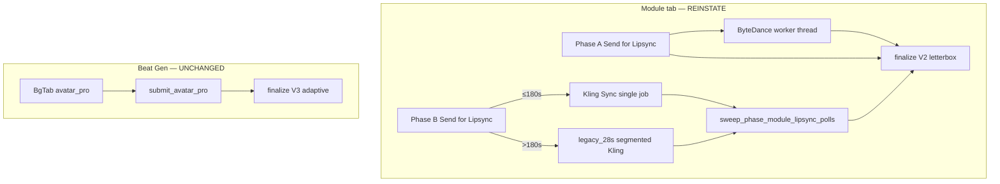

# TECH SPEC — Module Phase A/B legacy lipsync reinstatement v1

**Status:** Approved for implementation (3×3 debate below)  
**Scope:** Revert **Module tab** Phase A/B from Kling Avatar Pro back to legacy lipsync pipelines. **Beat Gen Avatar Pro is unchanged.**  
**Supersedes (module only):** `TECH_SPEC_PHASE_A_AVATAR_PRO_WIRE_v1.md`, `TECH_SPEC_PHASE_B_AVATAR_PRO_WIRE_v1.md`  
**Proof anchor:** Event_3 Phase B (~204s Cedric stem) + Phase A (~29s Arlo stem) — legacy regen → v6 re-splice → module bake.

---

## Success statement

Kim opens **Module → Phase A or Phase B** on any event with a voice stem:

1. **Phase A:** Base-clip picker visible; **Send for Lipsync** submits ByteDance tight lipsync on canonical Arlo idle base (`base_clip_bytedance_tight_v1`). Worker thread runs async; restart resumes via `sweep_phase_a_lipsync_resume`.
2. **Phase B:** Base-clip picker required (`cedric_base_clip_id`); **Send for Lipsync** submits Kling Sync on crossfade-looped Cedric base. Stems **≤180s** → single job; **>180s** → `legacy_28s` segmented Kling (~8 chunks for Event 3).
3. Terminal delivery uses **V2 letterbox** (`PHASE_MODULE_LIPSYNC_DELIVERY_RECIPE_V2`) — not V3 adaptive sacrifice (Avatar-only).
4. State shows legacy methods; Avatar-only keys (`avatar_still_file`, `lipsync_route`, `estimated_cost_usd`) are **not written** on module submit.
5. **Beat Gen** tab still submits Avatar Pro via `submit_avatar_pro` + V3 delivery — zero regression.
6. Existing Avatar pins on disk remain until operator regen; stitch reads `phase_*_lipsync_file` regardless of method.

---

## Non-goals (v1)

- Removing Beat Gen Avatar Pro (`beat_avatar_lipsync`, `submit_avatar_pro`, `BgTab` `avatar_pro` mode).
- Naive `git revert` of omnibus commits (`819b4d3` mixed unrelated fixes).
- Pause-aligned segmentation (`pause_aligned_v2`) — proven to fragment Event 3 audio.
- Avatar segmented runner (`run_phase_b_avatar_segmented_production.py`) — delete, not restore.
- Kid-app (`MindfulNest`) changes — no module Avatar code exists there.
- Auto-deleting Dropbox Avatar MP4 artifacts — archive after green regen only.

---

## Architecture (target)



---

## 3×3 agent debate

Three agents × three axes. **Verdict** column is binding for implementation.

### Round 1 — Shape of the reinstatement

#### Axis 1 — Handler change strategy

| Agent | Position | Rationale |
|-------|----------|-----------|
| **A — Naive git revert** | Revert `bea295d` + `b6fc45a` | Fast; omnibus ancestry makes this unsafe |
| **B — Surgical restore** | Extract `handle_phase_a_lipsync` from `bea295d^`, `handle_phase_b_lipsync` from `b6fc45a^`; re-wire existing helpers on disk | Helpers never deleted; lowest regression risk |
| **C — Greenfield reimplement** | Rewrite handlers from spec prose | Duplicates 700+ lines; invites subtle bugs |

**Verdict: B** — Forward surgical restore + hybrid Phase B branch. **Not** whole-commit revert.

---

#### Axis 2 — Phase B long stems (>180s)

| Agent | Position | Rationale |
|-------|----------|-----------|
| **A — Single Kling job only (MVP)** | Ship ≤180s path first; defer chunking | Simpler PR; Event 3 blocked (~204s) |
| **B — Hybrid in v1** | ≤180s single; >180s `legacy_28s` from deploy backup | Event 3 is proof anchor; ~8 chunks vs 19 pause-aligned |
| **C — Avatar full-stem for long B** | Keep Avatar for >180s only | Perpetuates cost/quality class user rejected |

**Verdict: B** — Hybrid in **same PR** as handler restore. Forced `strategy=legacy_28s` at call site; **never** `pause_aligned_v2`.

---

#### Axis 3 — Delivery encode routing

| Agent | Position | Rationale |
|-------|----------|-----------|
| **A — V3 adaptive for all module output** | One recipe | Kling Sync 720×544 pillarbox crashes V3 nose probe; wrong tool for legacy |
| **B — Method-gated: legacy → V2 letterbox; Avatar → V3** | `finalize(..., delivery_recipe=...)` from `lipsync_method` | Beat Gen keeps V3; module gets proven letterbox strip |
| **C — Skip delivery encode for legacy** | Save raw Kling bytes | Regresses bitrate/shape gates; stitch preflight breaks |

**Verdict: B** — Restore V2 path in `plan_module_lipsync_reframe()` + `finalize_phase_module_lipsync_delivery()`. **Hard gate:** Commit A must land letterbox branch **before** handler revert (current uncommitted code is V3-only and raises on non-V3).

---

### Round 2 — Cleanup & sequencing

#### Axis 4 — Segmented module files

| Agent | Position | Rationale |
|-------|----------|-----------|
| **A — Delete all segmented code** | Fewer files | Breaks >180s hybrid; `phase_b_segmented_timeline_assemble` already imports missing module |
| **B — Restore Kling segmented to git; delete Avatar segmented runner only** | Commit backup `phase_b_kling_segmented_lipsync.py`; drop `run_phase_b_avatar_segmented_production.py` | Correct split: Kling library vs Avatar experiment |
| **C — Keep broken imports** | No file moves | CI/import smoke fails forever |

**Verdict: B** — Restore from `.deploy_backups/20260623T221700Z/Production/tools/phase_b_kling_segmented_lipsync.py` into git (fix typo on line 136). **Delete** `run_phase_b_avatar_segmented_production.py`. **Keep** `phase_b_segmented_timeline_assemble.py`. **Do not** restore `phase_b_kling_pause_aligned_segments.py` unless import requires it — strip pause-aligned import if `legacy_28s` only needs `chunk_audio_for_bytedance`.

---

#### Axis 5 — Module Avatar operator scripts

| Agent | Position | Rationale |
|-------|----------|-----------|
| **A — Delete all 6 immediately** | Clean tree | Loses incident recovery; grep-locked tests break mid-PR |
| **B — Phase 2 archive after green QA** | Move to `Production/tools/archive/20260704_module_avatar_runners/` with deprecation headers | Bisect-friendly; one escape hatch optional |
| **C — Keep all scripts wired** | Dual runtime | Confuses operators; contradicts revert |

**Verdict: B** — **Delete now:** `run_phase_b_avatar_segmented_production.py` (deprecated pause-aligned). **Archive after Event 3 bake green:** `run_phase_a/b_avatar_full_stem_production.py`, `run_phase_a_avatar_20s_probe.py`, `run_phase_b_avatar_5s_probe.py`, `run_phase_b_avatar_insert_splice.py`.

---

#### Axis 6 — Commit sequencing

| Agent | Position | Rationale |
|-------|----------|-----------|
| **A — Monolithic revert PR** | One diff | Cannot bisect delivery vs routing failures |
| **B — Commit A (shared durability) → Commit B (reinstatement) → Commit C (archive)** | Transitions + delivery branch first | Proven operator workflow |
| **C — Revert handlers first** | Unblock UI | Delivery V3-only crashes legacy terminal write |

**Verdict: B** — See [Commit plan](#commit-plan) below.

---

### Round 3 — Durability & isolation

#### Axis 7 — Phase A async model

| Agent | Position | Rationale |
|-------|----------|-----------|
| **A — Unify on Avatar poller for Phase A** | One sweep | ByteDance is sync worker + tmp checkpoint — different lifecycle |
| **B — Restore worker + `sweep_phase_a_lipsync_resume`** | Pre-Avatar proven path | Current sweep **poisons** legacy `running` rows |
| **C — Sync ByteDance in HTTP handler** | Simple | Blocks HTTP; dies on tab close |

**Verdict: B** — Restore full resume (re-spawn worker from `_tmp_phase_a_permanent`). Remove “resubmit Avatar Pro” clear stub.

---

#### Axis 8 — Beat Gen firewall

| Agent | Position | Rationale |
|-------|----------|-----------|
| **A — Shared handler with feature flag** | One code path | Highest cross-contamination risk |
| **B — Module handlers + PhaseProducer only** | Never touch `beat_avatar_lipsync`, `arlo_avatar_beat_pipeline`, `submit_avatar_pro` | Category separation |
| **C — Delete `phase_b_avatar_lipsync.py`** | Name says phase_b | Breaks Beat Gen + lipsync_sender imports |

**Verdict: B** — Split `test_beatgen_omni_restore`: Beat Gen unchanged; **module** handler must **not** call `submit_avatar_pro`.

---

#### Axis 9 — production_state migration

| Agent | Position | Rationale |
|-------|----------|-----------|
| **A — Purge all Avatar keys from JSON on deploy** | Clean state | Breaks audit trail; stitch pins still reference Avatar MP4s |
| **B — Pop Avatar keys on first legacy submit; leave historical files** | Forward-only migration | Safe; operator regen writes new keys |
| **C — Ignore stale keys** | No migration | UI may show Avatar still chip if not cleared |

**Verdict: B** — On legacy submit `pop()`: `phase_*_lipsync_route`, `phase_*_avatar_still_file`, `phase_*_lipsync_estimated_cost_usd`, `phase_*_lipsync_raw_file` (optional keep raw pattern for Kling). Set `phase_*_lipsync_requires_regen` until regen complete. **Reconcile Event 3 stem** before regen (~12.6s state vs ~205s lipsync mismatch).

---

## Avatar Pro cleanup (module scope)

### KEEP — Beat Gen & shared transport (never delete on this project)

| Item | Role |
|------|------|
| `phase_b_avatar_lipsync.py` | Shared constants (`AVATAR_PRO_PROHIBIT`, `estimate_avatar_pro_usd`, …) — **misnamed; not module-only** |
| `beat_avatar_lipsync.py` | Beat prompts, `encode_avatar_pro_delivery()` |
| `lipsync_sender.submit_avatar_pro()` | WaveSpeed Avatar transport |
| `arlo_avatar_beat_pipeline.py` | Beat Gen subprocess |
| `phase_a_avatar_lipsync.py` | Unused after module revert; **archive**, do not delete until Beat Gen audit confirms zero imports |
| `kling_startend_pipeline.ensure_avatar_still_dimensions()` | Submit-time still prep (Beat Gen) |
| `phase_module_lipsync_delivery.py` V3 probes | Beat Gen gibberish crop |
| `TECH_SPEC_BEAT_GEN_AVATAR_PRO_v1.md` | Beat Gen authority |

### REPLACE — Module hot path

| Item | Action |
|------|--------|
| `server_handlers/phases.py` | Restore legacy handlers; rename `_apply_phase_avatar_pro_audio_prep` → `_apply_phase_lipsync_audio_prep` (generic pad after trim) |
| `PhaseProducer.tsx` | Base-clip picker; “Send for Lipsync”; POST `base_clip_id` |
| `phaseAArloContract.ts` | Remove `PHASE_A_ARLO_AVATAR_STILL_LABEL` |
| `sweep_phase_a_lipsync_resume` | Full ByteDance resume |
| Module tests asserting Avatar | Flip to legacy contract (see [Test matrix](#test-matrix)) |

### RESTORE — Never committed to git

| File | Source |
|------|--------|
| `phase_b_kling_segmented_lipsync.py` | `.deploy_backups/20260623T221700Z/Production/tools/` |

### DELETE

| File | Reason |
|------|--------|
| `run_phase_b_avatar_segmented_production.py` | Deprecated pause-aligned Avatar chunks |

### ARCHIVE (post-QA)

| File | When |
|------|------|
| `run_phase_a_avatar_full_stem_production.py` | After Event 3 bake green |
| `run_phase_b_avatar_full_stem_production.py` | Same |
| `run_phase_a_avatar_20s_probe.py` | Same |
| `run_phase_b_avatar_5s_probe.py` | Same |
| `run_phase_b_avatar_insert_splice.py` | Same |

### OPTIONAL (follow-up PR, not blocking)

- Rename `phase_b_avatar_lipsync.py` → `avatar_pro_contract.py`
- Rename delivery probes `probe_avatar_pro_*` → `probe_delivery_*`

---

## Implementation plan

### Phase 0 — Prerequisites (Commit A)

**Token:** `PHASE_MODULE_LIPSYNC_LEGACY_PREP_V1`

1. **Delivery branch restore** in `phase_module_lipsync_delivery.py`:
   - `plan_module_lipsync_reframe(path, *, delivery_recipe=...)` routes:
     - `PHASE_MODULE_LIPSYNC_DELIVERY_RECIPE_V2` → letterbox side-strip + subtitle band + scale-to-fill (`build_phase_lipsync_reframe_vf`)
     - `PHASE_MODULE_LIPSYNC_DELIVERY_RECIPE_V3` → adaptive sacrifice (`plan_module_lipsync_reframe_v3`)
   - `finalize_phase_module_lipsync_delivery(..., delivery_recipe=...)` accepts explicit recipe; default V3 for Beat Gen callers.
   - `_write_phase_*_lipsync_complete` passes recipe from `lipsync_method`:
     - Legacy methods → V2
     - `kling_avatar_pro_v1` → V3 (Beat Gen + any stale Avatar pins reencoded manually)
2. **Late-fade transitions** — ship `STITCH_MODULE_LATE_FADE_TRANSITIONS_V1` (already on branch).
3. **Raw pin** — keep for forward Kling downloads (`*_raw.mp4`); legacy reencode uses native download or undelivered source.
4. **Audio padding** — `_apply_phase_lipsync_audio_prep` (generic) after stem trim for **all** module lipsync submits.
5. **Tests:** delivery V2 smoke on synthetic Kling-shaped 720×544; V3 unchanged for Beat Gen parity test.

### Phase 1 — Handler reinstatement (Commit B)

**Token:** `MODULE_LIPSYNC_LEGACY_REINSTATE_V1`

#### Phase A handler (`bea295d^` extract)

- Require / resolve `base_clip_id` (Arlo idle wizard desk v4).
- `_spawn_phase_a_lipsync_worker` → `run_phase_a_base_clip_bytedance_lipsync`.
- Terminal: `needs_manual_visual_review`, `phase_a_lipsync_method=base_clip_bytedance_tight_v1`.
- Budget: ByteDance cost model (not `estimate_avatar_pro_usd`).
- **No** `submit_avatar_pro`.

#### Phase B handler (`b6fc45a^` extract + hybrid)

```python
LIPSYNC_SINGLE_PASS_MAX_S = 180.0  # single constant in phase_lipsync_job_contract.py

if audio_duration_s <= LIPSYNC_SINGLE_PASS_MAX_S:
    prep_phase_b_kling_base_video(...)
    LipSyncClient.submit(video, audio)
    # polling path unchanged
else:
    from phase_b_kling_segmented_lipsync import (
        PHASE_B_KLING_SEGMENT_STRATEGY_LEGACY,
        run_phase_b_kling_segmented_lipsync,
    )
    run_phase_b_kling_segmented_lipsync(
        ...,
        segment_strategy=PHASE_B_KLING_SEGMENT_STRATEGY_LEGACY,  # forced — never pause_aligned
    )
    # sync multi-job OR async per-chunk polling — match backup behavior; document in PR
```

- Require `base_clip_id`; `coerce_phase_b_cedric_base_clip_id`.
- Budget: `COST_PER_LIPSYNC × chunk_count` preflight for segmented path.
- State: `phase_b_cedric_base_clip_id`; **pop** Avatar keys on submit.

#### Shared terminal write

- `_write_phase_b_lipsync_complete` / Phase A equivalent:
  - `finalize_phase_module_lipsync_delivery(..., delivery_recipe=V2, dest_path=...)`
  - `add_spend("lipsync", COST_PER_LIPSYNC)` (× chunks if segmented)
  - Write `phase_*_lipsync_delivery_recipe=PHASE_MODULE_LIPSYNC_DELIVERY_RECIPE_V2`

#### UI (`PhaseProducer.tsx`)

- Restore base-clip `<select>` Phase A + B.
- Button label: **Send for Lipsync** (not Avatar Pro).
- Phase B: hide Avatar still chip; show Cedric base clip picker.
- Busy state: Phase A `running`; Phase B `polling` — via `phase_lipsync_job_contract`.

#### Poller scope

- `sweep_phase_module_lipsync_polls` — Phase B (and Phase A if ever on polling path).
- `sweep_phase_a_lipsync_resume` — Phase A ByteDance worker only.

### Phase 2 — Cleanup (Commit C, after Event 3 QA)

- Archive module Avatar runners (see table above).
- Supersede headers on `TECH_SPEC_PHASE_A/B_AVATAR_PRO_WIRE_v1.md`.
- Optional Dropbox housekeeping: move pre-revert Avatar MP4s to `.backups/pre_avatar_revert/`.

---

## File change checklist

| File | Change |
|------|--------|
| `server_handlers/phases.py` | Restore A/B handlers; resume sweep; generic audio prep; recipe-gated finalize |
| `phase_module_lipsync_delivery.py` | V2/V3 branch in plan + finalize |
| `phase_b_kling_segmented_lipsync.py` | **Add** from deploy backup |
| `phase_b_kling_base_prep.py` | Re-wire only (no edit unless bitrate constant drift) |
| `phase_a_middle_permanent.py` | Re-wire only |
| `phase_lipsync_job_contract.py` | Add `LIPSYNC_SINGLE_PASS_MAX_S = 180` |
| `storyboard-v2/.../PhaseProducer.tsx` | Legacy UI |
| `storyboard-v2/.../phaseAArloContract.ts` | Remove Avatar still label |
| `run_phase_b_avatar_segmented_production.py` | **Delete** |
| `tests/test_phase_a_avatar_wire.py` | Flip to legacy assertions |
| `tests/test_chipper_reliability_gates.py` | Flip Phase A gate |
| `tests/test_phase_b_kling_base_prep.py` | Flip handler gate |
| `tests/test_phase_b_panel.py` | Mock `LipSyncClient.submit`, not `submit_avatar_pro` |
| `tests/test_beatgen_omni_restore.py` | Split module vs Beat Gen |
| **New** `tests/test_phase_b_kling_segmented_legacy.py` | Import smoke + `legacy_28s` segment count for 204s fixture |

### Do not edit (Beat Gen firewall)

- `beat_avatar_lipsync.py`
- `arlo_avatar_beat_pipeline.py`
- `lipsync_sender.submit_avatar_pro`
- `beat_generator.py` Avatar branches
- `BgTab.tsx` `avatar_pro` mode
- `server_handlers/background.py` Avatar beat routing

---

## production_state keys

### Written on legacy submit

| Key | Value |
|-----|-------|
| `phase_a_lipsync_method` | `base_clip_bytedance_tight_v1` |
| `phase_a_chipper_sitting_clip_id` | base clip id |
| `phase_b_cedric_base_clip_id` | base clip id |
| `phase_*_lipsync_status` | `running` (A) or `polling` (B) |
| `phase_*_lipsync_delivery_recipe` | `PHASE_MODULE_LIPSYNC_DELIVERY_RECIPE_V2` on complete |

### Popped on legacy submit

| Key |
|-----|
| `phase_*_avatar_still_file` |
| `phase_*_lipsync_route` |
| `phase_*_lipsync_estimated_cost_usd` |
| `phase_*_lipsync_audio_duration_s` (optional pop) |

### Unchanged (method-agnostic)

| Key | Notes |
|-----|-------|
| `phase_*_lipsync_file` | Stitch slot authority reads this |
| `phase_*_lipsync_requires_regen` | Set until regen proof |

---

## Event 3 operator sequence

Strict order after **Commit A + B** deployed and server restarted:

1. **Stem reconcile** — Regen Audio → Mix Audio; confirm `phase_b_voice_stem_file` duration matches ~204s (not ~12.6s stale pin).
2. **Clear stale polling** — If `phase_*_lipsync_status=polling`, operator reset or wait for sweep idle.
3. **Phase B Send for Lipsync** — Expect segmented (~8 × 28s Kling jobs); budget ~$2.80 vs Avatar ~$23.
4. **Phase A Send for Lipsync** — ByteDance on Arlo base; visual review gate.
5. **Delivery verify** — Output 1280×720 V2 letterbox; no V3 sacrifice metadata on module pins.
6. **Re-splice Phase B v6** — Lipsync swap invalidates existing preview; re-export `phase_b_preview_cedric_trim_*_v6.mp4`.
7. **Stitch slot export** — Confirm `STITCH_BAKE_SLOT_AUTHORITY_V1` slot points at v6 (~200.9s playback).
8. **Module bake** — Audit boundary fades `[2800, 3800, 3800]`; Phase B tail not dimmed before resolution.
9. **Archive** — Move superseded Avatar MP4s to `.backups/pre_avatar_revert/` (optional).

---

## Commit plan

| Commit | Token | Contents |
|--------|-------|----------|
| **A** | `PHASE_MODULE_LIPSYNC_LEGACY_PREP_V1` | V2/V3 delivery branch; transitions; generic audio prep; raw pin; tests |
| **B** | `MODULE_LIPSYNC_LEGACY_REINSTATE_V1` | Handlers; UI; segmented restore; test flips; delete avatar segmented runner |
| **C** | `MODULE_AVATAR_RUNNER_ARCHIVE_V1` | Archive scripts; doc supersede headers (after Event 3 QA) |

**Do not** include in commits: `.runtime_*`, `.production_snapshots`, `server_event_pin.json`, generated HTML bundles.

---

## Test matrix

| Tier | Command | Pass criteria |
|------|---------|---------------|
| Unit | `pytest tests/test_phase_module_lipsync_delivery.py` | V2 plan on 720×544 fixture; V3 on Avatar fixture; sacrifice ≤30% unchanged |
| Unit | `pytest tests/test_stitch_module_late_fade_transitions_v1.py tests/test_black_pause_boundaries.py` | Fade budgets `[2800,3800,3800]`; B→res out=0 |
| Unit | `pytest tests/test_phase_b_kling_segmented_legacy.py` | Import OK; 204s → ~8 segments; strategy forced legacy |
| Contract | `pytest tests/test_phase_a_avatar_wire.py` (renamed) | Handler has ByteDance; no `submit_avatar_pro` in Phase A block |
| Contract | `pytest tests/test_phase_b_kling_base_prep.py` | Handler has `prep_phase_b_kling_base_video` + `submit` |
| Contract | `pytest tests/test_beatgen_omni_restore.py` | Beat Gen still uses Avatar; module handler does not |
| Contract | `pytest tests/test_beat_avatar_pipeline.py tests/test_avatar_pro_delivery_parity.py` | Unchanged green |
| Integration | Dropbox Event_3 Phase B probe (skip if absent) | V2 delivery; clean bottom band at ~180s |
| Operator | Phase B regen + v6 re-splice + bake | Audit slot authority + transition fades |

---

## Top failure modes & guards

| # | Failure | Guard |
|---|---------|-------|
| 1 | V3-only finalize crashes legacy Kling output | Commit A recipe branch; pytest V2 smoke |
| 2 | Beat Gen regression via shared finalize | Explicit `delivery_recipe` param; Beat Gen passes V3 |
| 3 | Phase A resume clears ByteDance work | Restore full `sweep_phase_a_lipsync_resume`; restart test |
| 4 | Segmented defaults to pause_aligned | Handler hardcodes `legacy_28s`; CI import test |
| 5 | Bake uses stale v5 slot after lipsync swap | Operator sequence step 6–7; `requires_regen` gate |

---

## Cost reference (full stem, Event 3 scale)

| Path | Phase B ~204s | Phase A ~29s |
|------|---------------|--------------|
| Avatar Pro | ~$23 | ~$3.27 |
| Kling single (if ≤180s) | ~$0.35 | — |
| Kling legacy_28s (~8 jobs) | ~$2.80 | — |
| ByteDance tight | — | ~$0.15–0.35 |

---

## Doc supersession

| Document | Status after this spec |
|----------|------------------------|
| `TECH_SPEC_PHASE_A_AVATAR_PRO_WIRE_v1.md` | **Superseded** for Module tab; historical reference |
| `TECH_SPEC_PHASE_B_AVATAR_PRO_WIRE_v1.md` | **Superseded** for Module tab; historical reference |
| `TECH_SPEC_MODULE_LIPSYNC_V3_RAW_PIN_v1.md` | **Amended** — V3 applies to Avatar/Beat Gen; module legacy uses V2 |
| `TECH_SPEC_BEAT_GEN_AVATAR_PRO_v1.md` | **Active** — unchanged |

---

## Implementation sign-off

3×3 debate consensus: **surgical handler restore + hybrid Phase B + method-gated V2/V3 delivery + Beat Gen firewall + phased script archive**. Simplicity hawk’s “defer >180s” was **overruled** for Event 3 proof anchor; “surgical restore not reimplement” was **adopted**.

**Next step:** Implement Commit A on branch `fix/phase-lipsync-v3-transitions-v1`, then Commit B on `feat/module-lipsync-legacy-reinstate-v1`.
