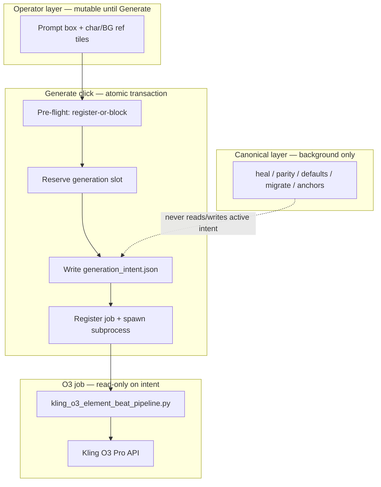

# O3 Generation Intent Snapshot — Tech Spec v1

**Status:** Implemented (tooling, 2026-06-15) — commit `778e828` on `feat/o3-generation-intent-snapshot`  
**Owner:** mindfulnest-tooling  
**Incident driver:** Event 2 Beat 13 (`bg_arc1_event2_pre_beat_30`, Loral) — prompt morph, char-ref ignore, g7 overwrite, silent orphan recovery, UI snap-back  
**User-facing promise:** **Whatever is in the prompt box and ref tiles when you click Generate is exactly what Kling receives** — prompt, visual identity, voice element, and generation slot — with no silent morphs, leaks, or “success” when something failed.

---

## Problem statement

Beat Gen treats the live beat sidecar as **both** an operator workbench (typed prompt, dropped refs, locks) **and** a canonical maintenance surface (parity, proven bind, heal, defaults, anchors). Those concerns write the **same fields** (`kling_o3_prompt`, `reference_image`, `kling_o3_generation`, element binding) at different times with different authority.

### Symptom → mechanism map

| Symptom | Mechanism | Why intent-freeze flags alone fail |
|---------|-----------|-----------------------------------|
| `(female raccoon)` stripped after Generate | `ensure_operator_insert_char_ref_parity` pops `o3_prompt_box_law` and calls `build_kling_o3_prompt` **after** submit handler stamps box law | One of ~30 rewrite paths; guards are whack-a-mole |
| Magnifying-glass pose despite hands-to-face drop | `@Image1` correct in submit log; Kling identity from Element `refer_images`; gate false-passes via `allow_pose_dir_fallback` (bytes in `poses/` ≠ registered on Element) | Two parallel identity channels with fuzzy alignment |
| Good g7 overwritten (no g8) | `gen = sidecar_gen + 1` collides with existing disk clip; redo slot clearing deletes prior good file | Not intent override — split source of truth for slot numbering |
| Textarea snaps back immediately | `promptDirtyRef` cleared; `refreshState` repaints from morphed sidecar | UI mirrors mutable sidecar, not committed intent |
| “It worked” with wrong voice/pose | Dropbox `errno 11` sidecar crash; orphan recovery reports `done` without terminal failure contract | Observability gap, not mutation policy |

### Root cause (one line)

**Generate is not a transaction.** There is no immutable record of operator intent at click time; canonical layers and the subprocess both read/write live sidecar mid-flight.

### What we are not doing

- Sprinkling more `if o3_prompt_box_law` guards on individual heal paths (Agent 3)
- Rewriting `BgTab.tsx` or splitting Beat Gen UI
- Replacing `character_subjects.json` / proven bind / anchor model wholesale
- Changing Kling API semantics (Element + `@Image1` dual channel stays; we make alignment explicit and mandatory)

---

## Design decision: Generation Intent Snapshot

On **Generate click**, the server performs an **atomic intent commit** that produces a frozen `generation_intent` record. Until that job reaches a **terminal state**, every consumer reads the intent — not live sidecar fields — for submit payload, UI display, and audit.



### Two-layer beat model (conceptual)

| Layer | Storage | Writers | Readers |
|-------|---------|---------|---------|
| **Operator draft** | `beat.kling_o3_prompt`, `beat.reference_image`, locks | `update-beat`, UI debounced save | Beat Gen cards (editable when no active intent) |
| **Canonical** | proven bind, anchors, default prompt templates, emotion picks | `_migrate_sidecar`, parity (when no active intent), session reconcile | Next Generate pre-flight only |
| **Committed intent** | `{event_dir}/arlo_o3_jobs/{job_id}_intent.json` | **Once** at Generate commit | Subprocess, poll, UI during job, terminal audit |

Active intent **wins** over sidecar for display and API payload until terminal.

---

## Invariants (must never regress)

1. **Intent immutability** — After `{job_id}_intent.json` is written, no code path may mutate its fields. Corrections require a new Generate (new `job_id` / `intent_id`).
2. **Payload authority** — Subprocess and Kling API use **only** resolved fields from the intent file. Subprocess must not call `heal_*`, `build_kling_o3_prompt`, `ensure_operator_insert_char_ref_parity`, or `ensure_beat_element_aligned_reference` on intent-bearing fields.
3. **Visual identity closure** — Intent commit fails closed unless `char_ref_abs_path` is a member of the live Element pose set (`char_ref_matches_element_images(..., allow_pose_dir_fallback=False)`) OR commit successfully re-registers the pose onto the Element first.
4. **Slot reservation** — `generation_slot` is allocated as `max(sidecar_gen, highest_g_on_disk(beat_id)) + 1` and reserved **before** subprocess spawn. No unlink of an existing `g{N}` clip during reservation.
5. **Terminal honesty** — Job status is exactly one of: `running`, `done`, `failed`, `done_with_warning`. `done` requires sidecar persist success **or** explicit operator acknowledgment of recovery. Silent orphan `done` without `warning` is forbidden.
6. **UI fidelity** — While `status === running`, prompt textarea and ref thumbnails display intent snapshot values, not live sidecar refresh.
7. **Concurrent job guard** — Second Generate on same beat while intent active returns `409 INTENT_JOB_ACTIVE` (existing behavior extended to intent contract).
8. **Attempt isolation** — Subprocess sidecar writes use `expected_attempt_id` from intent; stale attempts cannot mutate beat state (existing `update_beat_locked` behavior).

---

## Schema: `generation_intent`

**Path:** `{event_dir}/arlo_o3_jobs/{job_id}_intent.json`  
**Written:** synchronously in `handle_bg_submit_arlo_o3_voice` **before** `Popen`, after pre-flight passes.  
**Env passed to subprocess:** `MN_O3_INTENT_PATH={absolute_path}` (replaces inferring payload from live sidecar).

```json
{
  "schema_version": 1,
  "intent_id": "<uuid hex>",
  "job_id": "<8-char>",
  "beat_id": "bg_arc1_event2_pre_beat_30",
  "event_id": "Event_2",
  "phase": "pre",
  "committed_at": "2026-06-15T19:30:00.000Z",
  "committed_by": "submit-arlo-o3-voice",

  "prompt": {
    "verbatim": "Loral (female raccoon) speaks with a warm female voice: ...",
    "spoken_sent": "extracted single sentence for audit",
    "sha256": "<hex of verbatim string>"
  },

  "visual": {
    "char_ref_abs_path": "/.../ChatGPT Image Jun 15, 2026, 03_51_40 PM (1).png",
    "char_ref_sha256": "<hex>",
    "bg_ref_abs_path": "/.../bg.png",
    "bg_ref_sha256": "<hex>",
    "reference_image_locked": true,
    "element_char_ref_gate": {
      "aligned": true,
      "method": "live_refer_images",
      "refer_images_resolved": [
        "Lorelai/poses/lorelai_canonical_neutral.png",
        "Lorelai/poses/chatgpt_image_jun_15_2026_03_51_40_pm_1.png",
        "Lorelai/poses/lorelai_explaining.png"
      ],
      "registration_action": "reconciled"
    }
  },

  "voice": {
    "speaker": "Lorelai",
    "element_id": "313441038164306",
    "element_name": "Loral",
    "kling_voice_id": "895210468825628751",
    "proven_o3_bind": {
      "lock_element_id": true,
      "proven_from_beat_id": "bg_arc1_event2_pre_beat_18"
    }
  },

  "generation": {
    "slot": "g8",
    "slot_index": 8,
    "master_clip_path": ".../kling_o3_clips/bg_arc1_event2_pre_beat_30_g8_element_o3_master.mp4",
    "delivery_clip_path": ".../kling_o3_clips/bg_arc1_event2_pre_beat_30_g8_element_o3_master_delivery.mp4",
    "sidecar_gen_before": 7,
    "disk_gen_max_before": 7,
    "replace_slot_index": null
  },

  "runtime": {
    "attempt_id": "<uuid hex>",
    "log_path": ".../arlo_o3_jobs/{job_id}_{beat_id}.log",
    "pipeline_script": ".../kling_o3_element_beat_pipeline.py"
  },

  "preflight": {
    "checks_passed": [
      "prompt_non_empty",
      "char_ref_file_exists",
      "bg_ref_file_exists",
      "element_char_ref_aligned",
      "proven_o3_bind_valid",
      "slot_reserved"
    ],
    "canonical_skipped": [
      "ensure_operator_insert_char_ref_parity",
      "apply_kling_o3_defaults_to_beat"
    ]
  }
}
```

### Terminal sidecar: `{job_id}_terminal.json`

Written when job completes (success, failure, or warning). UI poll prefers this over log parsing when present.

```json
{
  "schema_version": 1,
  "job_id": "...",
  "intent_id": "...",
  "status": "done",
  "terminal_at": "ISO",
  "phase_last": "finalize",
  "sidecar_persist_ok": true,
  "warning": null,
  "submitted": {
    "prompt_voice_excerpt": "Loral (female raccoon) speaks...",
    "char_ref": "/absolute/path.png",
    "element_id": "313441038164306"
  },
  "delivered": {
    "video_path": "..._g8_element_o3_master_delivery.mp4",
    "duration_s": 5.04,
    "generation": 8
  },
  "failure": null
}
```

**`done_with_warning` example:**

```json
{
  "status": "done_with_warning",
  "warning": {
    "code": "ORPHAN_DELIVERY_RECOVERED",
    "message": "Sidecar write failed (errno 11); delivery recovered from disk.",
    "recovered_from": "orphan_delivery_after_sidecar_io_error"
  },
  "sidecar_persist_ok": false
}
```

---

## Generate commit transaction (server)

**Handler:** `handle_bg_submit_arlo_o3_voice` (`server_handlers/background.py`)

### Phase 0 — Guards (unchanged + extended)

| Check | Error code |
|-------|------------|
| Beat exists | `BEAT_NOT_FOUND` |
| No active intent/job on beat | `INTENT_JOB_ACTIVE` (409) |
| Prompt non-empty | `EMPTY_PROMPT` |
| Speaker voice-ready | `SPEAKER_NOT_VOICE_READY` |

### Phase 1 — Capture operator payload (from request body only)

Read **only** from POST body for intent fields — not from sidecar after migrate:

- `kling_o3_prompt` → `prompt.verbatim`
- `reference_image`, `bg_ref_image` → `visual.*` (validate files exist)
- `replace_slot_index` → `generation.replace_slot_index`

**Do not** run `_migrate_sidecar` heals on these fields before capture. Migrate may run on **other** beats in sidecar under lock, but the target beat's operator fields for this transaction come from the body snapshot.

### Phase 2 — Visual identity closure (register-or-block)

```
char_path = body.reference_image.abs_path
speaker = beat.speaker (from sidecar — immutable for insert beats)

IF NOT char_ref_matches_element_images(char_path, speaker, allow_pose_dir_fallback=False):
    IF reference_image_locked:
        result = try_register_dropped_char_ref_on_element(beat, wavespeed_key)
        IF NOT result.ok:
            RETURN 400 ELEMENT_VISUAL_MISMATCH with detail + refer_images on disk
        Re-fetch refer_images_resolved from registry
        Re-check char_ref_matches_element_images(..., allow_pose_dir_fallback=False)
        IF still false:
            RETURN 400 ELEMENT_REGISTRATION_FAILED
    ELSE:
        RETURN 400 ELEMENT_VISUAL_MISMATCH (unlocked must align before commit)
```

**Critical rule:** `allow_pose_dir_fallback=False` at commit. Poses-dir byte presence alone is **not** alignment.

**Proven bind:** `validate_proven_o3_element_submit` runs against resolved `element_id` / `kling_voice_id` **after** any registration. `lock_element_id: true` does not skip visual closure — it only pins which Element receives the new pose.

### Phase 3 — Voice / element resolution (read-only)

- `resolve_o3_element_list_entry(beat, sidecar)` → intent `voice.*`
- No `finalize_proven_element_beat`, `ensure_operator_insert_char_ref_parity`, or `apply_kling_o3_defaults_to_beat` on this beat during commit.

### Phase 4 — Slot reservation

```python
sidecar_gen = int(beat.get("kling_o3_generation") or 0)
disk_gen_max = highest_o3_generation_on_disk(beat_id, event_dir)  # scan kling_o3_clips/
next_gen = max(sidecar_gen, disk_gen_max) + 1
slot_label = f"g{next_gen}"
# Do NOT delete existing clips. Reservation is allocate-only.
```

Write paths into intent `generation.*`. If `replace_slot_index` set, record it — slot UI remap happens at finalize, not by deleting prior `g{N}` files at commit.

### Phase 5 — Write intent + spawn

1. Write `{job_id}_intent.json` (atomic: temp + rename)
2. Set beat job pointers: `kling_o3_voice_fix_attempt_id`, `kling_o3_voice_fix_ui_job_id`, `status=job_starting`, etc.
3. **Do not** write morphed `kling_o3_prompt` or `reference_image` back to sidecar except:
   - optional mirror of `prompt.verbatim` for post-job canonical display (same bytes as intent — not rebuilt)
4. `Popen` pipeline with env:
   - `MN_O3_INTENT_PATH`
   - `MN_O3_ATTEMPT_ID`
   - `MN_O3_JOB_LOG`
5. Register `_ARLO_O3_JOBS[job_id]`

### What commit explicitly does NOT do

| Removed from commit path | Reason |
|--------------------------|--------|
| `stamp_o3_prompt_box_law` / `o3_prompt_box_law` flags | Superseded by intent file |
| `ensure_operator_insert_char_ref_parity` | Canonical; violates verbatim prompt |
| `finalize_proven_element_beat` | Canonical; may rewrite refs/prompt |
| `ensure_beat_element_aligned_reference` (unlocked redirect) | Canonical |
| `upgrade_element_bound_voice_prompt` | Heal |
| `heal_o3_element_submit_prompt` | Heal |
| `prepare_kling_o3_prompt_for_submit` (rebuild) | Heal |
| `sync_element_char_ref_status` forcing ok while running | Replaced by intent pre-flight |

---

## Subprocess changes

**File:** `kling_o3_element_beat_pipeline.py`

### Boot

1. Load intent from `MN_O3_INTENT_PATH` — **required**. Missing file → `phase: failed`, exit 2.
2. Load sidecar for beat metadata only (speaker, beat_id, options layout) — not for prompt/ref resolution.
3. Validate intent files still exist on disk (`char_ref_abs_path`, `bg_ref_abs_path`).

### Submit

```python
char_path = intent["visual"]["char_ref_abs_path"]
bg_path = intent["visual"]["bg_ref_abs_path"]
prompt = intent["prompt"]["verbatim"]
element_entry = {
    "element_id": intent["voice"]["element_id"],
    "element_name": intent["voice"]["element_name"],
    "voice_id": intent["voice"]["kling_voice_id"],
}
gen = intent["generation"]["slot_index"]
```

Call `o3.run_beat_generation(api_key, prompt, char_path, bg_path, element_entry=element_entry)` — **no** intermediate heal functions.

Log `phase: o3_submit` with intent cross-reference:

```json
{"phase": "o3_submit", "intent_id": "...", "prompt_sha256": "...", "char_ref": "...", "element": {...}}
```

### Persist

- First running persist sets `kling_o3_generation` from `intent.generation.slot_index` (not `sidecar+1`).
- All `update_beat_locked` calls use `intent.runtime.attempt_id`.
- On success/failure, write `{job_id}_terminal.json`.

### Top-level failure envelope

Wrap `run_pipeline` in `try/except`:

```python
except Exception as exc:
    log_json({"phase": "failed", "error": str(exc), "traceback": ...})
    write_terminal(status="failed", ...)
    sys.exit(1)
```

Every exit path must emit terminal JSON.

---

## Canonical layer — when it may run

| Function | Allowed when | Blocked when |
|----------|--------------|--------------|
| `_migrate_sidecar` heals on **other** beats | Always | — |
| `_migrate_sidecar` heals on **target** beat | No active intent | `beat_o3_voice_job_running(beat)` OR `{job_id}_intent.json` exists with non-terminal status |
| `ensure_operator_insert_char_ref_parity` | No active intent; background session load | During active intent |
| `finalize_proven_element_beat` | New beat materialization; not during job | During active intent |
| `apply_kling_o3_defaults_to_beat` | Extract/insert materialization only | During active intent |
| `recover_orphan_o3_delivery` | Terminal recovery only | Must set `done_with_warning` if sidecar persist failed |

### Central gate helper

**New file:** `o3_generation_intent.py`

```python
def beat_has_active_intent(beat_id: str, event_dir: Path) -> bool:
    """True if any {job_id}_intent.json for beat_id has no terminal.json."""

def active_intent_path_for_beat(beat_id: str, event_dir: Path) -> Path | None:

def load_generation_intent(path: Path) -> dict:

def commit_generation_intent(...) -> dict:  # phases 1-5

def write_intent_terminal(job_id: str, event_dir: Path, payload: dict) -> None:

def assert_canonical_mutation_allowed(beat_id: str, event_dir: Path) -> None:
    """Raises IntentActiveError if canonical heal would touch operator fields."""
```

All Tier 1–4 mutation entry points (see Blast Radius) call `assert_canonical_mutation_allowed` or `beat_has_active_intent` before writing operator fields.

---

## Blast radius — every touchpoint

### New / modified files

| File | Change |
|------|--------|
| `Production/tools/o3_generation_intent.py` | **New** — schema, commit, load, terminal, active detection |
| `Production/tools/o3_job_status_contract.py` | Add `INTENT_TERMINAL_STATUSES`; `beat_has_active_generation_intent()` |
| `Production/tools/server_handlers/background.py` | Rewrite `handle_bg_submit_arlo_o3_voice` commit transaction; gate `handle_bg_update_beat`, `handle_bg_align_element_ref`, `handle_bg_add_element_pose`, `handle_bg_select_o3_video`; poll returns intent + terminal; `done_with_warning` |
| `Production/tools/kling_o3_element_beat_pipeline.py` | Intent-only submit; terminal JSON; try/except envelope |
| `Production/tools/beat_generator.py` | `highest_o3_generation_on_disk()`; `_migrate_sidecar` intent guard; remove gen+1 from running persist (intent owns gen) |
| `Production/tools/kling_character_registry.py` | Export strict gate wrapper `char_ref_aligned_for_intent_commit()` |
| `Production/tools/storyboard-v2/src/o3GenerationIntent.ts` | **New** — TS types + helpers |
| `Production/tools/storyboard-v2/src/o3JobStatusContract.ts` | Terminal status parity |
| `Production/tools/storyboard-v2/src/components/BgTab.tsx` | Intent-bound prompt/refs during job; post-submit audit strip; amber warning banner |
| `Production/tools/tests/test_o3_generation_intent_commit.py` | **New** — core contract tests |
| `Production/tools/tests/test_o3_generation_intent_blast_radius.py` | **New** — mutation blocking matrix |
| `Production/docs/BEATGEN_OPERATOR_CHAR_REF_VOICE.md` | Update operator docs |
| `.cursor/rules/mindfulnest-intro-canonical-tail.mdc` | N/A (intro only) |
| New rule: `.cursor/rules/o3-generation-intent.mdc` | Agent guardrail |

### API contract changes

#### `POST /api/bg/submit-arlo-o3-voice`

**Response (success):**

```json
{
  "ok": true,
  "job_id": "9e44f1e3",
  "intent_id": "...",
  "generation_slot": "g8",
  "submitted": {
    "prompt_excerpt": "Loral (female raccoon) speaks...",
    "char_ref": "/absolute/path.png",
    "element_id": "313441038164306",
    "refer_images": ["Lorelai/poses/..."]
  }
}
```

**Response (blocked):**

```json
{
  "ok": false,
  "error_code": "ELEMENT_VISUAL_MISMATCH",
  "error_message": "Char ref not in Element refer_images. Register or align before Generate.",
  "detail": { "char_ref": "...", "refer_images": ["..."] }
}
```

#### `GET /api/bg/poll-arlo-o3-voice-status`

Add fields:

```json
{
  "status": "running|done|failed|done_with_warning",
  "intent": { /* snapshot or subset */ },
  "terminal": { /* terminal.json when complete */ },
  "warning": { /* if done_with_warning */ },
  "beat": { /* enriched snapshot — must not overwrite intent-bound UI fields while running */ }
}
```

#### `POST /api/bg/update-beat`

When `beat_has_active_intent(beat_id)`:

- Reject mutations to `kling_o3_prompt`, `reference_image`, `bg_ref_image`, `speaker` → `409 INTENT_JOB_ACTIVE`
- Allow non-O3 fields (trim, notes, etc.) — optional v1: reject all beat updates during intent for simplicity

### Mutation entry point matrix (must block or redirect)

| Tier | Entry point | Action during active intent |
|------|-------------|----------------------------|
| 1 | `handle_bg_update_beat` | 409 on operator fields |
| 1 | `handle_bg_align_element_ref` | 409 |
| 1 | `handle_bg_add_element_pose` | 409 |
| 1 | `handle_bg_select_o3_video` | 409 |
| 1 | `handle_bg_generate_kling_prompts` | 409 if any beat in segment has active intent |
| 1 | `BgTab` `flushPromptSave` / textarea | Disable edits; show intent-bound text |
| 2 | Submit handler heals | **Removed from commit** — N/A during active |
| 3 | `_migrate_sidecar` per-beat heals | Skip target beat |
| 3 | `handle_bg_session_state` char ref heal loop | Skip beats with active intent |
| 4 | Subprocess heal functions | **Removed** — intent-only |
| 4 | `recover_orphan_o3_delivery` | Allowed at terminal; must emit `done_with_warning` |

---

## UI specification

### During active intent (`status === running`)

1. **Prompt textarea** — read-only; displays `poll.intent.prompt.verbatim` (or last submit response). Placeholder: "Generation in progress — prompt locked to submitted intent."
2. **Char/BG ref thumbnails** — display intent paths; no drop target.
3. **Generate button** — disabled; label "Generating g8…"
4. **Audit strip** (new, below prompt box):
   - `Submitted: Loral (female raccoon) speaks…`
   - `Char ref: …03_51_40 PM (1).png`
   - `Element: Loral (313441038164306)`
   - `Slot: g8`

### On terminal

| Status | UI |
|--------|-----|
| `done` | Green toast; merge beat from poll; unlock editor |
| `failed` | Red toast with `terminal.failure.message`; unlock editor |
| `done_with_warning` | **Amber banner** persistent until dismiss: warning message + "Sidecar may not reflect delivery — check g8 in clips folder." |

### `refreshState` / session-state

While beat has active intent, `mergeBeatFromO3Poll` must **not** overwrite local intent-bound prompt/ref from sidecar `kling_o3_prompt` / `reference_image`. Merge options, status, video paths only.

---

## Test matrix (mandatory before ship)

### Unit — intent commit (`test_o3_generation_intent_commit.py`)

| Test | Assert |
|------|--------|
| `test_commit_writes_intent_json` | File exists; schema_version; prompt sha matches body |
| `test_commit_prompt_verbatim_no_morph` | Body has `(female raccoon)` → intent identical; sidecar not rebuilt via `build_kling_o3_prompt` |
| `test_commit_blocks_pose_dir_false_positive` | Bytes in `poses/` but not in `refer_images` + locked → 400 unless register succeeds |
| `test_commit_registers_locked_drop` | Mock register → `refer_images` includes new pose → commit ok |
| `test_commit_slot_max_sidecar_disk` | sidecar g6, disk g7 → slot g8 |
| `test_commit_does_not_delete_existing_g7` | g7 file mtime unchanged after commit to g8 |
| `test_commit_skips_parity_and_defaults` | `ensure_operator_insert_char_ref_parity` not called (mock/spy) |
| `test_proven_lock_still_requires_visual_closure` | `lock_element_id: true` + mismatched ref → register-or-block, not silent pass |

### Unit — subprocess (`test_o3_generation_intent_pipeline.py`)

| Test | Assert |
|------|--------|
| `test_pipeline_loads_intent_not_sidecar_prompt` | Sidecar has different prompt → API receives intent prompt |
| `test_pipeline_missing_intent_fails` | exit 1 + terminal `failed` |
| `test_pipeline_gen_from_intent` | `kling_o3_generation` set to intent slot, not sidecar+1 |
| `test_pipeline_exception_writes_terminal` | Forced exception → `terminal.status === failed` |

### Blast radius (`test_o3_generation_intent_blast_radius.py`)

| Test | Assert |
|------|--------|
| `test_update_beat_blocked_during_intent` | 409 on prompt mutation |
| `test_migrate_sidecar_skips_active_beat` | heal does not change `kling_o3_prompt` |
| `test_orphan_recovery_emits_warning` | errno 11 path → `done_with_warning` |

### Regression — existing suites (must stay green)

- `test_o3_prompt_box_law.py` — box law tests remain valid for non-intent paths (extract materialization); add note that Generate uses intent
- `test_o3_job_status_contract_parity.py` — extend for terminal statuses
- `test_o3_job_state_reliability.py`
- `test_insert_beat_form_first.py`
- `test_locked_library_char_ref_migrate.py`
- `test_o3_proven_char_ref_pin.py`
- `test_beat_ref_drop_lock.py`

### Integration — Beat 13 proof (manual + automated fixture)

**Fixture beat:** `bg_arc1_event2_pre_beat_30` (or e2e fixture clone)

**Procedure:**

1. Drop hands-to-face char ref (locked)
2. Type prompt with `(female raccoon)` and female voice instruction
3. Click Generate
4. Assert `{job_id}_intent.json` prompt contains `(female raccoon)`
5. Assert `refer_images_resolved` includes hands-to-face pose
6. Assert slot = `g8` (or next free), prior g7 file intact
7. Poll until terminal
8. Assert `terminal.submitted.prompt_voice_excerpt` matches intent
9. Assert UI never showed morph (Playwright: textarea value contains `(female raccoon)` throughout job)
10. Listen/visual check: female voice + hands-to-face pose (operator sign-off)

---

## Deployment & verification

1. Implement in `mindfulnest-tooling` on feature branch `feat/o3-generation-intent-snapshot`
2. `pytest Production/tools/tests/test_o3_generation_intent_*.py` + regression suites — green
3. `npm run build` in `storyboard-v2`
4. Mirror tooling → Dropbox (`deploy_storyboard_v59.sh` or parity script)
5. `verify_tooling_dropbox_parity.py` exit 0
6. Restart `production_server.py` from Dropbox
7. `curl -s http://localhost:5111/` → 200
8. Hard refresh storyboard; confirm `build-sha` in served HTML
9. Run Beat 13 proof procedure on live Event_2
10. Commit with message focused on intent transaction durability

---

## Migration & backward compatibility

| Scenario | Behavior |
|----------|----------|
| In-flight jobs without intent file (pre-deploy) | Poll falls back to log parsing (existing). No crash. |
| `o3_prompt_box_law` on old beats | Ignored on Generate; intent supersedes. Field deprecated in docs. |
| Legacy `kling_o3.py` batch path | Out of scope v1 (routes not registered). If re-wired later, must use same intent commit. |
| `MN_O3_PROMPT_BOX_LAW=1` env | Deprecated; subprocess uses intent file. |

---

## Rollback plan

1. Revert deploy mirror to prior Dropbox tools SHA
2. Restart server
3. In-flight intent jobs: poll still works (terminal.json optional); subprocess with `MN_O3_INTENT_PATH` unset falls back to sidecar path **only if** rollback build includes fallback branch (keep for one release)

**Rollback fallback (implement in v1):**

```python
if not intent_path:
    log_warning("legacy_sidecar_submit_path")
    # existing sidecar-based path — allows safe rollback one release
```

Remove fallback in v2 after intent proven in production.

---

## Acceptance criteria (ship gate)

- [ ] No code path between Generate click and Kling API call mutates `prompt.verbatim` or `char_ref_abs_path` outside intent commit
- [ ] Locked drop with hands-to-face pose either registers on Element or blocks with visible error — never silent magnifying-glass identity
- [ ] Redo/Generate never overwrites existing `g{N}` clip at commit time
- [ ] UI prompt box does not snap back during active job
- [ ] Orphan recovery never returns `done` without `sidecar_persist_ok: true` OR `done_with_warning` amber banner
- [ ] Beat 13 proof: female raccoon prompt in intent + terminal + UI; correct slot; prior gens preserved
- [ ] All mandatory tests green; CI pre-push green

---

## Implementation order (single sprint)

| Step | Deliverable | Est. |
|------|-------------|------|
| 1 | `o3_generation_intent.py` schema + commit phases 1–5 | 4h |
| 2 | Submit handler rewrite + API responses | 4h |
| 3 | Pipeline intent-only path + terminal JSON | 4h |
| 4 | Canonical blast-radius gates (`_migrate_sidecar`, update-beat) | 3h |
| 5 | Poll + orphan `done_with_warning` | 2h |
| 6 | BgTab intent-bound UI + audit strip + amber banner | 4h |
| 7 | Test matrix + Beat 13 fixture | 4h |
| 8 | Deploy + proof | 2h |

**Total:** ~27h focused implementation + QA

---

## Out of scope (v1)

- Rewriting `CHARACTER_REFER_ANCHORS` / removing magnifying-glass pins (operator may update via Element admin after intent ships)
- Dropbox I/O durability beyond terminal honesty (`done_with_warning`)
- Legacy batch O3 path in `kling_o3.py`
- Auto-migrating poisoned historical sidecar rows
- Maestro / app-repo changes

---

## Related specs

- `INSERT_BEAT_FORM_FIRST_SPEC_v1.md` — insert materialization (canonical layer at birth)
- `O3_PAID_OUTPUT_VISIBILITY_SPEC_v1.md` — disk authority for delivered clips (complementary; intent owns **submit**, disk reconcile owns **post-delivery visibility**)
- `BEATGEN_OPERATOR_CHAR_REF_VOICE.md` — operator char-ref workflow (update after ship)

---

## Glossary

| Term | Meaning |
|------|---------|
| **Intent** | Immutable `generation_intent.json` written at Generate commit |
| **Canonical** | Proven/heal/defaults/parity — background consistency layer |
| **Operator draft** | Live sidecar fields the editor mutates before Generate |
| **Visual closure** | Char ref confirmed in live Element `refer_images` before submit |
| **Terminal** | Job reached `done`, `failed`, or `done_with_warning` |
