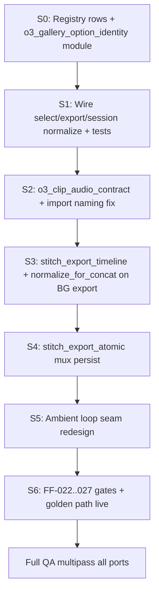

# TECH_SPEC — Operator Export Truth Closure v1

**Status:** Draft v1.1 — 2-agent review complete; pending Kim approval before Full QA implementation  
**Reviews:** Adversary [998524ee](998524ee-c1e6-41a9-9a8f-e2253393d55e) · Advocate [9469a2f6](9469a2f6-ce91-48e4-9bac-4ab73fc1e7bc) — both **APPROVE WITH CONDITIONS**  
**Marker:** `OPERATOR_EXPORT_TRUTH_CLOSURE_V1`  
**Branch (implementation):** `fix/operator-export-truth-closure-v1` (from current tooling HEAD)  
**Parent registry:** `STORYBOARD_AUTHORITY_REGISTRY_v1.md`  
**Sibling spec:** `TECH_SPEC_O3_GALLERY_CLOSURE_v1.md` (lifecycle: terminal done ⟺ gallery row exists) — **this spec** closes selection identity (tile = export = stitch playback)  
**Extends:** `FAST_AND_FLAWLESS_DONE_v1.md` V3 (adds FF-022..FF-027)  
**Trigger incident:** Event_4 resolution Send to Stitcher — beat 5 audible when operator selected silent still; ambient double loop ~25s/27s; lip sync drift after beat 5; mux hash missing after export bake.

**Goal:** One permanent structural closure for **all events, all dedicated ports (:5111–5116+), all future servers** — not Event_4 patches. Operator loop must be boring: **select tile → approve → Send to Stitcher → hard refresh → hear/see exactly what was selected**, with fail-closed gates at every boundary.

---

## 0. Reproduction evidence (pre-fix, cold load — no heal)

Captured 2026-06-30 from live SQLite + ffprobe (agent-run; Kim did not run terminal).

### Event_4 beat `bg_arc1_event4_post_beat_05`

| Field | Value |
|-------|-------|
| `kling_o3_video_path` | `…/bg_arc1_event4_post_beat_05_g1_delivery_trimmed.mp4` |
| `kling_o3_selected_option_key` | `bg_arc1_event4_post_beat_05_o3_video_040343a7cf` |
| `kling_o3_status` | `still_rendered` |

**Gallery rows (index → label → key integrity → audio):**

| Idx | Label | `key === sha1(path)[:10]` | ffprobe audio |
|-----|-------|---------------------------|---------------|
| 0 | O3 i2v + TTS | **false** (`50e7508ff4` on trimmed) | audio |
| 1 | O3 i2v + TTS | true (7300 still_insert) | audio |
| 2 | O3 i2v silent | **false** (`040343a7cf` on trimmed) | audio |
| 3 | recovered O3 delivery | true (7536 still_insert) | **none** |

**Structural fact:** Key `040343a7cf` is the canonical hash for `…7536…` (silent) but also appears on row 2 bound to `g1_delivery_trimmed` (audible). Select/export uses first key match:

```7177:7178:Production/tools/server_handlers/background.py
    opt = next((o for o in options if o.get("key") == option_key), None)
```

Same first-match pattern in `find_active_o3_option()` (`beat_generator.py` ~4785–4792).

**Operator-visible split:** Tile preview plays per-row `video_path`; export uses `kling_o3_video_path` + broken key resolution — silent tile audible in Stitcher.

### Ambient double seam

- Bed file: `Event_4/ambien bed pretty option4.mp3` — duration ~27.35s (ffprobe).
- Filter lane: `STITCH_AMBIENT_LOOP_XFADE_V1` builds body+glue tile then `aloop` (`stitch_ambient_loop.py` ~183–192).
- Resolution slot ~49s → two audible seams per bed period (~25s body/glue, ~27s tile repeat) baked into mux, not client double-play.

### Lip sync / timeline drift

- Boundaries: `_boundaries_for_pair_fade_concat` uses `_ffprobe_duration(clip)` = **format duration** (`beat_generator.py` ~14233).
- Export gate: `assert_stitch_export_clips_av_aligned` allows **≤250ms per clip** only (`ffmpeg_stitch.py` ~1610–1625); no cumulative join drift gate.
- `normalize_for_concat` exists (`ffmpeg_stitch.py` ~798) but **Beat Gen export concat path** (`concat_kling_o3_approved_beats`) does not call it before `_ffmpeg_concat_kling_clips_reencode`.

### Mux lineage

- `validate_stitch_slot_media_artifacts` **clears** `mux_preview_hash` on duration/mtime drift (`test_stitch_mux_video_lineage.py`).
- Export bake calls `persist_stitch_slot_media_artifacts` (`stitch_editor.py` ~2829–2838) but load_job fast validation can clear hash before operator hard refresh — no atomic **export finished ⇒ hash persisted or export fails** contract.

### Server note

`http://localhost:5114/api/build_sha` returned 404 at capture time — deploy proof must use established parity script + served bundle sha gate (FF-014).

---

## 1. Category-unlocker (arc-level)

| Item | Value |
|------|-------|
| **Bug category** | Split authority on gallery identity, export timeline, stitch playback artifacts, and ambient loop geometry — fixes in one layer (trim FF-019) do not close sibling splits |
| **Category fix** | Declare four new registry concepts with single read/write gates, fail-closed validation on every mutation + export + stitch bake, live golden-path CI |
| **Fix type** | CATEGORY — not Event_4 data heal, not label rename, not operator workaround |

**Non-negotiable operator rule after ship:**

> The clip that plays when the operator clicks a gallery tile is the clip that exports, stitches, and muxes — or the operation fails with an explicit error.

---

## 2. Meta-pattern (reason for the reason)

From `STORYBOARD_AUTHORITY_REGISTRY_v1.md`:

> Two or more places each believe they decide the same concept, with no declared winner.

This spec closes **four unresolved splits** still marked `shipped` in registry but proven `partial` by Event_4:

| Split | Losers today | Winner after closure |
|-------|--------------|----------------------|
| Gallery tile vs export pointer | `_resolve_o3_select_option` first-match; corrupt keys | `o3_gallery_option_identity` contract |
| "Silent" label vs media shape | cosmetic labels | `o3_clip_audio_contract` ffprobe gate |
| Format duration vs video stream | boundaries + concat | `stitch_export_timeline_duration` single fn |
| Mux bake vs persisted hash | validate clears hash silently | `stitch_mux_preview_lineage` atomic persist |

---

## 3. New authority concepts (registry rows)

Add to `authority_registry.py` + human registry doc in **Session 0**:

### 3.1 `o3_gallery_option_identity` — FF-022

| | |
|--|--|
| **Question** | Which disk file does this gallery option key denote? |
| **Shape** | disk |
| **Invariant** | ∀ option row: `key === f"{beat_id}_o3_video_{sha1(video_path)[:10]}"` AND keys unique per beat |
| **Read gate** | `resolve_o3_gallery_option(beat, option_key)` → exactly one row or raise |
| **Write gate** | `assign_kling_o3_option_to_slot`, `reconcile_o3_disk_deliveries_for_beat`, `import_delivery_clip_to_beat`, `_repair_o3_select_before_resolve` must call `normalize_o3_gallery_options(beat)` before persist |
| **Export gate** | `assert_beat_export_gallery_authority(beat)` before concat clip materialize |

**Module:** new `Production/tools/o3_gallery_option_identity.py`

**Behaviors:**

1. **`normalize_o3_gallery_options(beat) -> list[str]`** — heal-on-read inside beatgen lock:
   - Regenerate key when `key !== canonical_key(path)`
   - On duplicate keys: keep row where `key === canonical_key(path)`; demote others with regenerated keys; log `O3_GALLERY_KEY_COLLISION_HEAL`
   - Drop rows with missing files (existing prune behavior preserved)
   - Update `kling_o3_selected_option_key` if it pointed at demoted row (follow same path)

2. **`resolve_o3_gallery_option(beat, option_key) -> dict`** — never `next()` without validation; HTTP 409 `O3_GALLERY_OPTION_AMBIGUOUS` if duplicate keys remain after normalize (fail closed)

3. **`assert_beat_export_gallery_authority(beat) -> None`**:
   - `kling_o3_video_path` must equal `resolve_o3_gallery_option(beat, kling_o3_selected_option_key).video_path`
   - If `kling_o3_selected_option_key` empty: active row (`active: true`) must match path
   - Raises `ValueError` with beat_id + both paths — export returns 400 `EXPORT_GALLERY_AUTHORITY`

**Wire points (mandatory):**

| Call site | Change |
|-----------|--------|
| `background._resolve_o3_select_option` | delegate to `resolve_o3_gallery_option` |
| `beat_generator.find_active_o3_option` | same — grep gate bans key loops outside contract |
| `background._apply_o3_video_selection` ~7320 | **remove** `Path(vp).stem` key assignment |
| `background._apply_still_draft_pointer` ~7284 | **remove** stem-based key fallback |
| `background._repair_o3_select_before_resolve` | call `normalize_o3_gallery_options` before repair |
| `kling_stitch_readiness.finalize_kling_delivery_clip` | sync `kling_o3_selected_option_key` with canonical key for path |
| `beat_generator.promote_o3_video_path_active` ~4898 | preserve canonical keys only |
| `beat_generator.stash_prior_kling_o3_before_redo` ~12436 | normalize after append |
| `beat_generator.find_o3_video_path_for_option_key` ~12272 | stem fallback must not bypass identity contract |
| `kling_o3_element_beat_pipeline.py`, `arlo_*_pipeline.py` | all `assign_kling_o3_option_to_slot` entry points |
| `beat_generator.reconcile_o3_disk_deliveries_for_beat` | normalize after additive import |
| `beat_generator.assign_kling_o3_option_to_slot` | assert canonical key on write (already computes key — add duplicate-key eviction) |
| `kling_o3.py` `_prepare_bg_export_request` | after `prepare_beats_for_stitch_export`, run `assert_beat_export_gallery_authority` per beat |
| `background.handle_bg_session_state` ~2352 | normalize before beat payload return |
| **Registry:** supersede `o3_gallery_active_clip` | export read path goes through FF-022; write path calls normalize |

**Client:** no new export gates (forbidden by registry). Optional: show server `gallery_authority_error` toast on 409 select.

---

### 3.2 `o3_clip_audio_contract` — FF-023

| | |
|--|--|
| **Question** | What audio shape does this still-insert / O3 option promise? |
| **Shape** | disk (derived from ffprobe) |
| **Contracts** | Enum on option row: `video_only` \| `embedded_voice` \| `tts_muxed` |

**Problem:** Three meanings collapsed under "silent":
- Ken Burns `still_insert_*_kling_idle_tts.mp4` with **no audio stream** (true silent still)
- O3 delivery without ElevenLabs (`g1_delivery_trimmed`) — **still has Kling AAC**
- TTS muxed export clip

**Module:** extend `o3_gallery_option_identity.py` or `kling_stitch_readiness.py`

**Behaviors:**

1. **`probe_o3_clip_audio_contract(path) -> str`** — ffprobe: no audio → `video_only`; audio + filename `_tts` or sidecar binding → `tts_muxed`; else `embedded_voice`

2. **`stamp_o3_option_audio_contract(opt_row)`** — set `audio_contract` field on write/reconcile

3. **Export gate for still-insert beats:** when operator selected option has `audio_contract === video_only`, export segment must have **no embedded voice** (no audible speech energy at beat boundary — ffprobe + astats/RMS gate). **Do not** require zero audio streams on final concat: BG export and `normalize_for_concat` intentionally inject silent AAC for filter-graph compatibility (`ffmpeg_stitch.py` ~806–809; `beat_generator.py` ~14094–14107). Operator "silent" = no Kling/EL voice, not absence of silent AAC padding.

4. **UI labels** — derived from contract + pipeline mode, not free-text only:
   - `video_only` → "still (no audio)"
   - `embedded_voice` → "O3 delivery (embedded voice)"
   - `tts_muxed` → "O3 + TTS"

**Still-insert import path:** `import_delivery_clip_to_beat` must not use `_kling_idle_tts` suffix when copying raw O3 delivery bytes (`beat_generator.py` ~12584–12586) — use contract-appropriate dest name via new helper `delivery_dest_name_for_contract(beat_id, slot, contract)`.

---

### 3.3 `stitch_export_timeline_duration` — FF-024

| | |
|--|--|
| **Question** | What duration drives concat, boundaries, and stitch slot `video_dur_ms`? |
| **Shape** | derived (single function) |
| **Read gate** | `export_clip_timeline_duration_s(path) -> float` |
| **Rule** | `min(video_stream_dur, audio_stream_dur)` when both present; else format duration; used identically in concat padding, boundary markers, slot upsert |

**Module:** `credentials_lib/ffmpeg_stitch.py` (add function) + wire in `beat_generator.py`

**Behaviors:**

1. **`export_clip_timeline_duration_s(path)`** — wraps existing `ffprobe_stream_duration_s` for v/a; document as sole authority

2. **Pre-concat normalize (mandatory):** new step in `resolve_segment_stitch_export_clip_paths` after materialize + loudnorm, **except** canonical intro tail (pre-built composite — skip normalize). Same LD-284 codec spec already used in Phase A/B export (`production_server.py` references).

3. **Replace `_ffprobe_duration(clip)` in `_boundaries_for_pair_fade_concat`** with `export_clip_timeline_duration_s`

4. **Cumulative drift gate:** new `assert_stitch_export_cumulative_av_aligned(clip_paths, *, max_join_drift_ms=50)` — simulate concat cursor with video stream ends; raise before ffmpeg concat

5. **Stitch upsert:** extend existing `stitch_slot_timeline_dur` authority — `ensure_stitch_slot_timeline_dur_ms` delegates to `export_clip_timeline_duration_s` (no parallel duration fn)

**Durability script:** `verify_stitch_export_timeline_authority_durability.sh` — Event_4 resolution fixture export; assert cumulative drift ≤50ms at each beat boundary in output.

---

### 3.4 `stitch_mux_preview_lineage` — FF-025

| | |
|--|--|
| **Question** | After BG export or stitch save, which mux preview is authoritative for playback? |
| **Shape** | disk |
| **Invariant** | If slot has SFX or ambient requiring layered audio, `mux_preview_hash` + `mux_video_path` + `mux_video_mtime_ms` + `mux_preview_duration_ms` persisted **in same `mutate_state` as export upsert** or export job fails |

**Module:** refactor `stitch_editor.stitch_upsert_event_slot` (today: **three** separate `mutate_state` calls at ~2068–2095 — validate heal → bake → persist). Align with existing `STITCH_WRITE_TIME_PLAYBACK_ARTIFACTS_V1` / `STITCH_EXPORT_MUX_BAKE_V1` (`test_stitch_load_job_playback_bake.py`: **load_job is read-only** — no bake-on-load heal).

**Behaviors:**

1. **`atomic_export_upsert_with_playback_artifacts(h, job, slot_key, video_path, …)`** — one `mutate_state`:
   - Upsert slot video + dur + boundaries
   - Run `ensure_stitch_slot_playback_artifacts_on_export`
   - Persist **correct artifact type**: `mux_preview_hash` when `_stitch_slot_has_sfx`; **`ambient_mix_hash`** when ambient-only (Event_4 resolution class); both when SFX+ambient
   - Re-read slot; if `stitch_slot_needs_playback_artifact_bake` still true → raise → BG export job **fails** (fail closed)

2. **Load job:** validate may clear stale hash — but export must have already persisted replacement. Hard refresh has **no** heal path.

3. **Client:** `resolveSlotPlaybackPreviewUrl` unchanged — server guarantees post-export hash for the artifact type the slot requires

4. **Milestone stitch jobs:** same atomic path for milestone `stitch_store` (`kling_o3.py` milestone export branch ~1110–1128)

**Durability:** extend `test_stitch_mux_video_lineage.py` + live curl: after export job terminal `done`, `GET /api/stitch_editor/load_job` includes `mux_preview_hash` for resolution slot.

---

### 3.5 `stitch_ambient_loop_seam_budget` — FF-026

| | |
|--|--|
| **Question** | How many audible loop seams may a baked ambient mux contain per bed period? |
| **Shape** | derived |
| **Budget** | **≤1 audible seam per bed period** in slot (operator acceptance) |

**Problem:** Current tile (`body` + `glue` + `aloop`) produces **2** seams per ~27s period (`stitch_ambient_loop.py` ~183–192).

**Structural redesign (not gain tweak):**

**Option A (preferred):** Single-period seamless tile only — remove inner body/glue concat; use one `acrossfade` wrap head/tail on trimmed bed; loop that tile with `aloop` once. One seam at period boundary.

**Option B:** If bed shorter than slot, loop entire trimmed bed with single crossfade at wrap only (no body split).

**Implementation:**

1. New function `build_ambient_seamless_period_tile(...)` replacing body/glue split
2. **`measure_ambient_seam_count(mux_or_bed_path, slot_dur_s) -> int`** — ffmpeg `astats`/`silencedetect` heuristic or fixed probe times at `n * bed_period ± 0.5s`; used in tests only initially
3. Gate: `test_stitch_ambient_loop_seam_budget.py` — 49s slot, 27s bed → seam count ≤ ceil(slot/bed_period)
4. **Production gate:** ambient mux bake fails closed if seam budget exceeded (not tests-only)

**Out of scope:** Re-picking ambient beds per event (operator content choice).

---

## 4. Fast & Flawless extensions

Add to `FAST_AND_FLAWLESS_DONE_v1.md` and `verify_fast_and_flawless_done.sh`:

| ID | Requirement | Proof |
|----|-------------|-------|
| **FF-022** | O3 gallery option identity | `verify_o3_gallery_option_identity_durability.sh` + `test_o3_gallery_option_identity.py` |
| **FF-023** | O3 clip audio contract on export | `test_o3_clip_audio_contract_export.py` + ffprobe in durability script |
| **FF-024** | Stitch export timeline single authority | `verify_stitch_export_timeline_authority_durability.sh` |
| **FF-025** | Mux preview atomic persist on BG export | `test_stitch_export_atomic_mux_persist.py` + live load_job curl |
| **FF-026** | Ambient loop seam budget | `test_stitch_ambient_loop_seam_budget.py` |
| **FF-027** | Live golden path (all events class) | `verify_operator_export_golden_path_live.sh` on :5114 Event_4 + fixture event |

**FF-027 golden path steps (mandatory multipass):**

1. Cold server start (no heal-before-proof)
2. Open `http://localhost:PORT/?event=Event_N` — hard refresh
3. Beat Gen: select known `video_only` still option → approve
4. Send to Stitcher → wait terminal done
5. ffprobe exported slot video at beat boundary — audio contract match
6. Stitcher load_job — **`ambient_mix_hash`** present for ambient-only slots (Event_4 resolution); `mux_preview_hash` when SFX exist
7. Browser: play composer — agent verifies beat 5 has no embedded voice; ambient seam budget (structural test + listen at ~25s/27s on Event_4)
8. Hard refresh repeat — same artifact hash + playback URL lineage

**Fleet matrix (minimum):** Event_4 resolution + one intro-heavy event + one still-insert-heavy event × deploy parity on `:5111–5116` where resolution slot exists (stretch: full fleet via FF-016 catalog)

---

## 5. Implementation sessions (dependency order)



### Session 0 — Contract module + registry

| Deliverable | Files |
|-------------|-------|
| `o3_gallery_option_identity.py` | new |
| Registry rows 3.1–3.5 | `authority_registry.py`, `STORYBOARD_AUTHORITY_REGISTRY_v1.md` |
| Grep gate: no raw `next((o for o in options if o.get("key")` outside contract | `verify_o3_gallery_option_identity_durability.sh` |

### Session 1 — Gallery identity wire + fail closed

| Deliverable | Files |
|-------------|-------|
| Replace `_resolve_o3_select_option` / `find_active_o3_option` | `background.py`, `beat_generator.py` |
| Normalize on reconcile + assign | `beat_generator.py` |
| Export gate | `kling_o3.py`, `concat_kling_o3_approved_beats` entry |
| Unit tests: duplicate key, key/path mismatch, first-match regression | `test_o3_gallery_option_identity.py` |

### Session 2 — Audio contract

| Deliverable | Files |
|-------------|-------|
| `probe_o3_option_audio_contract` | `o3_gallery_option_identity.py` |
| Fix `import_delivery_clip_to_beat` dest naming | `beat_generator.py` |
| Export ffprobe gate for still-insert | `kling_stitch_readiness.py` or export path |
| Tests: 7536 vs trimmed shapes | `test_o3_clip_audio_contract_export.py` |

### Session 3 — Timeline authority

| Deliverable | Files |
|-------------|-------|
| `export_clip_timeline_duration_s` | `ffmpeg_stitch.py` |
| `normalize_for_concat` in BG export | `beat_generator.py` |
| Cumulative drift assert | `ffmpeg_stitch.py`, wired in concat |
| Boundary function swap | `_boundaries_for_pair_fade_concat` |

### Session 4 — Atomic mux persist

| Deliverable | Files |
|-------------|-------|
| `stitch_export_atomic.py` | new |
| Wire BG export core | `kling_o3.py` `_run_bg_export_to_stitcher_core` |
| Validation ordering fix | `stitch_media_artifacts.py`, `stitch_editor.py` load_job |

### Session 5 — Ambient seam redesign

| Deliverable | Files |
|-------------|-------|
| Single-seam tile builder | `stitch_ambient_loop.py` |
| Seam budget tests | `test_stitch_ambient_loop_seam_budget.py` |

### Session 6 — Gates + live proof

| Deliverable | Files |
|-------------|-------|
| Durability scripts FF-022..027 | `Production/scripts/` |
| Update meta gate | `verify_fast_and_flawless_done.sh` |
| Event_4 does NOT require manual heal in script — tests use fixture + optional live :5114 |

---

## 6. Full QA protocol (Kim rules — mandatory for ship)

| # | Rule | How this spec satisfies |
|---|------|-------------------------|
| 1 | No fabrication | §0 evidence table; all wire points cite existing paths; implementation must attach curl/ffprobe/pytest artifacts to PR |
| 2 | Reproduce first | §0 captured before any code change; PR description includes pre-fix ffprobe + API JSON |
| 3 | Category fix | §1 category-unlocker; no Event_4-only `UPDATE beat_json` in ship path — heal via `normalize_o3_gallery_options` on read |
| 4 | Multipass every boundary | §4 FF-027 + per-session tests |
| 5 | No heal-before-proof | Golden path step 1 cold start; durability scripts fail if normalize runs before assert in test harness |
| 6 | Durability | `deploy_storyboard_v59.sh` → Dropbox parity exit 0 → restart → HTTP 200 → build-sha = HEAD |
| 7 | Commit when done | One commit per session minimum; merge PR only when FF-022..027 green |
| 8 | No Find Issues / Bugbot | CI + pre-push only |
| 9 | Visual/browser proof | FF-027 step 7 — agent opens Stitcher composer, listens at ~25s/27s, verifies beat 5 silent at operator level |

---

## 7. Acceptance criteria (definition of done)

**Gallery / export**

- [ ] Duplicate option keys impossible after normalize; export fails closed if any remain
- [ ] Selecting tile 3 (7536 silent) and approving → export beat 5 segment has **no embedded voice** (astats/RMS gate; silent AAC padding allowed)
- [ ] `kling_o3_video_path` === path from `kling_o3_selected_option_key` for every exported beat

**Timeline / lipsync**

- [ ] Cumulative A/V drift at beat joins ≤50ms on Event_4 resolution export (post normalize)
- [ ] Boundaries match concat duration source (unit test)

**Stitch playback**

- [ ] After BG export, `load_job` returns `ambient_mix_hash` (ambient-only) or `mux_preview_hash` (SFX) without manual bake
- [ ] Hard refresh → composer plays layered artifact URL (`resolveSlotPlaybackPreviewUrl`), not dry video with double ambient perception

**Ambient**

- [ ] ≤1 seam per bed period on 49s / 27s bed regression test

**Fleet**

- [ ] FF-022..027 in meta gate; fleet matrix §4 (3 event classes minimum)
- [ ] Frozen corrupt fixture (duplicate keys pre-normalize) in pytest; golden path harness does **not** normalize before cold assert

---

## 8. Registry reconciliation (Session 0 mandatory)

| Existing row | Relationship to new concept |
|--------------|----------------------------|
| `o3_gallery_active_clip` | **Superseded read path** by `o3_gallery_option_identity`; write path must normalize + sync selected key |
| `stitch_slot_timeline_dur` | **Extended** — `ensure_stitch_slot_timeline_dur_ms` delegates to `export_clip_timeline_duration_s` |
| `stitch_playback_url` | Unchanged client read; server must persist correct artifact hash type post-export |

Add `forbidden_client_gates` + `server_delegation` tuples mirroring FF-019 pattern in `authority_registry.py`.

---

## 9. Explicit non-goals

- Re-exporting all historical events (normalize-on-read heals on next touch)
- Client-side export enable predicates (registry forbidden)
- Cursor Find Issues / Bugbot
- Replacing ambient bed library content
- Phase B lipsync pipeline changes (separate contract)

---

## 10. Rollback / compatibility

- New fields: `audio_contract` on option rows (optional until stamped; probe on export)
- Normalize-on-read is backward compatible — corrupt Event_4 beat 5 heals on first GET/export
- Ambient filter change invalidates ambient mux sig → automatic rebake on next load (existing sig machinery)

---

## 11. Agent review synthesis (2026-06-30)

Both reviewers: **APPROVE WITH CONDITIONS**. Consensus: category fix is correct; ship after conditions below incorporated (v1.1).

| Reviewer | Verdict | Key condition |
|----------|---------|---------------|
| Adversary | APPROVE WITH CONDITIONS | FF-023 vs concat silent-AAC contradiction resolved (v1.1); ban stem key writers; ambient_mix_hash proof |
| Advocate | APPROVE WITH CONDITIONS | Registry overlap table; cross-link O3 Gallery Closure; widen FF-027 fleet |

**Kim sign-off required before Full QA implementation:**

1. Five new registry concepts + supersession table (§8)
2. Normalize-on-read heals corrupt sidecars on first touch — audit log `O3_GALLERY_KEY_COLLISION_HEAL`
3. Ambient Option A (single wrap crossfade tile)
4. FF-027 fleet matrix (3 event classes minimum)
5. Phase B lipsync remains out of scope
6. No Event_4-only SQL heal in ship path
7. PR attaches §0 pre-fix evidence + post-fix FF-027 artifacts

---

## 12. Agent review checklist (for future reviewers)

1. Does FF-022 eliminate first-match / duplicate-key class **for all beats**?
2. Does FF-023 gate **embedded voice absence** (not zero audio streams)?
3. Does FF-024 close cumulative drift without breaking intro canonical tail?
4. Does FF-025 persist **ambient_mix_hash** or **mux_preview_hash** atomically with no load_job bake?
5. Does FF-026 reduce seams to ≤1 per period with production fail-closed gate?
6. Does FF-027 prove live golden path across fleet matrix?
7. Any remaining split authority?

---

*End of spec — version 1.1*
